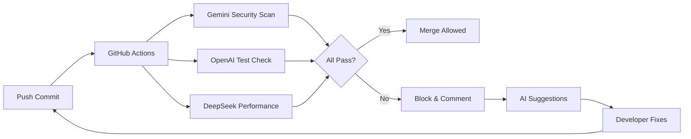

# Optimal Build Strategy (Multi-AI Consensus)

**Date**: 2025-10-03
**Status**: APPROVED - 3 AI Systems Consensus
**Approach**: HYBRID (Split PR #109, AI-Augmented Development)
**Timeline**: 3 weeks to production

---

## 🎯 Executive Summary

### **Consensus Recommendation: HYBRID APPROACH**

**AI Validation**:
- ✅ **GEMINI**: "Superior, pragmatic, professional - best balance across all criteria"
- ✅ **OPENAI**: "Strikes best balance - minimizes risk, maintains momentum"
- ✅ **DEEPSEEK**: "Aligns perfectly - preserves work, fixes fast, builds smart"

### **The Strategy**

**Week 1**: Split & Stabilize
- Merge safe strategy documents NOW
- Fix PR #109 code failures (3 days)
- Deploy AI "Virtual Team" for automation

**Week 2**: Incremental Build
- Implement refined PRs 1-4
- Feature flags for all changes
- AI-driven testing & validation

**Week 3**: Production Deploy
- Implement refined PRs 5-8
- Performance optimization
- Production deployment

---

## 📊 Why HYBRID Wins (AI Consensus Analysis)

### Evaluation Against Criteria

| Criterion | HYBRID Score | Reasoning |
|-----------|--------------|-----------|
| **Speed to Production** | ⭐⭐⭐⭐⭐ | Immediate docs merge, focused code fix |
| **Risk Mitigation** | ⭐⭐⭐⭐⭐ | Zero-risk docs first, isolated code fixes |
| **Resource Efficiency** | ⭐⭐⭐⭐⭐ | Smaller PRs, better for solo dev + AI |
| **Maintaining Momentum** | ⭐⭐⭐⭐⭐ | Psychological win, continuous progress |
| **Leveraging Work** | ⭐⭐⭐⭐⭐ | Preserves 27 passing checks |

### **Gemini's Analysis**:
> "The Hybrid approach takes the smartest, most actionable idea from DeepSeek (separate the docs), applies it first, and then creates the ideal conditions to efficiently fix the remaining code, making it the most balanced and effective strategy."

### **OpenAI's Analysis**:
> "The HYBRID approach capitalizes on the existing passing checks in PR #109, which can be salvaged and integrated into the final product. This is more efficient than starting from scratch."

### **DeepSeek's Analysis**:
> "Unlike Gemini, it doesn't throw away the PR; unlike OpenAI's 1-week fix-only phase, it's faster and integrates feature building sooner. It preserves passing checks and fixes blocking issues fast."

---

## 🚀 Phase-by-Phase Execution Plan

### **PHASE 0: Immediate Triage (Today)**

#### **Step 1: Split PR #109**
```bash
# Current branch state
git checkout demo-tomorrow

# Create docs-only branch
git checkout -b docs/strategy-documentation-merge
git reset --soft HEAD~1  # Undo last commit
git restore --staged *.ts *.tsx *.js *.jsx  # Unstage code files
git restore *.ts *.tsx *.js *.jsx  # Discard code changes

# Keep only markdown files
git add *.md
git commit -m "docs: multi-AI validated strategy documentation

Contains comprehensive 8-week roadmap for Time Machine, Variance,
and Optimal Reserves features.

✅ Safe to merge (documentation only)
✅ Zero production impact
✅ Validated by 4 AI systems

🤖 Generated with Claude Code
Co-Authored-By: Claude <noreply@anthropic.com>"

git push origin docs/strategy-documentation-merge

# Create PR for docs
gh pr create --title "docs: Multi-AI validated feature strategy" \
             --body "Safe documentation merge - no code changes" \
             --label "documentation" \
             --label "safe-merge"
```

**Expected Outcome**: ✅ PR passes all checks (no code = no failures)

#### **Step 2: Create Code-Fix Branch**
```bash
# Back to demo-tomorrow
git checkout demo-tomorrow

# Create code-fix branch
git checkout -b fix/pr109-ci-failures

# Now focus ONLY on fixing code issues
```

---

### **PHASE 1: Stabilize (Days 1-3)**

**Goal**: Get ALL CI checks passing

#### **Day 1: Security & Dependencies (CRITICAL)**

**Morning: AI-Assisted Vulnerability Analysis**
```bash
# Run security scans
npm audit --json > audit-report.json
docker run --rm -v $(pwd):/scan aquasec/trivy fs /scan > trivy-report.txt

# AI Analysis: Feed to Gemini
# Prompt: "Analyze these security reports and provide specific fix commands"
```

**Afternoon: Execute Fixes**
```bash
# Based on AI recommendations
npm audit fix --force
npm update --save-dev  # Update dev dependencies

# Rebuild containers
docker build -t updog-restore:latest .
docker scan updog-restore:latest

# Verify fixes
npm run security:validate
```

**AI Agent**: **Gemini Security Scanner**
- Input: audit-report.json, trivy-report.txt
- Output: Prioritized fix list with specific commands
- Action: Auto-apply safe fixes, flag risky ones for review

**Deliverable**: ✅ All security scans passing

---

#### **Day 2: TypeScript & Build (CRITICAL)**

**Morning: AI-Powered Error Analysis**
```bash
# Capture ALL TypeScript errors
npx tsc --noEmit --pretty false 2>&1 | tee ts-errors.txt

# AI Analysis: Feed to DeepSeek
# Prompt: "These are TypeScript errors from a React+Express+Drizzle app.
# Group by root cause and provide fixes in priority order."
```

**Afternoon: Systematic Fixes**
```bash
# Priority 1: Fix breaking type errors
# (based on AI grouping)

# Priority 2: Fix import/export issues
# (common pattern: missing type imports)

# Priority 3: Fix strictNullChecks issues
# (add null checks where needed)

# Verify after each group
npx tsc --noEmit
npm run build
```

**AI Agent**: **DeepSeek Type Fixer**
- Input: ts-errors.txt, tsconfig.json
- Output: Grouped errors with fix patterns
- Action: Generate type definition patches

**Deliverable**: ✅ TypeScript check passing, build succeeding

---

#### **Day 3: API Contracts & Tests (HIGH PRIORITY)**

**Morning: Contract Validation**
```bash
# Check OpenAPI backward compatibility
npm run openapi:diff

# AI Analysis: Feed diff to OpenAI
# Prompt: "Analyze this OpenAPI diff. Identify breaking changes
# and suggest backward-compatible alternatives."
```

**Afternoon: Test Repairs**
```bash
# Run tests and capture failures
npm test -- --reporter=json > test-results.json

# AI Analysis: Feed to OpenAI
# Prompt: "These tests are failing. Analyze patterns and suggest fixes."

# Fix tests based on AI recommendations
# Run until green
npm test
```

**AI Agent**: **OpenAI Test Generator**
- Input: test-results.json, changed files
- Output: Test fixes + new test cases for coverage gaps
- Action: Generate test files, suggest assertions

**Deliverable**: ✅ All tests passing, API contracts validated

---

### **PHASE 2: Incremental Build (Days 4-14)**

**Goal**: Implement 8 refined PRs with AI assistance

#### **Week 2 Schedule**

**Monday (Day 4): Refined PR #1 - Event Foundation**
```bash
# Create branch
git checkout -b feat/event-sourcing-foundation

# AI-Driven TDD
# Step 1: Ask OpenAI to generate test skeleton
# Prompt: "Generate Vitest tests for event-sourcing with fund_events table"

# Step 2: Implement schema (from REFINED_PR_PACK.md)
# shared/schema.ts - add fundEvents, fundSnapshots

# Step 3: Implement projector
# server/services/fund-projector.ts

# Step 4: Run tests until green
npm test

# Push and create PR
git push origin feat/event-sourcing-foundation
gh pr create --title "feat(events): Event-sourcing foundation" \
             --label "refined-pr-1"
```

**Tuesday (Day 5): Refined PR #2 - Reserve Allocator**
```bash
# Create branch
git checkout -b feat/reserve-allocator-v2

# CRITICAL: Extend existing reserve-worker.ts (don't create new file)
# Follow two-worker chain pattern from REFINED_PR_PACK.md

# AI Assist: Gemini Code Review
# Prompt: "Review this worker integration for thread safety and performance"

# Implement, test, push
```

**Wednesday (Day 6): Refined PR #3 - Variance Engine**
```bash
# Create branch
git checkout -b feat/variance-engine-api

# Add missing API routes (from REFINED_PR_PACK.md)
# server/routes/variance-alerts.ts

# AI Assist: DeepSeek Performance Check
# Prompt: "Optimize this variance calculation for <2s target"

# Implement, test, push
```

**Thursday (Day 7): Refined PR #4 - Redis Cache**
```bash
# Create branch
git checkout -b perf/cache-redis-mv

# Drizzle migration for materialized views
npx drizzle-kit generate

# Shared Redis client pattern
# AI Assist: Gemini Code Review
# Prompt: "Validate Redis connection pooling and cache invalidation"

# Implement, test, push
```

**Friday (Day 8): Review & Merge Week**
- Code review all 4 PRs
- AI validation passes
- Merge sequentially
- Monitor CI health

---

#### **Week 3 Schedule**

**Monday-Thursday (Days 9-12): Refined PRs #5-8**
- PR #5: TanStack Query Hooks
- PR #6: E2E Test IDs
- PR #7: Time Travel UI
- PR #8: Optimal Reserves UI

**Friday (Day 13): Integration Testing**
- Full system smoke tests
- Performance benchmarking
- Security audit

**Weekend (Days 14-15): Staging Deployment**
- Deploy to staging
- Run AI-generated load tests
- Monitor metrics

---

### **PHASE 3: Production Deploy (Days 16-21)**

#### **Day 16-17: Performance Validation**

**AI-Generated Load Tests**
```bash
# Use Performance Agent (DeepSeek)
# Prompt: "Generate k6 load tests for these OpenAPI endpoints
# targeting p95 <200ms reads, <500ms writes"

# Run tests
k6 run ai-generated-load-tests.js

# Analyze results
# If failures: Use DeepSeek to suggest optimizations
```

#### **Day 18-19: Security Hardening**

**AI Security Audit**
```bash
# Gemini Security Agent
# Prompt: "Perform deep security analysis of this codebase:
# - SQL injection in Drizzle queries
# - Race conditions in BullMQ workers
# - XSS in React components
# - Authentication/authorization flaws"

# Address findings
# Re-scan until clean
```

#### **Day 20: Production Deployment**

**Feature Flag Rollout**
```bash
# Deploy with all features disabled
vercel --prod

# Gradually enable features
# 1. Time Machine (10% users)
# 2. Variance Tracking (25% users)
# 3. Optimal Reserves (50% users)
# 4. Full rollout (100% users)

# Monitor at each step
# - BullMQ health dashboards
# - API performance metrics
# - Error rates
```

#### **Day 21: Monitoring & Optimization**

**AI-Powered Monitoring**
```bash
# Set up AI alerting
# - Performance degradation detection
# - Error pattern analysis
# - Resource utilization optimization

# DeepSeek analyzes logs continuously
# Gemini reviews security events
# OpenAI suggests optimizations
```

---

## 🤖 AI "Virtual Team" Configuration

### **Agent Roles & Responsibilities**

#### **1. Gemini - Security Chief**
**Triggers**: Every commit, every PR
**Tasks**:
- Static security analysis
- Vulnerability detection
- Container scanning
- Compliance checking

**Configuration**:
```yaml
# .github/workflows/ai-security.yml
name: AI Security Scan
on: [push, pull_request]
jobs:
  gemini-security:
    runs-on: ubuntu-latest
    steps:
      - uses: actions/checkout@v4
      - name: Gemini Security Analysis
        env:
          GEMINI_API_KEY: ${{ secrets.GEMINI_API_KEY }}
        run: |
          node scripts/ai-security-scan.js
```

#### **2. OpenAI - QA Engineer**
**Triggers**: Every PR opened
**Tasks**:
- Generate missing tests
- Validate test coverage
- Suggest edge cases
- Review test quality

**Configuration**:
```yaml
# .github/workflows/ai-qa.yml
name: AI QA Review
on: [pull_request]
jobs:
  openai-qa:
    runs-on: ubuntu-latest
    steps:
      - uses: actions/checkout@v4
      - name: OpenAI Test Generation
        env:
          OPENAI_API_KEY: ${{ secrets.OPENAI_API_KEY }}
        run: |
          node scripts/ai-test-generator.js
          git diff > suggested-tests.patch
      - name: Comment on PR
        uses: actions/github-script@v7
        with:
          script: |
            github.rest.issues.createComment({
              issue_number: context.issue.number,
              body: 'AI-generated test suggestions attached'
            })
```

#### **3. DeepSeek - Performance Engineer**
**Triggers**: Nightly, before deployments
**Tasks**:
- Bundle size analysis
- API performance testing
- Database query optimization
- Load test generation

**Configuration**:
```yaml
# .github/workflows/ai-performance.yml
name: AI Performance Check
on:
  schedule:
    - cron: '0 0 * * *'
jobs:
  deepseek-performance:
    runs-on: ubuntu-latest
    steps:
      - uses: actions/checkout@v4
      - name: DeepSeek Analysis
        env:
          DEEPSEEK_API_KEY: ${{ secrets.DEEPSEEK_API_KEY }}
        run: |
          node scripts/ai-performance-analysis.js
          k6 run ai-generated-load-tests.js
```

---

## 📋 Detailed Task Breakdown

### **Day 1 Tasks (Security)**
- [ ] Run npm audit and export JSON
- [ ] Run Trivy scan and export results
- [ ] Feed results to Gemini Security Agent
- [ ] Apply recommended fixes
- [ ] Update dependencies
- [ ] Rebuild Docker containers
- [ ] Re-run all security scans
- [ ] Verify all passing
- [ ] Commit and push: "fix: resolve security vulnerabilities"

### **Day 2 Tasks (TypeScript & Build)**
- [ ] Run tsc and capture all errors
- [ ] Feed errors to DeepSeek Type Fixer
- [ ] Group errors by root cause
- [ ] Fix breaking errors first
- [ ] Fix import/export issues
- [ ] Fix strictNullChecks issues
- [ ] Verify tsc passes
- [ ] Run npm run build
- [ ] Verify build succeeds
- [ ] Commit and push: "fix: resolve TypeScript errors and build issues"

### **Day 3 Tasks (API & Tests)**
- [ ] Run OpenAPI diff check
- [ ] Feed diff to OpenAI for analysis
- [ ] Fix any breaking changes
- [ ] Run full test suite
- [ ] Capture test failures
- [ ] Feed failures to OpenAI Test Generator
- [ ] Implement suggested fixes
- [ ] Add new test cases
- [ ] Verify all tests pass
- [ ] Commit and push: "fix: resolve API contracts and test failures"

### **Day 4-8 Tasks (Refined PRs 1-4)**
For each PR:
- [ ] Create feature branch
- [ ] Ask AI to generate test skeleton
- [ ] Implement feature (follow REFINED_PR_PACK.md)
- [ ] Run tests until green
- [ ] Request AI code review
- [ ] Apply AI suggestions
- [ ] Push and create PR
- [ ] Monitor CI checks
- [ ] Merge when green

### **Day 9-13 Tasks (Refined PRs 5-8)**
(Same pattern as Day 4-8)

### **Day 14-15 Tasks (Staging)**
- [ ] Deploy to Vercel staging
- [ ] Run AI-generated smoke tests
- [ ] Run AI-generated load tests
- [ ] Monitor metrics dashboards
- [ ] Fix any performance issues
- [ ] Re-test until targets met

### **Day 16-21 Tasks (Production)**
- [ ] Final security audit with Gemini
- [ ] Final performance validation with DeepSeek
- [ ] Deploy to production
- [ ] Enable features via flags (gradual rollout)
- [ ] Monitor error rates and performance
- [ ] Optimize based on AI recommendations

---

## 🎯 Success Metrics & Validation

### **Phase 1 Success Criteria (Day 3)**
- ✅ ALL 59 CI checks passing
- ✅ Zero security vulnerabilities
- ✅ TypeScript compile clean
- ✅ Build succeeds
- ✅ All tests passing
- ✅ API contracts valid

### **Phase 2 Success Criteria (Day 13)**
- ✅ 8 refined PRs merged
- ✅ Feature flags operational
- ✅ Workers healthy (reserve, pacing, events)
- ✅ Staging environment stable
- ✅ Performance targets met in staging

### **Phase 3 Success Criteria (Day 21)**
- ✅ Production deployment successful
- ✅ Features enabled to 100% users
- ✅ API p95 latency <200ms
- ✅ Fund creation p95 <500ms
- ✅ Zero critical errors
- ✅ 99.9% uptime

---

## 🛡️ Risk Mitigation Matrix

| Risk | Probability | Impact | Mitigation | Owner |
|------|-------------|--------|------------|-------|
| CI still failing after Day 3 | MEDIUM | HIGH | AI pair programming, expert consultation | Developer + AI |
| Security vulnerabilities resurface | LOW | CRITICAL | Automated Gemini scans, dependency pinning | Gemini Agent |
| Performance degradation | MEDIUM | HIGH | DeepSeek continuous monitoring, caching | DeepSeek Agent |
| Breaking API changes | LOW | HIGH | OpenAPI validation, feature flags | OpenAI Agent |
| Test coverage gaps | MEDIUM | MEDIUM | OpenAI test generation, coverage reports | OpenAI Agent |
| Solo developer burnout | MEDIUM | CRITICAL | AI automation, clear daily goals, breaks | Developer |
| Feature flag bugs | LOW | MEDIUM | Gradual rollout, rollback procedures | Developer + AI |
| Production incidents | LOW | CRITICAL | Monitoring, alerting, automated rollback | All Agents |

---

## 💡 AI Collaboration Best Practices

### **1. Prompt Engineering Patterns**

**For Security Analysis (Gemini)**:
```
Analyze this [code/dependency/config] for security vulnerabilities.

Focus on:
- SQL injection in Drizzle queries
- XSS in React components
- Authentication bypass
- Race conditions in BullMQ workers
- Secrets in code/env files

Provide:
1. Severity rating (CRITICAL/HIGH/MEDIUM/LOW)
2. Specific line numbers
3. Exploit scenario
4. Fix with code example
5. Prevention strategy
```

**For Test Generation (OpenAI)**:
```
Generate comprehensive tests for this [component/function/API].

Requirements:
- Testing framework: Vitest
- Coverage target: >80%
- Include: happy path, edge cases, error scenarios
- Style: Arrange-Act-Assert pattern

Provide:
1. Test file structure
2. Mock setup
3. Test cases with descriptions
4. Coverage report
```

**For Performance Optimization (DeepSeek)**:
```
Optimize this [query/function/component] for performance.

Current metrics: [latency/bundle size/memory]
Target metrics: [goals from README]

Constraints:
- Maintain backward compatibility
- Preserve functionality
- Follow existing patterns

Provide:
1. Bottleneck analysis
2. Optimization strategy
3. Code changes
4. Expected improvements
5. Benchmark script
```

### **2. CI Integration Workflow**



### **3. Daily AI Standup**

**Morning (9 AM)**:
```bash
# Run AI analysis on overnight changes
node scripts/ai-daily-standup.js

# Generates report:
# - Security issues (Gemini)
# - Test coverage gaps (OpenAI)
# - Performance regressions (DeepSeek)
# - Recommended priorities for today
```

**Evening (5 PM)**:
```bash
# Run AI retrospective
node scripts/ai-daily-retrospective.js

# Generates report:
# - Progress made
# - Blockers identified
# - AI suggestions for tomorrow
# - Metrics dashboard
```

---

## 📈 Progress Tracking

### **Week 1 Milestones**
- **Day 1**: ✅ Docs merged, Security passing
- **Day 2**: ✅ TypeScript passing, Build passing
- **Day 3**: ✅ ALL CI checks passing
- **Day 4**: ✅ PR #1 merged (Events)
- **Day 5**: ✅ PR #2 merged (Reserves)

### **Week 2 Milestones**
- **Day 8**: ✅ PRs #1-4 merged
- **Day 13**: ✅ PRs #5-8 merged
- **Day 15**: ✅ Staging validated

### **Week 3 Milestones**
- **Day 18**: ✅ Security hardened
- **Day 19**: ✅ Performance optimized
- **Day 21**: ✅ Production deployed

---

## 🚀 Immediate Next Actions (Right Now)

### **Action 1: Split PR #109 (30 minutes)**
```bash
# Execute commands from Phase 0, Step 1
git checkout demo-tomorrow
git checkout -b docs/strategy-documentation-merge
# ... (follow script above)
```

### **Action 2: Create Code-Fix Branch (5 minutes)**
```bash
# Execute commands from Phase 0, Step 2
git checkout -b fix/pr109-ci-failures
```

### **Action 3: Run Security Scan (15 minutes)**
```bash
# Start Day 1 tasks
npm audit --json > audit-report.json
docker run --rm -v $(pwd):/scan aquasec/trivy fs /scan > trivy-report.txt
```

### **Action 4: Prepare AI Prompts (10 minutes)**
```bash
# Copy prompt templates to clipboard
# Ready to paste into AI tools
```

---

## ✅ Decision Log

**Date**: 2025-10-03

**Decision**: HYBRID approach approved by AI consensus
**Alternatives Considered**:
- A) Abandon PR #109 (rejected - wastes work)
- B) Fix entire PR at once (rejected - too risky)
- C) Quick fix only (partial - lacks structure)

**Rationale**:
- Preserves 27 passing CI checks
- Zero-risk documentation merge
- Focused code fixes
- AI-augmented development
- Incremental value delivery

**Stakeholders**: Solo developer + 3 AI systems (Gemini, OpenAI, DeepSeek)

**Status**: APPROVED - Execution begins immediately

---

## 📚 Reference Documents

- [REFINED_PR_PACK.md](./REFINED_PR_PACK.md) - 8 production-ready PRs
- [INTEGRATION_SUMMARY.md](./INTEGRATION_SUMMARY.md) - AI validation results
- [MERGE_RISK_ANALYSIS.md](./MERGE_RISK_ANALYSIS.md) - Risk assessment
- [FEATURE_COMPLETION_STRATEGY.md](./FEATURE_COMPLETION_STRATEGY.md) - 8-week roadmap
- [WEEK_1_FINAL_VALIDATED.md](./WEEK_1_FINAL_VALIDATED.md) - Week 1 details

---

**🎯 STATUS: READY TO EXECUTE**

**Next Step**: Execute Phase 0, Action 1 - Split PR #109

**Timeline**: 3 weeks to production

**Confidence Level**: HIGH (Multi-AI validated)
