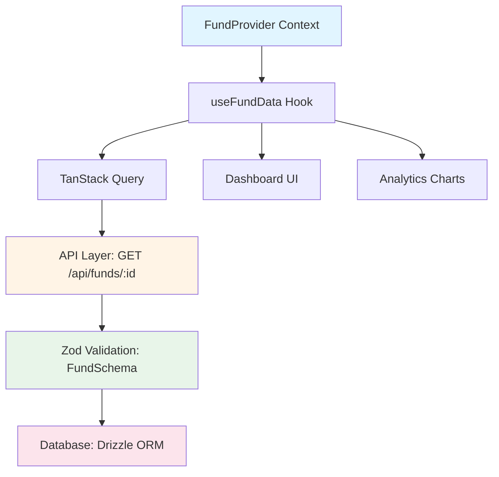

# Phase 3 Implementation Handoff Memo

**Date:** November 6, 2025 **Status:** ✅ Strategy Approved - Ready for
Implementation **For:** Fresh Implementation Session **Context:** Solo dev side
project, internal documentation only

---

## Executive Summary (30 Second Brief)

**What:** Document 6 critical undocumented systems (API, State, Validation,
Database, Testing, AI Agents) **Why:** Onboard yourself after breaks + future
collaborators in <5 days **How:** Autonomous AI agents + "Why-Questions"
knowledge capture + ultra-pragmatic internal-only docs **Timeline:** 4 weeks
(25-33 hours execution) **Output:** 26 files in `/docs/internal/` with Design
Rationale + DoD + Examples

---

## What's Already Complete (Phase 2)

✅ **Engine Documentation** (Merged PR #206)

- 15 files, 13,949 lines, 95-99% quality
- ReserveEngine, PacingEngine, CohortEngine, Monte Carlo
- Proven: 87-91% time savings with AI agents

✅ **Infrastructure Built**

- `scripts/extract-code-references.mjs` (auto-generates file:line anchors)
- Promptfoo validation configs (4 modules, 20 test cases)
- `scripts/validation/prompts/` (4 prompt templates)

✅ **Strategic Documents**

- ANTI_PATTERNS.md (2,043 lines - failure patterns)
- PROMPT_PATTERNS.md (proven orchestration workflows)
- PROJECT-PHOENIX-COMPREHENSIVE-STRATEGY.md (21-week master plan)

---

## Phase 3 Scope: The 6 Critical Systems

| Module              | Why Undocumented          | Files | Effort |
| ------------------- | ------------------------- | ----- | ------ |
| **Database Schema** | No docs found             | 3     | 8-10h  |
| **Data Validation** | 70+ schemas, no patterns  | 4     | 10-12h |
| **API Layer**       | 31 routes, zero docs      | 5     | 15-20h |
| **TanStack Query**  | Widespread use, no guide  | 4     | 12-15h |
| **AI Agents**       | 39 files, complex system  | 4     | 15-20h |
| **Testing**         | Multi-project pain points | 3     | 6-8h   |

**Total:** 26 files, 66-85h work → **25-33h wall time** (parallel AI execution)

---

## Key Innovation: Internal-Only + Why-Questions

### 1. Internal-Only Structure

**All docs go in:** `/docs/internal/` (not `/docs/notebooklm-sources/`)

**No:** Branding, publishing, external site, marketing materials **Yes:**
Pragmatic internal developer reference

```
/docs/internal/
  index.md                    # Entry point
  maintenance.md              # Quarterly ritual
  checklists/
    definition-of-done.md     # 10-line template
    self-review.md            # 5 questions
  architecture/
    state-flow.md             # Single Mermaid diagram
  [6 module folders]/
    *.md files with DoD
```

### 2. Why-Questions Workflow (Knowledge Capture)

**Problem:** ADRs sparse, AI can't infer architectural intent from code alone

**Solution:** Agent generates questions, you answer in 15-30 min

**Process:**

1. Context Agent scans code + tests + `DECISIONS.md`
2. If sparse (<3 decisions), generates **Why-Questions:**
   ```markdown
   ## Missing Context (Need 15-min Input)

   1. API Layer: Why Express over Fastify/Hono?
   2. State: Why TanStack Query over Redux?
   3. Database: Why Drizzle over Prisma?
   ```
3. **You answer** (voice notes/bullets, whatever's fastest)
4. Agent writes **Design Rationale** section:
   ```markdown
   ## Design Rationale

   - Decision: [one sentence]
   - Alternatives: [2-3 bullets]
   - Trade-offs: ✅ [2 pros] ⚠️ [2 cons]
   - When to revisit: [condition]
   ```

**Time:** 15-30 min per module = **3h total for 6 modules** **ROI:** Captures
tacit knowledge before you forget it

### 3. Tiny Enforceable DoD (10 Lines Per Doc)

Every doc ends with:

```markdown
---

## Definition of Done

**Security/Reliability:** Input validation at [boundary]; [X]s timeout; [Y]x
retry w/ backoff **Observability:** Log `{[fields]}`; metric: `[name]`; span:
`[name]` **Performance:** Target p95 < [X]ms; cache: staleTime=[Y]s ([data
type]) **Example:** `[command or code]` → [expected result] **Ownership:**
DRI=you; next review: [date+6mo]
```

**Time:** 15 min per module = **1.5h total**

---

## 4-Week Timeline

### Week 46: Foundation (Nov 11-15)

**Monday (Infrastructure - 3-4h):**

- Create `/docs/internal/` structure + index.md
- Install Mermaid.js: `npm install -D @mermaid-js/mermaid-cli`
- Create DoD template in `/docs/internal/checklists/`
- Create self-review checklist

**Tuesday-Friday (Docs - 5-6h wall time):**

- **2 parallel agents:** Database + Validation
- **Why-Questions:** Answer for both modules (30 min each)
- **Create:** State flow diagram (Mermaid) in `/architecture/`
- **Deliverable:** 7 files (Database 3 + Validation 4) with DoD + Rationale

---

### Week 47: Interface (Nov 18-22)

**Monday-Friday (Docs - 6-7h wall time):**

- **2 parallel agents:** API Layer + TanStack Query
- **Why-Questions:** Answer for both modules (30 min each)
- **Special sections:**
  - API: Mini-contract example (Zod → types, not full generation)
  - State: Performance rules ("never import xlsx in render path")
  - State: Query hygiene (staleTime/gcTime defaults)
- **Deliverable:** 9 files (API 5 + State 4) with DoD + Rationale

**Buffer:** 1-2 days between Week 47 and 48 for dependency resolution

---

### Week 48: Application (Nov 25-29)

**Monday-Friday (Docs - 7-8h wall time):**

- **2 parallel agents:** AI Agents (4 pages) + Testing (3 pages)
- **Why-Questions:** Answer for both modules (30 min each)
- **AI Agents reduced scope:**
  - 01-overview-and-base.md (combined)
  - 02-memory.md (critical architecture)
  - 03-failure-and-cost.md (playbook)
  - 04-quick-reference.md (recipes)
- **Testing critical path:**
  - 01-multi-project.md (path alias pain points)
  - 02-fixtures.md
  - 03-micro-benchmark.md
- **Deliverable:** 7 files (Agents 4 + Testing 3) with DoD + Rationale

---

### Week 49: Validation (Dec 2-6)

**Monday-Wednesday (Self-Review - 2-3h):**

- Run **Self-Review Checklist** (30 min per module):
  ```markdown
  - [ ] Can I understand after 6 months away?
  - [ ] Are "why" decisions captured?
  - [ ] Is there a copy-paste example?
  - [ ] Are failure modes mentioned?
  - [ ] Cache/latency expectations specified?
  ```
- Run **staleness check:**
  `node scripts/extract-code-references.mjs --check-stale`
- Fix broken anchors (if any)

**Thursday-Friday (Self-Onboarding Test - 1-2h facilitator):**

- Take 1-2 week break from codebase
- **Task:** Add new API endpoint using only docs
- **Target:** Complete in 2-4 hours
- **Log:** Time taken, gaps found, questions that arose
- **Fix:** Update docs with learnings

**Final Deliverable:**

- `/docs/internal/maintenance.md` (quarterly ritual documented)
- Validation results + gap fixes

---

## Success Criteria (Solo Dev)

**Must Have (Primary):**

1. ✅ **Self-Onboarding Test:** Add endpoint using only docs in 2-4h (after 1-2
   week break)
2. ✅ **DoD Coverage:** All 6 modules have 10-line DoD footer
3. ✅ **Design Rationale:** All 6 modules have "Why" captured (from
   Why-Questions)
4. ✅ **Runnable Examples:** Each module has ≥1 copy-paste example

**Nice to Have (Secondary):**

1. ✅ **State Flow Diagram:** Single visual in `/architecture/`
2. ✅ **Performance Rules:** Documented in State module
3. ✅ **Quarterly Maintenance:** Process doc + calendar reminder set

---

## Key Files to Reference

**Strategic Documents:**

- [PHASE3-STRATEGY-FINAL-2025-11-06.md](PHASE3-STRATEGY-FINAL-2025-11-06.md) -
  Comprehensive 80-page strategy (for stakeholders)
- [ANTI_PATTERNS.md](ANTI_PATTERNS.md) - What to avoid (2,043 lines)
- [PROMPT_PATTERNS.md](PROMPT_PATTERNS.md) - Proven AI agent workflows

**Infrastructure:**

- `scripts/extract-code-references.mjs` - Code anchor automation (already built)
- `scripts/validation/*.yaml` - Promptfoo configs (4 modules, Phase 2)
- `scripts/validation/prompts/*.md` - Prompt templates (4 files, Phase 2)

**Phase 2 Completed Docs (Reference Examples):**

- `docs/notebooklm-sources/reserves/` - 4 files, 95%+ quality
- `docs/notebooklm-sources/pacing/` - 4 files, 99% quality (includes
  VALIDATION-NOTES.md)
- `docs/notebooklm-sources/cohorts/` - 3 files, 95%+ quality
- `docs/notebooklm-sources/monte-carlo/` - 4 files, 98%+ quality

---

## Critical Execution Notes

### 1. Use Parallel AI Agents (Proven Pattern)

**Single message, multiple Task tool calls:**

```python
# Week 46 Example
Task --subagent docs-architect \
  "Document Database Schema using Why-Questions workflow"

Task --subagent docs-architect \
  "Document Data Validation using Why-Questions workflow"

# Both run simultaneously → 5-6h wall time (not 18-22h sequential)
```

**Proven:** Phase 2 achieved 87-91% time savings this way

### 2. Why-Questions Workflow (Do This)

When starting each module:

```python
Task --subagent context-orchestrator \
  "Extract patterns from [module].
   If ADRs sparse, generate Why-Questions for:
   - Why this technology choice?
   - What alternatives were considered?
   - What are the trade-offs?
   - When should we revisit this decision?"
```

**Then:** You answer in 15-30 min, feed back to agent

### 3. DoD Template (Copy-Paste Ready)

```markdown
---

## Definition of Done

**Security/Reliability:** Validate input at [X]; [Y]s timeout; [Z]x retry w/
exponential backoff; idempotency via [method] **Observability:** Log
`{endpoint, duration_ms, status, user_id}`; metric: `api_duration_ms`; span:
`api.[name]` **Performance:** Target p95 < [X]ms; cache: staleTime=[Y]s (fund
data), [Z]m (user profile) **Example:** `[command]` or `[code snippet]` →
[expected behavior] **Ownership:** DRI=you; next review: [today + 6 months]
```

### 4. State Flow Diagram (Mermaid Example)



Save to: `/docs/internal/architecture/state-flow.md`

### 5. Performance Rules (Copy-Paste Snippet)

```typescript
// ❌ DON'T: Import heavy libs in render path
import { utilsToXlsx } from './heavy-xlsx-lib'; // 500KB parsed upfront

// ✅ DO: Lazy import in event handlers
async function onExportClick() {
  const { utilsToXlsx } = await import('./heavy-xlsx-lib');
  await utilsToXlsx(data);
}

// ✅ DO: Web Worker for parsing
const worker = new Worker(new URL('./xlsx-worker.ts', import.meta.url));
worker.postMessage(data);
```

---

## Budget & ROI

### Investment

- **Time:** 25-33 hours over 4 weeks
- **Cost:** $50-100 (Promptfoo validation runs, LLM API)
- **Total:** ~$50-100 + your time

### Returns (Conservative)

- **Self-onboarding:** Save 3-5 days after long breaks (4x per year = 12-20 days
  saved)
- **First collaborator:** Onboard in 5 days vs 2 weeks (save 5 days = $4,000
  value)
- **Velocity:** 15% faster features (2-3 hours per feature × 20 features/year =
  40-60 hours saved)

**Break-even:** First long break OR first collaborator onboarded

---

## Anti-Patterns to Avoid

From [ANTI_PATTERNS.md](ANTI_PATTERNS.md):

1. ❌ **Documentation-First** - Read code first, document actuals
2. ❌ **Single-Pass Writing** - Plan for 2-3 iterations with self-validation
3. ❌ **Manual Code References** - Use `extract-code-references.mjs` (zero
   errors)
4. ❌ **Ignoring Tests** - Tests reveal 60-80% of edge cases
5. ❌ **Premature CI** - Quarterly manual check sufficient for solo dev
6. ❌ **Perfect Quality** - 80% "good enough" is actually good enough for side
   project

---

## Quick Start Commands

### Week 46 Monday (Infrastructure Setup)

```bash
# 1. Create internal docs structure
mkdir -p docs/internal/{checklists,architecture,database,validation,api,state,agents,testing}

# 2. Create index
cat > docs/internal/index.md << 'EOF'
# Internal Documentation

## Modules
- [Database Schema](database/)
- [Data Validation](validation/)
- [API Layer](api/)
- [State Management](state/)
- [AI Agents](agents/)
- [Testing](testing/)

## Checklists
- [Definition of Done](checklists/definition-of-done.md)
- [Self-Review](checklists/self-review.md)

## Architecture
- [State Flow Diagram](architecture/state-flow.md)

## Maintenance
- [Quarterly Ritual](maintenance.md)
EOF

# 3. Install Mermaid
npm install -D @mermaid-js/mermaid-cli

# 4. Create DoD template
cat > docs/internal/checklists/definition-of-done.md << 'EOF'
# Definition of Done Template

Copy this to the end of every documentation file:

---

## Definition of Done

**Security/Reliability:** [Input validation] at [boundary]; [X]s timeout; [Y]x retry w/ backoff
**Observability:** Log `{[key fields]}`; metric: `[metric_name]`; span: `[span_name]`
**Performance:** Target p95 < [X]ms; cache: staleTime=[Y]s ([data type])
**Example:** `[command or code]` → [result]
**Ownership:** DRI=you; next review: [date+6mo]
EOF

# 5. Create self-review checklist
cat > docs/internal/checklists/self-review.md << 'EOF'
# Self-Review Checklist

For each module, spend 30 minutes reviewing:

- [ ] Can I understand this after 6 months away?
- [ ] Are "why" decisions captured? (Design Rationale section)
- [ ] Is there a copy-paste example that works?
- [ ] Are failure modes mentioned? (timeouts, retries, errors)
- [ ] Are cache/latency expectations specified?

**Pass:** ≥4/5 checked
**Fail:** Update doc before moving to next module
EOF
```

### Week 46 Tuesday (Start Documentation)

```bash
# Launch parallel agents (single message, 2 Task calls)
# In Claude Code chat:

"Start Week 46 Database + Validation documentation:

1. Use context-orchestrator to extract patterns from:
   - client/src/core/ (database-related code)
   - shared/schemas/ (Drizzle schemas)
   - Generate Why-Questions if ADRs sparse

2. Launch 2 docs-architect agents in parallel:

   Agent 1: Document Database Schema (3 files in /docs/internal/database/)
   - 01-overview.md (Drizzle ORM choice, rationale)
   - 02-patterns.md (query patterns, transactions)
   - 03-optimization.md (pooling, indexes)
   - Include DoD footer in each

   Agent 2: Document Data Validation (4 files in /docs/internal/validation/)
   - 01-overview.md (Zod integration, rationale)
   - 02-zod-patterns.md (schema composition)
   - 03-type-system.md (discriminated unions, type guards)
   - 04-integration.md (frontend ↔ backend ↔ database sync)
   - Include DoD footer in each

3. I will answer Why-Questions in next message (15-30 min each module)"
```

---

## Validation Approach

### Self-Review (Week 49)

**Per Module (30 min each):**

1. Read through your own docs
2. Check self-review checklist (5 questions)
3. Try one example from docs (does it work?)
4. Check DoD footer (all 5 sections filled?)
5. Grade: Pass (4/5) or Fail (update doc)

**Total:** 3 hours for 6 modules

### Self-Onboarding Test (Week 49 + 2 weeks)

**Setup:**

1. Don't touch codebase for 1-2 weeks (natural break: holidays, busy period)
2. Come back, task: "Add new API endpoint `POST /api/investments/bulk-update`
   using only docs"
3. Track: Start time, questions that arise, blockers, completion time

**Success:** Complete in 2-4 hours **Failure:** Took >6 hours or needed to read
source code (gaps in docs)

**Action on Failure:** Update docs with missing info, log in
docs/internal/maintenance.md

---

## Quarterly Maintenance (Set Calendar Reminder)

**Every 3 months (1 hour):**

```bash
# 1. Check anchor staleness
node scripts/extract-code-references.mjs --check-stale

# Output shows:
# ❌ api/01-overview.md:42 - `/api/funds` → moved to `/api/v2/funds`
# ❌ state/02-queries.md:78 - `useFundData` → renamed to `useFund`
# ✅ 95% anchors still valid

# 2. Fix broken anchors (30-60 min)
# Regenerate or manually update

# 3. Log in maintenance.md
echo "## $(date +%Y-%m-%d) - Quarterly Check\n- Checked anchors: 5% stale\n- Fixed in 45 minutes\n" >> docs/internal/maintenance.md
```

---

## What NOT to Do (Scope Boundaries)

**DON'T:**

- ❌ Build CI automation (defer to Phase 4)
- ❌ Generate full OpenAPI specs (document pattern only)
- ❌ Create public doc site (internal only)
- ❌ Write operational runbooks (need production data)
- ❌ Comprehensive security deep-dive (deserves Phase 4)
- ❌ Multi-reviewer validation (you're solo dev)
- ❌ Perfect 90%+ quality (80% good enough is fine)

**DO:**

- ✅ Internal-only structure (`/docs/internal/`)
- ✅ Why-Questions workflow (capture tacit knowledge)
- ✅ Tiny DoD (10 lines per doc)
- ✅ Self-validation (checklist + onboarding test)
- ✅ Quarterly manual check (1h every 3 months)
- ✅ Good enough quality (80%+ utility)

---

## Success = Utility, Not Perfection

**Good Documentation:**

- You can onboard yourself after 6-month break
- You can onboard first collaborator in <5 days
- You can find answers without re-reading all code
- Examples work when copy-pasted

**Not Required:**

- Perfect diagrams for every flow
- Exhaustive edge case coverage
- 100% code reference accuracy
- Formal ADR backlog
- External publishing capability
- Brand-aligned styling

---

## Contact & Questions

**Reference Documents:**

- [PHASE3-STRATEGY-FINAL-2025-11-06.md](PHASE3-STRATEGY-FINAL-2025-11-06.md) -
  Full 80-page strategy
- [ANTI_PATTERNS.md](ANTI_PATTERNS.md) - What to avoid
- [PROMPT_PATTERNS.md](PROMPT_PATTERNS.md) - AI agent workflows

**If Stuck:**

- Check Phase 2 completed docs for examples
- Review Why-Questions template
- Reference DoD template
- Remember: 80% good enough, not 100% perfect

---

## Final Checklist Before Starting

**Infrastructure:**

- [ ] Read this handoff memo completely
- [ ] Review [ANTI_PATTERNS.md](ANTI_PATTERNS.md) (15 min)
- [ ] Check Phase 2 docs for quality examples (15 min)
- [ ] Understand Why-Questions workflow (5 min)

**Week 46 Prep:**

- [ ] Block 3-4 hours Monday for infrastructure setup
- [ ] Block 5-6 hours Tue-Fri for documentation
- [ ] Prepare to answer Why-Questions (15-30 min per module)

**Success Mindset:**

- [ ] Accept "good enough" quality (80%+, not 90%+)
- [ ] Focus on utility (can I use this?) not perfection
- [ ] Remember: Internal only, no external publishing
- [ ] Trust the proven process (Phase 2: 87-91% efficiency)

---

**Status:** ✅ Ready to Execute **Next Step:** Start fresh chat session, begin
Week 46 Monday infrastructure setup **Timeline:** 4 weeks (Nov 11 - Dec 6, 2025)
**Expected Outcome:** 26 files, 80%+ utility, can onboard in 2-4h after break

**Good luck! 🚀**

---

**Handoff Date:** November 6, 2025 **Prepared By:** Phase 3 Strategy Planning
Session **Approved By:** Solo Developer **Implementation:** Fresh Chat Session
(Week 46 Start)
