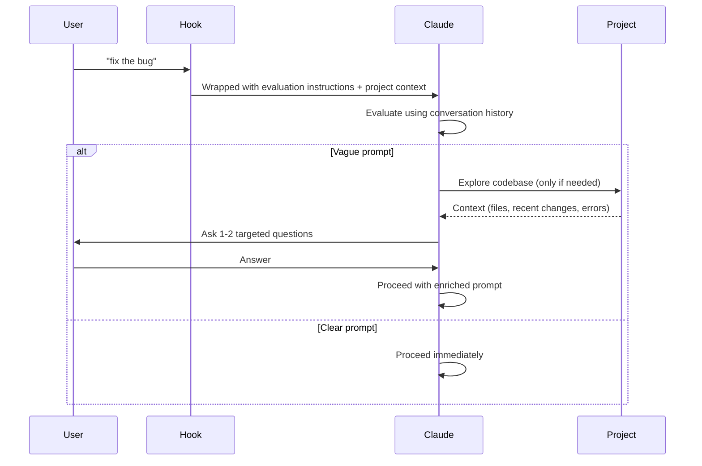

# Prompt Improver Hook

**Status:** ✅ Active
**Location:** `~/.claude/hooks/improve-prompt.py`
**Source:** Internalized from [severity1/claude-code-prompt-improver](https://github.com/severity1/claude-code-prompt-improver)
**License:** MIT

## Overview

The Prompt Improver Hook intercepts user prompts and evaluates if they need enrichment before execution. It uses Claude's `AskUserQuestion` tool to ask targeted clarifying questions for vague prompts, reducing back-and-forth and improving first-attempt outcomes.

**Key principle:** Trust user intent by default. Only intervene when genuinely unclear.

## How It Works



## Usage

### Normal Prompts (Evaluated)

```bash
# Vague prompts may trigger clarification
claude "fix the bug"
claude "update the engine"
claude "add validation"
claude "run the tests"

# Clear prompts proceed immediately
claude "Fix TypeError in client/src/components/Map.tsx line 127"
claude "Add Zod validation to /server/routes/funds.ts for fundId parameter"
```

### Bypass Prefixes

```bash
# * = Explicit bypass (skip evaluation)
claude "* just try adding dark mode"

# / = Slash commands (automatic bypass)
claude "/test-smart"
claude "/log-change"

# # = Memorize feature (automatic bypass)
claude "# remember to use rg over grep"

# Command patterns (automatic bypass)
claude "npm run test:quick"
claude "git status"
claude "docker ps"
```

## Project-Specific Enhancements

Our internalized version includes custom context about:

### Architecture Layers
- Frontend: `/client` (React, TypeScript, Vite)
- Backend: `/server` (Express, Node.js, BullMQ)
- Shared: `/shared` (Types, Drizzle schemas, Zod validation)

### Key Engines
- **ReserveEngine** - Reserve allocation calculations
- **PacingEngine** - Investment pacing analysis
- **CohortEngine** - Cohort-based portfolio analytics

### Domain-Specific Patterns
- **Waterfall types:** AMERICAN vs EUROPEAN
- **Waterfall helpers:** `applyWaterfallChange()`, `changeWaterfallType()`
- **Location:** `client/src/lib/waterfall.ts`

### Custom Commands
- `/test-smart`, `/fix-auto`, `/deploy-check`, `/perf-guard`, `/dev-start`
- `/log-change`, `/log-decision`, `/create-cheatsheet`

## Examples

### Example 1: Vague Domain Prompt

**Input:**
```bash
claude "fix the waterfall bug"
```

**Hook Behavior:**
```
Prompt Improver Hook seeking clarification:

Which waterfall implementation needs fixing?
  ○ AMERICAN waterfall (client/src/lib/waterfall.ts:applyWaterfallChange)
  ○ EUROPEAN waterfall (client/src/lib/waterfall.ts:changeWaterfallType)
  ○ Waterfall validation schema (shared/schemas/waterfall.ts)
  ○ Test suite (client/src/lib/__tests__/waterfall.test.ts)
  ○ Other (please specify file/function)
```

### Example 2: Clear Technical Prompt

**Input:**
```bash
claude "Fix hurdle clamping in applyWaterfallChange at line 42 to ensure [0,1] range"
```

**Hook Behavior:** Proceeds immediately (no questions)

### Example 3: Engine Disambiguation

**Input:**
```bash
claude "optimize the calculation"
```

**Hook Behavior:**
```
Prompt Improver Hook seeking clarification:

Which engine's calculations need optimization?
  ○ ReserveEngine (client/src/core/reserve-engine/)
  ○ PacingEngine (client/src/core/pacing-engine/)
  ○ CohortEngine (client/src/core/cohort-engine/)
  ○ Other calculation (please specify)
```

### Example 4: Test Scope Clarification

**Input:**
```bash
claude "run the tests"
```

**Hook Behavior:**
```
Prompt Improver Hook seeking clarification:

Which test suite should run?
  ○ npm test (full suite with Vitest)
  ○ npm run test:quick (skip API tests)
  ○ npm run test:ui (interactive dashboard)
  ○ npm run test:run (CI mode, single run)
  ○ /test-smart (intelligent selection based on changes)
```

## Token Overhead

**Per wrapped prompt:** ~350-400 tokens (includes project context)

**30-message session:** ~10.5k tokens (~5.25% of 200k context window)

**Trade-off:** Small overhead for significantly better first-attempt results and fewer clarification rounds.

## Analytics & Logging

All prompt evaluations are logged to `~/.claude/logs/prompt-improvements.jsonl`:

```jsonl
{"timestamp":"2025-10-18T12:34:56.789Z","project":"Updog (Press On Ventures VC Fund Modeling)","prompt_preview":"fix the waterfall bug","prompt_length":21,"wrapped":true,"bypassed":false}
{"timestamp":"2025-10-18T12:35:12.456Z","project":"Updog (Press On Ventures VC Fund Modeling)","prompt_preview":"npm run test:quick","prompt_length":19,"wrapped":false,"bypassed":true}
```

### Analyzing Logs

```bash
# Count how many prompts needed wrapping
jq 'select(.wrapped == true) | .prompt_preview' ~/.claude/logs/prompt-improvements.jsonl | wc -l

# Find most common vague prompt patterns
jq -r 'select(.wrapped == true) | .prompt_preview' ~/.claude/logs/prompt-improvements.jsonl | sort | uniq -c | sort -rn | head -10

# Identify documentation gaps
# If certain prompts consistently trigger clarification, add them to CLAUDE.md
```

## Configuration

### Disable Logging

Edit `~/.claude/hooks/improve-prompt.py`:

```python
LOG_ENABLED = False  # Change to False
```

### Customize Project Context

Edit the `PROJECT_CONTEXT` section in `~/.claude/hooks/improve-prompt.py` to add:
- New engines or modules
- Additional slash commands
- Domain-specific terminology
- Common file paths

### Add Custom Bypass Patterns

Edit the `COMMAND_PATTERNS` list:

```python
COMMAND_PATTERNS = [
    # ... existing patterns ...
    "my-custom-cli ",
    "special-command "
]
```

## Troubleshooting

| Issue | Solution |
|-------|----------|
| Hook not running | Check `~/.claude/settings.json` has correct path |
| Python errors | Ensure Python 3 installed: `python3 --version` |
| Over-questioning | Review logs, adjust `PROJECT_CONTEXT` for more specificity |
| Under-questioning | Reduce bypass patterns, verify hook is active |
| Can't find log file | Check `~/.claude/logs/` directory exists |

### Verify Hook is Active

```bash
# Check settings
cat ~/.claude/settings.json

# Test hook manually
echo '{"prompt":"fix the bug"}' | python3 ~/.claude/hooks/improve-prompt.py

# Expected output: Wrapped prompt with evaluation instructions
```

## Design Philosophy

1. **Trust user intent** - Most prompts pass through unchanged
2. **Conversation-aware** - Uses history before exploring codebase
3. **Minimal intervention** - Max 1-2 questions when genuinely unclear
4. **Project-specific** - Enhanced with domain knowledge about VC modeling
5. **Transparent** - Evaluation visible in conversation (not hidden)
6. **Non-pedantic** - Only asks when truly necessary

## Benefits

**Time saved:**
- Eliminates 5-10 clarification rounds per week
- Faster first-attempt success rate
- Less context-switching

**Quality improvement:**
- Better initial context for complex domain tasks
- Fewer misunderstood requirements
- More precise file/function targeting

**Documentation insights:**
- Logs reveal where CLAUDE.md needs expansion
- Identifies common ambiguous patterns
- Guides cheatsheet creation priorities

## When to Bypass

Use bypass prefixes when:
- **Exploratory work:** "* explore different approaches to validation"
- **Iterative refinement:** "* try that again with a different approach"
- **Quick commands:** `/test-smart` (already specific)
- **Shell commands:** `npm run build` (no evaluation needed)

## Future Enhancements

Potential improvements tracked in logs:

1. **Dynamic context loading** - Read CLAUDE.md automatically
2. **Pattern learning** - Train on historical prompt→clarification pairs
3. **Multi-language support** - Shell script version for non-Python environments
4. **Integration with /log-decision** - Auto-suggest when to document new patterns

## Related Documentation

- [CLAUDE.md](../CLAUDE.md) - Core architecture & conventions
- [claude-commands.md](./claude-commands.md) - Custom slash commands
- [memory-patterns.md](./memory-patterns.md) - Memory management strategies
- [DECISIONS.md](../DECISIONS.md#ai-orchestrator-for-multi-model-code-review) - Internalization rationale

## References

- **Original project:** [severity1/claude-code-prompt-improver](https://github.com/severity1/claude-code-prompt-improver)
- **License:** MIT
- **Internalized:** 2025-10-18
- **Reason:** Security & control (see [DECISIONS.md](../DECISIONS.md) - AI Orchestrator decision)
