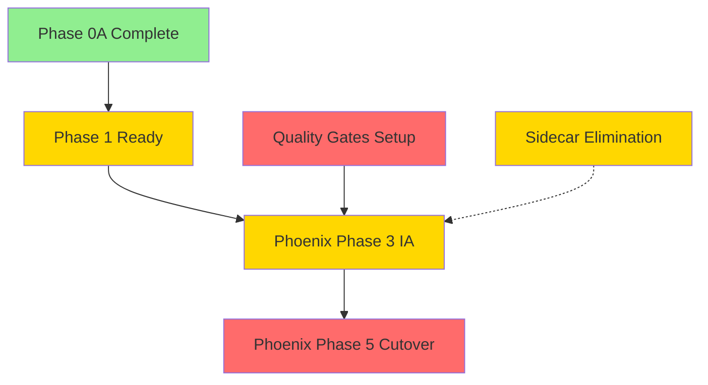

# Cross-Document Synthesis

<!-- Breadcrumb Navigation -->

[← INDEX](00-INDEX.md) | [Next Section →](06-ACTION-PLAN.md)

**Read Time**: ~2 minutes

**Date**: 2025-11-26 **Status**: DRAFT **Source**:
STRATEGIC-DOCUMENT-REVIEW-2025-11-26.md (lines 586-665)

---

## Cross-Document Synthesis

### Pattern: Temporal Displacement

All three documents exhibit the same pattern:

1. **Claims** written as present-tense facts
2. **Reality** lags by 2-3 weeks
3. **Timestamps** don't match git modification dates
4. **Status** claims contradict commit history

**Example**:

- [PROJECT-UNDERSTANDING](03-PROJECT-UNDERSTANDING-ANALYSIS.md#critical-gaps):
  "Last Updated: Nov 10" (actually Nov 17)
- [Phoenix Strategy](04-PHOENIX-STRATEGY-ANALYSIS.md#phase-1-documentation-excellence-claimed-90-complete):
  "Phase 0A: 100% complete" (was 50% on Nov 14, 100% by Nov 17)
- [Phase 1 Plan](02-PHASE1-PLAN-ANALYSIS.md): Created Nov 20, references Phase
  0A as "100% COMPLETE (verified Nov 18)"

**Why This Matters**: New sessions will load outdated context and make decisions
based on false premises.

### Pattern: Optimistic Time Estimates

All three documents systematically underestimate effort:

| Task              | Claimed   | Realistic   | Variance | Source                                                                                          |
| ----------------- | --------- | ----------- | -------- | ----------------------------------------------------------------------------------------------- |
| Phase 1 execution | 12-16 hrs | 20-28 hrs   | +75%     | [Phase 1 Analysis](02-PHASE1-PLAN-ANALYSIS.md#5-time-estimate-optimism)                         |
| Sidecar migration | 3-5 days  | 1-2 weeks   | +180%    | [Phoenix Analysis](04-PHOENIX-STRATEGY-ANALYSIS.md#phase-2-sidecar-elimination-planned-q1-2026) |
| Phoenix timeline  | 21 weeks  | 25-26 weeks | +24%     | [Timeline Slippage](04-PHOENIX-STRATEGY-ANALYSIS.md#timeline-slippage-analysis)                 |

**Driver**: Plans written during "peak optimism" phase, before execution
friction emerges.

### Pattern: Documentation ≠ Implementation

**Phoenix Phase 1**
([Documentation Excellence](04-PHOENIX-STRATEGY-ANALYSIS.md#phase-1-documentation-excellence-claimed-90-complete)):

- ✅ 5 modules documented at 96-99% quality
- ❌ Code implementations not verified against docs
- **Assumption**: "Gold-standard docs = production-ready code"
- **Reality**: Docs describe INTENT, code shows REALITY

**Recommendation**: Add "Implementation Verification" phase between doc writing
and claiming "complete".

### Dependency Chain Analysis

**Legend**:

- 🟢 Green: COMPLETE (Phase 0A)
- 🟡 Yellow: READY but not started (Phase 1, Sidecar, IA)
- 🔴 Red: BLOCKED (Cutover, Quality Gates)

**Critical Path**:

1. Quality Gates Setup (BLOCKING Phase 3)
2. Phase 1 Execution (READY)
3. IA Consolidation (DELAYED +3 weeks)
4. Production Cutover (DELAYED +5 weeks)

### Contradictions Matrix

| Document A            | Document B | Claim A           | Claim B          | Truth                            | Analysis                                                                           |
| --------------------- | ---------- | ----------------- | ---------------- | -------------------------------- | ---------------------------------------------------------------------------------- |
| PROJECT-UNDERSTANDING | Phoenix    | Phase 0A: 15%     | Phase 0A: 100%   | **100%** (git verified)          | [Details](03-PROJECT-UNDERSTANDING-ANALYSIS.md#contradictions-with-other-docs)     |
| Phase 1 Plan          | Phoenix    | Phoenix Week 5-6  | Phoenix Week 1-6 | **Week 1-6** (Phoenix correct)   | [Details](02-PHASE1-PLAN-ANALYSIS.md#3-phoenix-alignment-confusion)                |
| PROJECT-UNDERSTANDING | Filesystem | 15+ packages      | 11 packages      | **11** (filesystem verified)     | [Details](03-PROJECT-UNDERSTANDING-ANALYSIS.md#-partially-accurate-sections-60-85) |
| Phoenix               | Reality    | Week 1-6 IA start | Week 51-56 start | **Week 51-56** (3-week slippage) | [Details](04-PHOENIX-STRATEGY-ANALYSIS.md#timeline-slippage-analysis)              |
