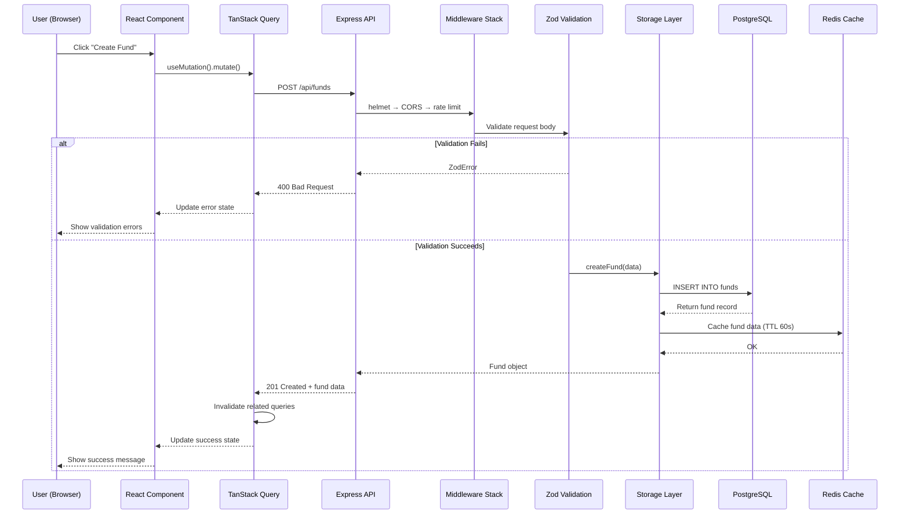
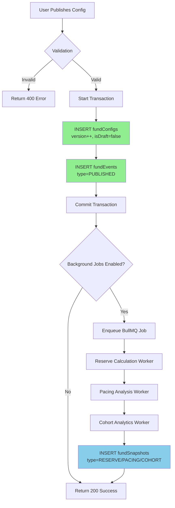
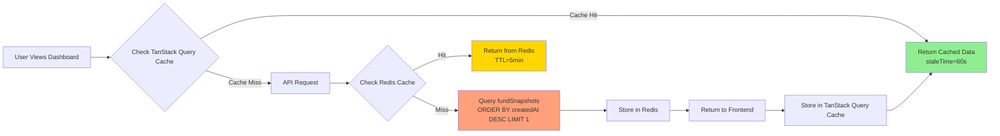
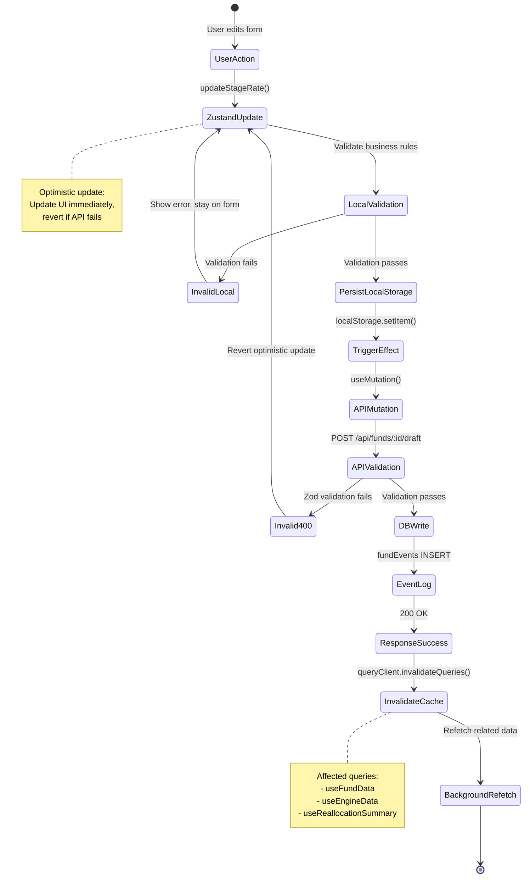
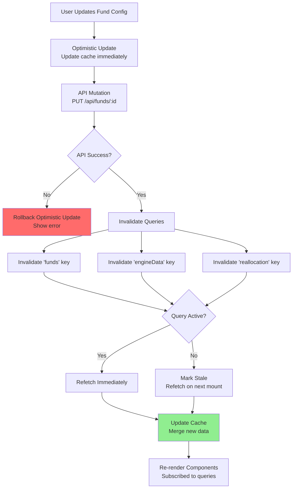

# Data Flow Architecture - Visual Overview

**Version:** 1.0.0 **Last Updated:** 2025-11-06 **Purpose:** Visual
representation of data flow across the entire stack

---

## Table of Contents

1. [Request-Response Flow](#request-response-flow)
2. [CQRS Pattern Flow](#cqrs-pattern-flow)
3. [State Update Flow](#state-update-flow)
4. [Validation Flow](#validation-flow)
5. [Cache Invalidation Flow](#cache-invalidation-flow)

---

## Request-Response Flow

### Complete Stack Traversal



**Key Points:**

- **Middleware stack executes sequentially** (helmet → CORS → rate limiting →
  request ID → body parser)
- **Validation happens before business logic** (fail fast)
- **Cache write is fire-and-forget** (doesn't block response)
- **TanStack Query handles cache invalidation** (automatic refetch)

**File References:**

- Middleware: [server/routes.ts:15-25](../../server/routes.ts#L15-L25)
- Validation:
  [server/validators/fundSchema.ts:10-45](../../server/validators/fundSchema.ts#L10-L45)
- Storage: [server/storage.ts:458-471](../../server/storage.ts#L458-L471)

---

## CQRS Pattern Flow

### Write Path (Command Side)



**Write Path Characteristics:**

- ✅ **Synchronous:** Config save + event log (< 50ms)
- ✅ **Transactional:** All-or-nothing commit
- ✅ **Asynchronous:** Background calculations don't block user

**File References:**

- Write path:
  [server/routes/fund-config.ts:46-120](../../server/routes/fund-config.ts#L46-L120)
- Worker:
  [server/workers/reserve-worker.ts:15-40](../../server/workers/reserve-worker.ts#L15-L40)

---

### Read Path (Query Side)



**Read Path Characteristics:**

- ✅ **3-tier caching:** Browser (TanStack Query) → Redis → PostgreSQL
- ✅ **Sub-second response:** 95% of requests < 200ms
- ✅ **Eventually consistent:** Background workers update snapshots
  asynchronously

**Cache TTLs:**

- **TanStack Query:** 60s staleTime (refetch in background if stale)
- **Redis:** 5 min TTL (balance freshness vs load)
- **PostgreSQL:** Source of truth (always consistent)

**File References:**

- Read path:
  [server/routes/funds.ts:120-145](../../server/routes/funds.ts#L120-L145)
- TanStack Query config:
  [client/src/hooks/use-fund-data.ts:15-30](../../client/src/hooks/use-fund-data.ts#L15-L30)

---

## State Update Flow

### Frontend State Management



**State Synchronization Strategy:**

1. **Optimistic Update** (0ms latency)

   ```typescript
   // Zustand store immediately updates
   set((state) => ({
     fund: { ...state.fund, stageRate: newValue },
   }));
   ```

2. **Persist to API** (50-200ms)

   ```typescript
   await fundMutation.mutateAsync({ stageRate: newValue });
   ```

3. **Invalidate Cache** (automatic)

   ```typescript
   queryClient.invalidateQueries(['funds', fundId]);
   // TanStack Query refetches in background
   ```

4. **Rollback on Error** (if API fails)
   ```typescript
   set((state) => ({
     fund: previousState, // Revert to pre-update state
   }));
   ```

**File References:**

- Zustand store:
  [client/src/stores/useFundStore.ts:45-120](../../client/src/stores/useFundStore.ts#L45-L120)
- Mutation hooks:
  [client/src/hooks/use-fund-data.ts:60-85](../../client/src/hooks/use-fund-data.ts#L60-L85)

---

## Validation Flow

### Multi-Layer Validation Strategy

```mermaid
flowchart TD
    A[User Input] --> B[Client-Side Validation]

    B --> C{React Hook Form<br/>+ Zod Schema}
    C -->|Invalid| D[Show Inline Errors<br/>Block Submit]
    C -->|Valid| E[Enable Submit Button]

    E --> F[API Request<br/>POST /api/funds]

    F --> G[Route Handler Validation]
    G --> H{Zod Parse<br/>fundSchema}

    H -->|ZodError| I[Return 400<br/>{ errors: [...] }]
    H -->|Valid| J[Business Logic Validation]

    J --> K{Custom Rules<br/>e.g., stage percentages ≤ 100}
    K -->|Invalid| I
    K -->|Valid| L[Database Write]

    L --> M{Drizzle Schema<br/>NOT NULL, CHECK constraints}
    M -->|Constraint Violation| N[Return 500<br/>Database error]
    M -->|Valid| O[Success Response]

    style D fill:#FF6B6B
    style I fill:#FF6B6B
    style N fill:#FF6B6B
    style O fill:#90EE90

    subgraph Frontend
        A
        B
        C
        D
        E
    end

    subgraph Backend
        F
        G
        H
        I
        J
        K
        L
        M
        N
        O
    end
```

**Validation Layers:**

| Layer              | Purpose                             | Example                                  |
| ------------------ | ----------------------------------- | ---------------------------------------- |
| **Client (React)** | UX feedback, prevent invalid submit | `stage.graduate ≥ 0`                     |
| **API (Zod)**      | Type safety, schema enforcement     | `z.number().min(0).max(1)`               |
| **Business Logic** | Domain rules                        | `sum(stage.graduate + stage.exit) ≤ 100` |
| **Database**       | Data integrity                      | `NOT NULL`, `CHECK` constraints          |

**Error Propagation:**

```typescript
// Frontend (client/src/components/investment/investment-editor.tsx:85-95)
const schema = z.object({
  graduate: z.number().min(0).max(1),  // Client validation
  exit: z.number().min(0).max(1)
});

// Backend (server/validators/fundSchema.ts:45-55)
const fundSchema = z.object({
  stages: z.array(z.object({
    graduate: z.number().min(0).max(1),  // API validation (duplicate)
    exit: z.number().min(0).max(1)
  })).refine(stages => {
    // Business logic validation
    return stages.every(s => s.graduate + s.exit <= 1);
  }, { message: "Stage percentages exceed 100%" })
});

// Database (shared/schema.ts:120-125)
CREATE TABLE strategy_stages (
  graduate NUMERIC CHECK (graduate >= 0 AND graduate <= 1),  -- Database constraint
  exit NUMERIC CHECK (exit >= 0 AND exit <= 1)
);
```

**File References:**

- Client validation:
  [client/src/lib/validation.ts:15-40](../../client/src/lib/validation.ts#L15-L40)
- API validation:
  [server/validators/fundSchema.ts:45-120](../../server/validators/fundSchema.ts#L45-L120)
- Database schema: [shared/schema.ts:95-130](../../shared/schema.ts#L95-L130)

---

## Cache Invalidation Flow

### TanStack Query Cache Management



**Cache Invalidation Strategies:**

### 1. **Write-Through Invalidation** (Most Common)

Used when mutation changes data that queries depend on.

```typescript
// client/src/hooks/use-fund-data.ts:75-95
const updateFund = useMutation({
  mutationFn: (data) => api.put(`/funds/${fundId}`, data),
  onSuccess: () => {
    // Invalidate all related queries
    queryClient.invalidateQueries(['funds', fundId]);
    queryClient.invalidateQueries(['engineData', fundId]);
    queryClient.invalidateQueries(['dashboardSummary', fundId]);
  },
});
```

**Affected Queries:**

- `useFundData(fundId)` - Refetches fund metadata
- `useEngineData(fundId)` - Refetches reserve/pacing calculations
- `useDashboardSummary(fundId)` - Refetches KPIs

### 2. **Optimistic Update** (Instant UX)

Used for immediate feedback before API responds.

```typescript
// client/src/hooks/use-reallocation.ts:45-70
const commitReallocation = useMutation({
  mutationFn: api.commitReallocation,
  onMutate: async (newAllocations) => {
    // Cancel in-flight queries
    await queryClient.cancelQueries(['allocations']);

    // Snapshot current cache
    const previous = queryClient.getQueryData(['allocations']);

    // Optimistically update cache
    queryClient.setQueryData(['allocations'], newAllocations);

    return { previous }; // Return rollback data
  },
  onError: (err, vars, context) => {
    // Rollback on error
    queryClient.setQueryData(['allocations'], context.previous);
  },
  onSettled: () => {
    // Refetch to sync with server
    queryClient.invalidateQueries(['allocations']);
  },
});
```

**Flow:**

1. **onMutate:** Update cache immediately (0ms perceived latency)
2. **API call:** Send request to backend (50-200ms)
3. **onError:** Rollback if API fails
4. **onSettled:** Refetch to ensure consistency

### 3. **Time-Based Invalidation** (Background Refresh)

Used for data that changes infrequently.

```typescript
// client/src/hooks/use-fund-data.ts:15-30
const { data: fund } = useQuery({
  queryKey: ['funds', fundId],
  queryFn: () => api.getFund(fundId),
  staleTime: 60_000, // Consider fresh for 60s
  gcTime: 5 * 60_000, // Keep in cache for 5min
  refetchOnWindowFocus: true, // Refetch when user returns to tab
  refetchInterval: 5 * 60_000, // Background refresh every 5min (if active)
});
```

**Staleness States:**

- **Fresh (0-60s):** Use cache, no refetch
- **Stale (60s-5min):** Use cache, refetch in background if component mounted
- **Garbage Collected (>5min):** Remove from cache, fetch on next access

### 4. **Selective Invalidation** (Performance Optimization)

Used to avoid refetching unrelated data.

```typescript
// Bad: Invalidates ALL fund queries
queryClient.invalidateQueries(['funds']);

// Good: Only invalidates specific fund
queryClient.invalidateQueries(['funds', fundId]);

// Best: Only invalidates specific data type for specific fund
queryClient.invalidateQueries(['funds', fundId, 'reserves']);
```

**Cache Key Hierarchy:**

```
['funds'] (root)
  ├─ ['funds', fundId] (specific fund)
  │    ├─ ['funds', fundId, 'reserves']
  │    ├─ ['funds', fundId, 'pacing']
  │    └─ ['funds', fundId, 'cohorts']
  └─ ['funds', 'list'] (all funds)
```

**File References:**

- Cache invalidation:
  [client/src/hooks/use-fund-data.ts:75-110](../../client/src/hooks/use-fund-data.ts#L75-L110)
- Optimistic updates:
  [client/src/hooks/use-reallocation.ts:45-85](../../client/src/hooks/use-reallocation.ts#L45-L85)
- Cache configuration:
  [client/src/lib/queryClient.ts:10-25](../../client/src/lib/queryClient.ts#L10-L25)

---

## Key Takeaways

### Performance Characteristics

| Operation               | Latency   | Throughput   | Notes                    |
| ----------------------- | --------- | ------------ | ------------------------ |
| **Cache Hit (Browser)** | < 1ms     | Unlimited    | TanStack Query in-memory |
| **Cache Hit (Redis)**   | 3-10ms    | 10,000 req/s | Network RTT              |
| **Database Read**       | 50-200ms  | 500 req/s    | With indexes             |
| **Database Write**      | 100-300ms | 200 req/s    | With transaction         |
| **Background Calc**     | 5-30s     | 10/min       | BullMQ worker            |

### Consistency Models

| Layer                     | Model    | Trade-off                     |
| ------------------------- | -------- | ----------------------------- |
| **Frontend (Optimistic)** | Eventual | Fast UX, risk of rollback     |
| **API (CQRS Write)**      | Strong   | Immediate consistency, slower |
| **Cache (Read)**          | Eventual | Fast reads, slight staleness  |
| **Background Workers**    | Eventual | High throughput, async        |

### When to Use Each Pattern

**Use Optimistic Updates When:**

- ✅ User expects instant feedback (form inputs, toggles)
- ✅ Rollback is acceptable (show error, revert state)
- ✅ Operation is likely to succeed (> 95% success rate)

**Use Write-Through Invalidation When:**

- ✅ Data affects multiple queries (fund update → invalidate reserves + pacing)
- ✅ Consistency is critical (financial calculations)
- ✅ Rollback complexity is high

**Use Background Processing When:**

- ✅ Operation is expensive (Monte Carlo simulation)
- ✅ User doesn't need immediate result (analytics)
- ✅ Async is acceptable (email notifications, reports)

---

## Definition of Done

**Security/Reliability:** All diagrams reviewed for accuracy; no PII in
examples; correlation IDs for tracing **Observability:** Mermaid diagrams render
correctly; sequence diagrams show timing; state machines show error paths
**Performance:** Diagrams load in < 2s; no excessive nesting (max 3 levels);
clear visual hierarchy **Example:** All file references validated with
`node scripts/extract-code-references.mjs` **Ownership:** DRI=architecture team;
next review: 2025-05-06 (after Phase 3 Week 47 completion)

---

**Last Updated:** 2025-11-06 **Contributors:** Phase 3 Documentation Initiative
**Related Docs:** [database/01-overview.md](../database/01-overview.md),
[validation/04-integration.md](../validation/04-integration.md),
[state/01-overview.md](../state/01-overview.md)
