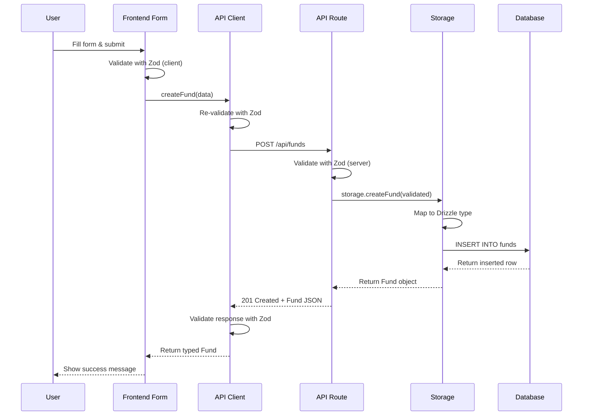
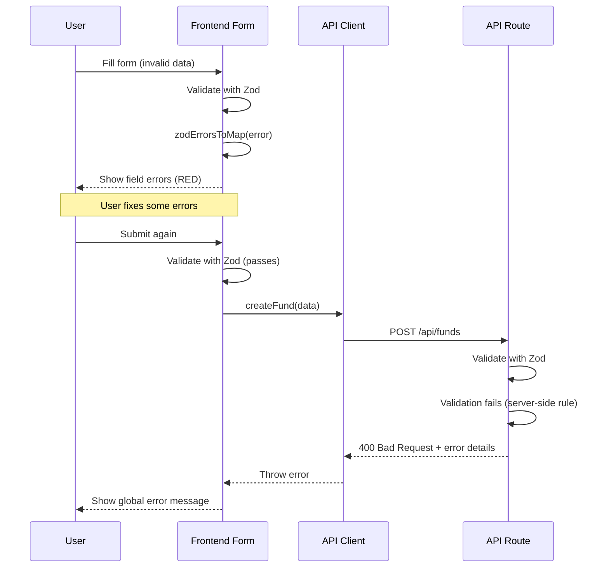

# Cross-Boundary Validation Integration

**Purpose:** Complete validation flows across frontend → backend → database
boundaries. Learn synchronization strategies, schema versioning, cache
invalidation, testing approaches, and troubleshooting.

**Audience:** Developers implementing full-stack features or debugging
cross-boundary validation issues.

---

## Table of Contents

1. [Frontend → Backend](#frontend--backend)
2. [Backend → Database](#backend--database)
3. [Database → Backend → Frontend](#database--backend--frontend)
4. [Schema Versioning](#schema-versioning)
5. [Cache Invalidation](#cache-invalidation)
6. [Testing Strategy](#testing-strategy)
7. [Complete Flow Examples](#complete-flow-examples)
8. [Troubleshooting](#troubleshooting)

---

## Frontend → Backend

### Form Validation → API Request

**Pattern:** Validate on client before submission, re-validate on server

```typescript
// ============================================
// Shared schema (shared/schemas/fund-model.ts)
// ============================================
export const CreateFundSchema = z.object({
  name: z.string().min(1, "Fund name required"),
  size: z.coerce.number().positive("Fund size must be positive"),
  managementFee: z.coerce.number().min(0).max(0.05),
  stageAllocations: z.array(z.object({
    stage: z.string(),
    percentage: z.number().min(0).max(100),
  })).min(1, "At least one stage required"),
}).refine(
  (data) => {
    const total = data.stageAllocations.reduce((sum, a) => sum + a.percentage, 0);
    return Math.abs(total - 100) < 0.01; // Allow rounding error
  },
  {
    message: "Stage allocations must sum to 100%",
    path: ['stageAllocations'],
  }
);

export type CreateFundInput = z.infer<typeof CreateFundSchema>;

// ============================================
// Frontend form (client/src/components/FundForm.tsx)
// ============================================
import { CreateFundSchema, type CreateFundInput } from '@shared/schemas/fund-model';
import { zodErrorsToMap } from '@/lib/validation';

export function FundForm() {
  const [formData, setFormData] = useState<Partial<CreateFundInput>>({});
  const [errors, setErrors] = useState<Record<string, string[]>>({});

  const handleSubmit = async () => {
    // Client-side validation
    const result = CreateFundSchema.safeParse(formData);

    if (!result.success) {
      // Map errors to fields
      const fieldErrors = zodErrorsToMap(result.error);
      setErrors(fieldErrors);
      return;
    }

    // Send validated data to API
    try {
      const fund = await createFund(result.data);
      console.log('Fund created:', fund);
    } catch (error) {
      // Handle API errors
      console.error('API error:', error);
    }
  };

  return (
    <form onSubmit={handleSubmit}>
      <input
        name="name"
        value={formData.name || ''}
        onChange={(e) => setFormData({ ...formData, name: e.target.value })}
      />
      {errors['name'] && <span className="error">{errors['name'][0]}</span>}

      <input
        name="size"
        type="number"
        value={formData.size || ''}
        onChange={(e) => setFormData({ ...formData, size: Number(e.target.value) })}
      />
      {errors['size'] && <span className="error">{errors['size'][0]}</span>}

      <button type="submit">Create Fund</button>
    </form>
  );
}

// ============================================
// API client (client/src/services/funds.ts)
// ============================================
import { CreateFundSchema, type CreateFundInput } from '@shared/schemas/fund-model';

export async function createFund(input: CreateFundInput): Promise<Fund> {
  // Optional: Re-validate before sending (belt-and-suspenders)
  const validated = CreateFundSchema.parse(input);

  const response = await fetch('/api/funds', {
    method: 'POST',
    headers: { 'Content-Type': 'application/json' },
    body: JSON.stringify(validated),
  });

  if (!response.ok) {
    const error = await response.json();
    throw new Error(error.message || 'Failed to create fund');
  }

  return response.json();
}

// ============================================
// Backend route (server/routes/funds.ts)
// ============================================
import { CreateFundSchema } from '@shared/schemas/fund-model';

router.post('/api/funds', async (req, res, next) => {
  try {
    // Server-side validation (REQUIRED - never trust client)
    const parsed = CreateFundSchema.safeParse(req.body);

    if (!parsed.success) {
      return res.status(400).json({
        error: 'Validation error',
        details: parsed.error.format(),
      });
    }

    // Process validated data
    const fund = await storage.createFund(parsed.data);

    res.status(201).json(fund);
  } catch (error) {
    next(error); // Pass to error handler
  }
});
```

**Key points:**

- ✅ **Always validate on server** (client validation is UX, not security)
- ✅ **Use same schema** (`shared/schemas/`) for consistency
- ✅ **safeParse() on server** to avoid uncaught exceptions
- ✅ **HTTP 400 for validation errors** with detailed error format

### Coercion Strategy

**Frontend:** Enable coercion for form inputs

```typescript
// Forms send strings, coerce to correct types
const FormSchema = z.object({
  fundSize: z.coerce.number().positive(), // "100000000" → 100000000
  managementFee: z.coerce.number(), // "0.02" → 0.02
  isEvergreen: z.coerce.boolean(), // "true" → true
});
```

**Backend:** Coercion depends on API contract

```typescript
// If API contract is strict JSON (numbers are numbers)
const StrictSchema = z.object({
  fundSize: z.number().positive(), // No coercion
});

// If API accepts query params (strings)
const CoerceSchema = z.object({
  fundSize: z.coerce.number().positive(), // Coerce from string
});
```

**Real example from codebase:**

```typescript
// server/routes/funds.ts
const FundCalculationDTO = z.object({
  fundSize: z.coerce.number().positive().int().default(100_000_000),
});

// Query params: /api/funds/calculate?fundSize=50000000
// Body JSON: { "fundSize": 50000000 }
// Both work with coercion
```

---

## Backend → Database

### Schema Validation → Drizzle Insert

**Pattern:** Validate with Zod, then map to Drizzle schema

```typescript
// ============================================
// Drizzle schema (shared/schema/index.ts)
// ============================================
import { pgTable, serial, text, numeric, timestamp } from 'drizzle-orm/pg-core';

export const funds = pgTable('funds', {
  id: serial('id').primaryKey(),
  name: text('name').notNull(),
  size: numeric('size', { precision: 20, scale: 2 }).notNull(),
  managementFee: numeric('management_fee', { precision: 5, scale: 4 }),
  createdAt: timestamp('created_at').defaultNow().notNull(),
  updatedAt: timestamp('updated_at').defaultNow().notNull(),
});

export type Fund = typeof funds.$inferSelect;
export type InsertFund = typeof funds.$inferInsert;

// ============================================
// Zod schema (shared/schemas/fund-model.ts)
// ============================================
export const CreateFundSchema = z.object({
  name: z.string().min(1),
  size: z.number().positive(),
  managementFee: z.number().min(0).max(1).optional(),
});

export type CreateFundInput = z.infer<typeof CreateFundSchema>;

// ============================================
// Storage layer (server/storage.ts)
// ============================================
import { db } from './db';
import { funds, type InsertFund } from '@shared/schema';
import {
  CreateFundSchema,
  type CreateFundInput,
} from '@shared/schemas/fund-model';

export class DbStorage {
  async createFund(input: CreateFundInput): Promise<Fund> {
    // Validate input with Zod
    const validated = CreateFundSchema.parse(input);

    // Map to Drizzle insert type
    const insertData: InsertFund = {
      name: validated.name,
      size: validated.size.toString(), // Numeric stored as string in DB
      managementFee: validated.managementFee?.toString(),
    };

    // Insert with Drizzle (type-safe)
    const [fund] = await db.insert(funds).values(insertData).returning();

    return fund;
  }
}
```

**Type mapping considerations:**

| Zod Type      | TypeScript Type  | Database Type   | Mapping                    |
| ------------- | ---------------- | --------------- | -------------------------- |
| `z.string()`  | `string`         | `TEXT`          | Direct                     |
| `z.number()`  | `number`         | `NUMERIC`       | `.toString()`              |
| `z.number()`  | `number`         | `INTEGER`       | Direct (for integers)      |
| `z.date()`    | `Date`           | `TIMESTAMP`     | Direct (pg driver handles) |
| `z.boolean()` | `boolean`        | `BOOLEAN`       | Direct                     |
| `z.enum()`    | `string` (union) | `TEXT` / `ENUM` | Direct                     |

### Validation Before Update

```typescript
// Update schema (partial fields)
export const UpdateFundSchema = CreateFundSchema.partial();

export class DbStorage {
  async updateFund(
    id: number,
    updates: Partial<CreateFundInput>
  ): Promise<Fund> {
    // Validate partial updates
    const validated = UpdateFundSchema.parse(updates);

    // Only update provided fields
    const updateData: Partial<InsertFund> = {};

    if (validated.name !== undefined) {
      updateData.name = validated.name;
    }
    if (validated.size !== undefined) {
      updateData.size = validated.size.toString();
    }
    if (validated.managementFee !== undefined) {
      updateData.managementFee = validated.managementFee.toString();
    }

    // Update with Drizzle
    const [fund] = await db
      .update(funds)
      .set({ ...updateData, updatedAt: new Date() })
      .where(eq(funds.id, id))
      .returning();

    if (!fund) {
      throw new Error(`Fund ${id} not found`);
    }

    return fund;
  }
}
```

### Database Constraint Violations

**Problem:** Validation passes, but database rejects (unique constraints,
foreign keys)

```typescript
try {
  const fund = await db.insert(funds).values(insertData).returning();
} catch (error) {
  // Handle database errors
  if (isDatabaseError(error)) {
    if (error.code === '23505') {
      // Unique constraint violation
      throw new Error('Fund with this name already exists');
    } else if (error.code === '23503') {
      // Foreign key violation
      throw new Error('Referenced entity does not exist');
    }
  }
  throw error; // Re-throw unknown errors
}
```

**Common PostgreSQL error codes:**

- `23505` - Unique violation
- `23503` - Foreign key violation
- `23502` - Not null violation
- `23514` - Check constraint violation

---

## Database → Backend → Frontend

### Query Results → Type-Safe Responses

**Pattern:** Query with Drizzle, validate output, return to frontend

```typescript
// ============================================
// Backend route (server/routes/funds.ts)
// ============================================
import { db } from '../db';
import { funds } from '@shared/schema';
import { FundSchema } from '@shared/schemas/fund-model';

router.get('/api/funds/:id', async (req, res, next) => {
  try {
    const id = Number(req.params.id);

    // Query database
    const fund = await db.select()
      .from(funds)
      .where(eq(funds.id, id))
      .limit(1)
      .then((rows) => rows[0]);

    if (!fund) {
      return res.status(404).json({ error: 'Fund not found' });
    }

    // Optional: Validate output against schema
    const validated = FundSchema.parse(fund);

    res.json(validated);
  } catch (error) {
    next(error);
  }
});

// ============================================
// Frontend API client (client/src/services/funds.ts)
// ============================================
import { FundSchema, type Fund } from '@shared/schemas/fund-model';

export async function getFund(id: number): Promise<Fund> {
  const response = await fetch(`/api/funds/${id}`);

  if (!response.ok) {
    throw new Error('Failed to fetch fund');
  }

  const data = await response.json();

  // Validate response from API
  return FundSchema.parse(data);
}

// ============================================
// Frontend component (client/src/components/FundDetail.tsx)
// ============================================
import { useQuery } from '@tanstack/react-query';
import { getFund } from '@/services/funds';

export function FundDetail({ fundId }: { fundId: number }) {
  const { data: fund, isLoading, error } = useQuery({
    queryKey: ['fund', fundId],
    queryFn: () => getFund(fundId),
  });

  if (isLoading) return <div>Loading...</div>;
  if (error) return <div>Error: {error.message}</div>;

  // fund is type-safe (validated by Zod)
  return (
    <div>
      <h1>{fund.name}</h1>
      <p>Size: ${fund.size.toLocaleString()}</p>
      <p>Management Fee: {(fund.managementFee * 100).toFixed(2)}%</p>
    </div>
  );
}
```

**Key points:**

- ✅ **Frontend validates API responses** (defense against backend bugs)
- ✅ **TanStack Query caches validated data** (type-safe throughout app)
- ✅ **Validation errors caught early** (before rendering)

### Decimal/Numeric Handling

**Problem:** Database returns numeric as string, need to convert

```typescript
// Database query returns:
const fund = {
  id: 1,
  name: 'My Fund',
  size: '100000000.00', // ← String from NUMERIC column
  managementFee: '0.0200',
};

// Zod schema with coercion
const FundSchema = z.object({
  id: z.number(),
  name: z.string(),
  size: z.coerce.number(), // Convert string → number
  managementFee: z.coerce.number(),
});

const validated = FundSchema.parse(fund);
// validated.size === 100000000 (number)
```

**Alternative: Decimal.js for precision**

```typescript
// shared/schemas/decimal-zod.ts
export const ZodDecimal = z
  .union([z.string(), z.number(), z.instanceof(Decimal)])
  .transform((val) => {
    if (val instanceof Decimal) return val;
    return new Decimal(val);
  });

// Usage
const FundSchema = z.object({
  size: ZodDecimal, // Always Decimal, never loses precision
  managementFee: ZodDecimal,
});

type Fund = z.infer<typeof FundSchema>;
// { size: Decimal, managementFee: Decimal }
```

---

## Schema Versioning

### Backward-Compatible Changes

**Safe changes (no migration needed):**

- ✅ Add optional field with default
- ✅ Make required field optional
- ✅ Widen validation (e.g., `max(100)` → `max(200)`)

```typescript
// v1
const FundSchemaV1 = z.object({
  name: z.string(),
  size: z.number(),
});

// v2 (backward compatible)
const FundSchemaV2 = z.object({
  name: z.string(),
  size: z.number(),
  currency: z.enum(['USD', 'EUR']).default('USD'), // ← New optional field
});

// v1 data still valid
FundSchemaV2.parse({ name: 'Fund I', size: 100_000_000 });
// Result: { name: "Fund I", size: 100000000, currency: "USD" }
```

### Breaking Changes

**Unsafe changes (require migration):**

- ❌ Remove field
- ❌ Rename field
- ❌ Make optional field required
- ❌ Tighten validation (e.g., `max(200)` → `max(100)`)

**Migration strategy:**

```typescript
// v1 schema
const FundSchemaV1 = z.object({
  fundSize: z.number(), // Old field name
});

// v2 schema
const FundSchemaV2 = z.object({
  size: z.number(), // Renamed field
});

// Migration function
function migrateFundV1toV2(v1Data: FundV1): FundV2 {
  return {
    size: v1Data.fundSize, // Map old field to new
  };
}

// Backend handles both versions
router.post('/api/funds', async (req, res) => {
  const version = req.header('API-Version') || 'v2';

  let validated: FundV2;

  if (version === 'v1') {
    const v1Data = FundSchemaV1.parse(req.body);
    validated = migrateFundV1toV2(v1Data);
  } else if (version === 'v2') {
    validated = FundSchemaV2.parse(req.body);
  } else {
    return res.status(400).json({ error: 'Unsupported API version' });
  }

  // Process v2 data
  const fund = await createFund(validated);
  res.json(fund);
});
```

### Schema Evolution Pattern

**File organization:**

```
shared/schemas/
├── fund-model-v1.ts      # Legacy schema (deprecated)
├── fund-model-v2.ts      # Current schema
├── fund-model.ts         # Re-exports latest (v2)
└── migrations/
    └── fund-v1-to-v2.ts  # Migration logic
```

**Latest schema re-export:**

```typescript
// shared/schemas/fund-model.ts
export * from './fund-model-v2';

// Consumers always import from base file
import { FundSchema } from '@shared/schemas/fund-model';
```

---

## Cache Invalidation

### When Validation Changes Require Cache Clear

**Scenario:** Schema validation rules change, cached data may be invalid

**Example:**

```typescript
// Before: Loose validation
const FundSchema = z.object({
  managementFee: z.number(), // Any number
});

// After: Strict validation
const FundSchema = z.object({
  managementFee: z.number().min(0).max(0.05), // 0-5% only
});

// Cached data with managementFee=0.10 now invalid!
```

**Solution:** Cache versioning

```typescript
// client/src/services/funds.ts
const CACHE_VERSION = 'v2'; // Increment on schema changes

export async function getFund(id: number): Promise<Fund> {
  const cacheKey = `fund:${id}:${CACHE_VERSION}`;

  // Check cache
  const cached = localStorage.getItem(cacheKey);
  if (cached) {
    try {
      const data = JSON.parse(cached);
      return FundSchema.parse(data); // Re-validate cached data
    } catch {
      // Invalid, fetch fresh
      localStorage.removeItem(cacheKey);
    }
  }

  // Fetch from API
  const fund = await fetchFundFromApi(id);
  localStorage.setItem(cacheKey, JSON.stringify(fund));
  return fund;
}
```

**TanStack Query integration:**

```typescript
// client/src/services/funds.ts
const QUERY_VERSION = 'v2';

export const fundQueryKey = (id: number) => ['fund', id, QUERY_VERSION];

export function useFund(id: number) {
  return useQuery({
    queryKey: fundQueryKey(id),
    queryFn: () => getFund(id),
    staleTime: 5 * 60 * 1000, // 5 minutes
  });
}

// To invalidate after schema change:
queryClient.invalidateQueries({ queryKey: ['fund'] }); // Clear all funds
```

### Validation Error Handling

**Problem:** Cached data fails validation after schema update

```typescript
// Wrapper with fallback
export async function getFund(id: number): Promise<Fund> {
  const response = await fetch(`/api/funds/${id}`);
  const data = await response.json();

  try {
    // Try to validate with latest schema
    return FundSchema.parse(data);
  } catch (error) {
    console.warn('Validation failed, fetching fresh data', error);

    // Force refresh from server
    const freshResponse = await fetch(`/api/funds/${id}`, {
      cache: 'no-cache',
    });
    const freshData = await freshResponse.json();

    return FundSchema.parse(freshData); // Must be valid now
  }
}
```

---

## Testing Strategy

### Unit Tests: Schema Validation

```typescript
// tests/unit/schemas/fund-schema.test.ts
import { describe, it, expect } from 'vitest';
import { CreateFundSchema } from '@shared/schemas/fund-model';

describe('CreateFundSchema', () => {
  it('accepts valid fund data', () => {
    const validData = {
      name: 'Test Fund',
      size: 100_000_000,
      managementFee: 0.02,
      stageAllocations: [
        { stage: 'seed', percentage: 50 },
        { stage: 'series_a', percentage: 50 },
      ],
    };

    const result = CreateFundSchema.safeParse(validData);
    expect(result.success).toBe(true);
  });

  it('rejects invalid fund size', () => {
    const invalidData = {
      name: 'Test Fund',
      size: -100, // ❌ Negative
      managementFee: 0.02,
      stageAllocations: [{ stage: 'seed', percentage: 100 }],
    };

    const result = CreateFundSchema.safeParse(invalidData);
    expect(result.success).toBe(false);

    if (!result.success) {
      expect(result.error.issues[0].message).toContain('positive');
    }
  });

  it('rejects stage allocations not summing to 100%', () => {
    const invalidData = {
      name: 'Test Fund',
      size: 100_000_000,
      managementFee: 0.02,
      stageAllocations: [
        { stage: 'seed', percentage: 50 },
        { stage: 'series_a', percentage: 40 }, // Total: 90%
      ],
    };

    const result = CreateFundSchema.safeParse(invalidData);
    expect(result.success).toBe(false);

    if (!result.success) {
      expect(result.error.issues[0].message).toContain('sum to 100%');
    }
  });
});
```

### Integration Tests: API Validation

```typescript
// tests/integration/funds-api.test.ts
import { describe, it, expect } from 'vitest';
import request from 'supertest';
import { app } from '@/server/app';

describe('POST /api/funds', () => {
  it('creates fund with valid data', async () => {
    const validData = {
      name: 'Test Fund',
      size: 100_000_000,
      managementFee: 0.02,
      stageAllocations: [{ stage: 'seed', percentage: 100 }],
    };

    const response = await request(app)
      .post('/api/funds')
      .send(validData)
      .expect(201);

    expect(response.body).toHaveProperty('id');
    expect(response.body.name).toBe('Test Fund');
  });

  it('returns 400 for invalid data', async () => {
    const invalidData = {
      name: '', // ❌ Empty name
      size: -100, // ❌ Negative size
    };

    const response = await request(app)
      .post('/api/funds')
      .send(invalidData)
      .expect(400);

    expect(response.body.error).toBe('Validation error');
    expect(response.body.details).toBeDefined();
  });

  it('enforces stage allocation sum constraint', async () => {
    const invalidData = {
      name: 'Test Fund',
      size: 100_000_000,
      managementFee: 0.02,
      stageAllocations: [
        { stage: 'seed', percentage: 60 },
        { stage: 'series_a', percentage: 50 }, // Total: 110%
      ],
    };

    const response = await request(app)
      .post('/api/funds')
      .send(invalidData)
      .expect(400);

    expect(response.body.details).toContain('sum to 100%');
  });
});
```

### E2E Tests: Full Validation Flow

```typescript
// tests/e2e/fund-creation.spec.ts
import { test, expect } from '@playwright/test';

test('creates fund with valid allocations', async ({ page }) => {
  await page.goto('/funds/new');

  // Fill form
  await page.fill('[name="name"]', 'E2E Test Fund');
  await page.fill('[name="size"]', '100000000');
  await page.fill('[name="managementFee"]', '0.02');

  // Add stage allocation
  await page.click('button:has-text("Add Stage")');
  await page.selectOption('[name="stageAllocations[0].stage"]', 'seed');
  await page.fill('[name="stageAllocations[0].percentage"]', '100');

  // Submit
  await page.click('button:has-text("Create Fund")');

  // Verify success
  await expect(page.locator('text=Fund created successfully')).toBeVisible();
});

test('shows validation error for invalid allocation', async ({ page }) => {
  await page.goto('/funds/new');

  // Fill form with invalid data
  await page.fill('[name="name"]', 'E2E Test Fund');
  await page.fill('[name="size"]', '100000000');

  // Add allocations that don't sum to 100%
  await page.click('button:has-text("Add Stage")');
  await page.selectOption('[name="stageAllocations[0].stage"]', 'seed');
  await page.fill('[name="stageAllocations[0].percentage"]', '50');

  await page.click('button:has-text("Add Stage")');
  await page.selectOption('[name="stageAllocations[1].stage"]', 'series_a');
  await page.fill('[name="stageAllocations[1].percentage"]', '40'); // Total: 90%

  // Submit
  await page.click('button:has-text("Create Fund")');

  // Verify error displayed
  await expect(page.locator('text=must sum to 100%')).toBeVisible();
});
```

---

## Complete Flow Examples

### Example 1: Fund Creation (Happy Path)



**Code flow:**

1. **Frontend validation**: `CreateFundSchema.safeParse(formData)`
2. **API client**: `createFund(validated)` → `POST /api/funds`
3. **Backend validation**: `CreateFundSchema.safeParse(req.body)`
4. **Storage layer**: Map to Drizzle `InsertFund` type
5. **Database insert**: `db.insert(funds).values(insertData).returning()`
6. **Response validation**: `FundSchema.parse(dbResult)`
7. **Frontend caching**: TanStack Query caches validated data

### Example 2: Validation Error (Unhappy Path)



**Error handling:**

1. **Frontend catches client errors**: Display field-specific messages
2. **Backend catches server errors**: Return HTTP 400 with details
3. **Frontend catches API errors**: Display global error or map to fields

### Example 3: Data Update Flow

```typescript
// ============================================
// Complete update flow
// ============================================

// Frontend component
export function EditFundForm({ fundId }: { fundId: number }) {
  const { data: fund } = useFund(fundId); // Fetch current data
  const [formData, setFormData] = useState(fund);

  const handleUpdate = async () => {
    // Only send changed fields
    const changes: Partial<CreateFundInput> = {};
    if (formData.name !== fund.name) changes.name = formData.name;
    if (formData.size !== fund.size) changes.size = formData.size;

    // Validate changes
    const result = UpdateFundSchema.safeParse(changes);
    if (!result.success) {
      setErrors(zodErrorsToMap(result.error));
      return;
    }

    // Send to API
    await updateFund(fundId, result.data);

    // Invalidate cache
    queryClient.invalidateQueries({ queryKey: ['fund', fundId] });
  };
}

// API client
export async function updateFund(
  id: number,
  updates: Partial<CreateFundInput>
): Promise<Fund> {
  const response = await fetch(`/api/funds/${id}`, {
    method: 'PATCH',
    body: JSON.stringify(updates),
  });

  if (!response.ok) throw new Error('Update failed');

  const data = await response.json();
  return FundSchema.parse(data); // Validate response
}

// Backend route
router.patch('/api/funds/:id', async (req, res) => {
  const id = Number(req.params.id);

  // Validate partial updates
  const parsed = UpdateFundSchema.safeParse(req.body);
  if (!parsed.success) {
    return res.status(400).json({ error: parsed.error.format() });
  }

  // Update in database
  const fund = await storage.updateFund(id, parsed.data);

  res.json(fund);
});

// Storage layer
export class DbStorage {
  async updateFund(
    id: number,
    updates: Partial<CreateFundInput>
  ): Promise<Fund> {
    const validated = UpdateFundSchema.parse(updates);

    const [fund] = await db
      .update(funds)
      .set({
        ...mapToDbFields(validated),
        updatedAt: new Date(),
      })
      .where(eq(funds.id, id))
      .returning();

    if (!fund) throw new Error('Fund not found');

    return fund;
  }
}
```

---

## Troubleshooting

### Common Sync Issues

#### Issue 1: Type Mismatch Between Frontend/Backend

**Symptom:** TypeScript error when calling API

```typescript
// Frontend
const fund = await createFund({
  name: 'Test',
  fundSize: 100_000_000, // ❌ Wrong field name
});

// Backend expects
type CreateFundInput = {
  name: string;
  size: number; // ← Different field name
};
```

**Solution:** Use shared schemas

```typescript
// shared/schemas/fund-model.ts
export const CreateFundSchema = z.object({
  name: z.string(),
  size: z.number(), // Single source of truth
});

// Both import from same source
import { CreateFundSchema } from '@shared/schemas/fund-model';
```

#### Issue 2: Missing Fields in Database Response

**Symptom:** Frontend validation fails on API response

```typescript
// API returns
{ id: 1, name: "Fund I" }

// Frontend expects
{ id: 1, name: "Fund I", size: 100000000, managementFee: 0.02 }

// Validation error: "size is required"
```

**Solution:** Make fields optional or provide defaults

```typescript
// Option 1: Optional fields
export const FundSchema = z.object({
  id: z.number(),
  name: z.string(),
  size: z.number().optional(),
  managementFee: z.number().optional(),
});

// Option 2: Database query selects all fields
const fund = await db.select().from(funds).where(eq(funds.id, id));
// Ensure SELECT includes all required columns
```

#### Issue 3: Stale Cache After Schema Update

**Symptom:** Validation errors on cached data after schema change

```typescript
// Old schema
const FundSchema = z.object({
  size: z.number(), // Any number
});

// New schema
const FundSchema = z.object({
  size: z.number().positive(), // Must be positive
});

// Cached fund with size=0 now fails validation
```

**Solution:** Version cache keys

```typescript
const CACHE_VERSION = 'v2'; // Increment after schema changes

const queryKey = ['fund', id, CACHE_VERSION];

// Or clear cache after deployment
queryClient.clear(); // Clear all cached data
```

#### Issue 4: Circular Schema Dependencies

**Symptom:** Import error: Cannot access 'X' before initialization

```typescript
// fund.ts
import { CompanySchema } from './company';
export const FundSchema = z.object({
  companies: z.array(CompanySchema),
});

// company.ts
import { FundSchema } from './fund'; // ❌ Circular!
export const CompanySchema = z.object({
  fund: FundSchema,
});
```

**Solution:** Use references or lazy evaluation

```typescript
// company.ts
export const CompanySchema = z.object({
  fundId: z.number(), // Reference by ID, not full schema
});

// Or use z.lazy()
export const CompanySchema: z.ZodType<Company> = z.lazy(() =>
  z.object({
    fund: FundSchema, // Evaluated lazily
  })
);
```

#### Issue 5: Coercion Hides Validation Errors

**Symptom:** Invalid data passes validation

```typescript
const Schema = z.object({
  percentage: z.coerce.number(),
});

Schema.parse({ percentage: 'abc' }); // NaN (passes!)
```

**Solution:** Validate after coercion

```typescript
const Schema = z.object({
  percentage: z.coerce
    .number()
    .refine((n) => !Number.isNaN(n), 'Must be valid number')
    .min(0)
    .max(100),
});

Schema.parse({ percentage: 'abc' }); // ❌ Error: Must be valid number
```

### Debugging Validation Failures

**Step 1: Log full error details**

```typescript
const result = Schema.safeParse(data);

if (!result.success) {
  console.error('Validation failed:', {
    input: data,
    errors: result.error.format(),
    issues: result.error.issues,
  });
}
```

**Step 2: Check field paths**

```typescript
result.error.issues.forEach((issue) => {
  console.log(`Field: ${issue.path.join('.')}`);
  console.log(`Error: ${issue.message}`);
  console.log(`Code: ${issue.code}`);
});

// Example output:
// Field: stageAllocations.0.percentage
// Error: Number must be greater than 0
// Code: too_small
```

**Step 3: Validate incrementally**

```typescript
// Test each field separately
const NameSchema = z.string().min(1);
const SizeSchema = z.number().positive();

console.log('Name valid:', NameSchema.safeParse(data.name).success);
console.log('Size valid:', SizeSchema.safeParse(data.size).success);

// Then combine
const FullSchema = z.object({
  name: NameSchema,
  size: SizeSchema,
});
```

---

## Definition of Done

**Security/Reliability:** Validation at all boundaries (frontend form, API
route, database write); API timeout: 10s; retry: 3x with exponential backoff
**Observability:** Log `{validation_point, schema_name, success, error_count}`;
metric: `validation.boundary_failures`; span: `validate.{boundary}`
**Performance:** Target p95 < 10ms for full validation chain (form → API → DB);
cache: validated responses for 5m (staleTime) **Example:** `POST /api/funds` →
validates request body, inserts to DB, validates response, returns typed JSON
**Ownership:** DRI=full-stack validation; next review: 2025-05-06

---

**Related Documentation:**

- [01-overview.md](./01-overview.md) - Validation architecture overview
- [02-zod-patterns.md](./02-zod-patterns.md) - Schema composition patterns
- [03-type-system.md](./03-type-system.md) - TypeScript type integration
