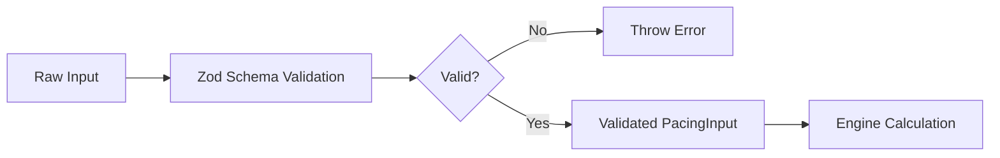

# PacingEngine Overview

**Module:** `client/src/core/pacing/PacingEngine.ts` **Purpose:** Type-safe fund
deployment pacing engine for strategic capital allocation **Estimated Reading
Time:** 5-7 minutes **Target Audience:** New developers, AI agents, portfolio
managers, fund strategists

---

## Table of Contents

1. [What is Investment Pacing?](#what-is-investment-pacing)
2. [Why Pacing Matters](#why-pacing-matters)
3. [Core Concepts](#core-concepts)
4. [High-Level Algorithm Overview](#high-level-algorithm-overview)
5. [When to Use Each Strategy](#when-to-use-each-strategy)
6. [Integration Points](#integration-points)

---

## What is Investment Pacing?

**Investment pacing** is the strategic allocation of a venture capital fund's
capital over time. Rather than deploying all capital at once, funds typically
spread investments across multiple quarters to:

- **Diversify timing risk** - Avoid concentration in a single market period
- **Manage reserves** - Maintain capacity for follow-on investments
- **Adapt to market conditions** - Adjust deployment speed based on bull/bear
  markets
- **Optimize portfolio construction** - Balance early-stage focus with
  later-stage opportunities

The **PacingEngine** calculates quarterly deployment schedules based on:

- Fund size (total capital available)
- Deployment start quarter
- Market conditions (bull, bear, neutral)
- Algorithm mode (rule-based or ML-enhanced)

**Key Insight:** Pacing is not just about spreading capital evenly—it's about
strategic timing that aligns with market opportunities, fund maturity, and
portfolio strategy.

---

## Why Pacing Matters

### Strategic Importance

1. **Risk Management**
   - Spreading capital across 8 quarters reduces exposure to any single market
     condition
   - Allows time for due diligence and deal sourcing
   - Maintains dry powder for reactive opportunities

2. **Market Timing**
   - **Bull markets**: Front-load deployment to capture growth momentum
   - **Bear markets**: Back-load deployment to acquire assets at lower
     valuations
   - **Neutral markets**: Even distribution for balanced exposure

3. **Portfolio Construction**
   - Early quarters: Focus on seed/early-stage investments (higher risk, higher
     potential)
   - Mid quarters: Balanced mix of stages
   - Late quarters: Follow-on investments and late-stage opportunities (lower
     risk, portfolio optimization)

4. **Cash Flow Management**
   - Predictable deployment schedules enable better fundraising planning
   - Supports reserve allocation for follow-on rounds
   - Coordinates with management fee collection and distribution planning

### Real-World Impact

From test case analysis
([pacing-engine.test.ts:158-167](tests/unit/engines/pacing-engine.test.ts#L158)):

```typescript
// $50M fund deployed over 8 quarters
const input = {
  fundSize: 50000000,
  deploymentQuarter: 1,
  marketCondition: 'neutral',
};
const result = PacingEngine(input);

// Typical output: Total deployment ~$45-55M (within 10% due to variability)
// Average per quarter: ~$6.25M with strategic phasing
```

**Trade-off:** Deterministic variability (±10% using seeded PRNG) prevents
overly mechanical deployment while maintaining reproducibility for testing and
scenario planning.

---

## Core Concepts

### 1. Deployment Schedule

All pacing strategies generate an **8-quarter deployment schedule**. This is a
hardcoded design decision based on typical VC fund investment periods (2 years).

**Structure:**

```typescript
interface PacingOutput {
  quarter: number; // Sequential quarter number (e.g., 1, 2, 3...)
  deployment: number; // Capital to deploy in this quarter (dollars)
  note: string; // Human-readable phase description
}
```

**Example:**

```typescript
[
  {
    quarter: 1,
    deployment: 8125000,
    note: 'neutral market pacing (early-stage focus)',
  },
  {
    quarter: 2,
    deployment: 7843200,
    note: 'neutral market pacing (early-stage focus)',
  },
  {
    quarter: 3,
    deployment: 6234500,
    note: 'neutral market pacing (early-stage focus)',
  },
  {
    quarter: 4,
    deployment: 6789100,
    note: 'neutral market pacing (mid-stage deployment)',
  },
  // ... continues for 8 quarters total
];
```

### 2. Market Condition Adjustments

The engine applies **multipliers** based on market conditions to shift capital
allocation timing:

| Market Condition | Early Multiplier (Q1-3) | Mid Multiplier (Q4-6) | Late Multiplier (Q7-8) |
| ---------------- | ----------------------- | --------------------- | ---------------------- |
| **Bull**         | 1.3× (front-loaded)     | 1.1×                  | 0.8× (reduced)         |
| **Bear**         | 0.7× (conservative)     | 0.9×                  | 1.2× (back-loaded)     |
| **Neutral**      | 1.0× (even)             | 1.0×                  | 1.0× (even)            |

**Rationale:**

- **Bull markets**: High valuations and abundant deals justify aggressive early
  deployment
- **Bear markets**: Lower valuations later in the cycle provide better entry
  points
- **Neutral markets**: Balanced distribution avoids market timing risk

### 3. Phase-Based Deployment

Each 8-quarter schedule is divided into **three phases**
([PacingEngine.ts:82-85](client/src/core/pacing/PacingEngine.ts#L82)):

1. **Early-Stage Focus (Q1-3)**: Seed and Series A investments
   - Higher risk tolerance
   - Portfolio construction phase
   - Maximum diversity of bets

2. **Mid-Stage Deployment (Q4-6)**: Series B and follow-on rounds
   - Balanced risk/return
   - Selective new investments + follow-ons
   - Portfolio refinement

3. **Late-Stage Optimization (Q7-8)**: Follow-on and late-stage investments
   - Risk mitigation through follow-ons
   - Portfolio concentration on winners
   - Reserve allocation

**Test Evidence:**
[pacing-engine.test.ts:113-143](tests/unit/engines/pacing-engine.test.ts#L113)
validates phase note assignment across all strategies.

### 4. Deterministic Variability

To prevent overly mechanical deployment, the engine introduces **controlled
randomness** using a seeded Pseudo-Random Number Generator (PRNG):

```typescript
// From PacingEngine.ts:22
const prng = new PRNG(123); // Fixed seed for determinism

// Applied during calculation (PacingEngine.ts:79)
const variability = 0.9 + prng.next() * 0.2; // ±10% variance
const deployment = baseAmount * multiplier * variability;
```

**Key Properties:**

- **Deterministic**: Same inputs always produce same outputs (critical for
  testing)
- **Reproducible**: Resets seed on each engine invocation
  ([PacingEngine.ts:126](client/src/core/pacing/PacingEngine.ts#L126))
- **Realistic**: Mimics real-world unpredictability in deal flow

**Edge Case:** Test
[pacing-engine.test.ts:326-335](tests/unit/engines/pacing-engine.test.ts#L326)
validates consistency across multiple runs with identical inputs.

### 5. Algorithm Modes

The PacingEngine supports two calculation modes:

**Mode 1: Rule-Based (Default)**

- Market condition multipliers + phase-based deployment
- Fast, transparent, predictable
- Suitable for most use cases

**Mode 2: ML-Enhanced** (enabled via `ALG_PACING=true` or
`NODE_ENV=development`)

- Applies rule-based calculation first
- Adds trend-based adjustments (0.85× to 1.15×) using PRNG
- Simulates machine learning optimization
- Note suffix: "ML-optimized pacing"

**Mode Detection:**
[PacingEngine.ts:47-49](client/src/core/pacing/PacingEngine.ts#L47)

```typescript
function isAlgorithmModeEnabled(): boolean {
  return (
    process.env['ALG_PACING']?.toLowerCase() === 'true' ||
    process.env['NODE_ENV'] === 'development'
  );
}
```

**Test Coverage:**
[pacing-engine.test.ts:191-222](tests/unit/engines/pacing-engine.test.ts#L191)
validates both modes.

---

## High-Level Algorithm Overview

### Input Validation Pipeline



**Validation Schema:** [shared/types.ts:113-117](shared/types.ts#L113)

```typescript
export const PacingInputSchema = z.object({
  fundSize: z.number().min(0),
  deploymentQuarter: z.number().int().min(1),
  marketCondition: z.enum(['bull', 'bear', 'neutral']),
});
```

**Test Coverage:**
[pacing-engine.test.ts:24-53](tests/unit/engines/pacing-engine.test.ts#L24)
validates rejection of invalid inputs.

### Core Calculation Flow

```
1. Reset PRNG seed (ensures determinism)
2. Validate input with Zod
3. Detect algorithm mode (rule-based vs ML-enhanced)
4. Calculate base amount: fundSize / 8 quarters
5. FOR each of 8 quarters:
   a. Determine phase (early/mid/late)
   b. Apply market condition multiplier
   c. Add deterministic variability (±10%)
   d. Round to whole dollars
   e. Generate phase note
   f. Validate output with Zod
6. Return PacingOutput[]
```

**Implementation:**
[PacingEngine.ts:52-95](client/src/core/pacing/PacingEngine.ts#L52) for
rule-based, [PacingEngine.ts:98-113](client/src/core/pacing/PacingEngine.ts#L98)
for ML-enhanced.

### Output Generation

The primary function `PacingEngine()`
([PacingEngine.ts:124](client/src/core/pacing/PacingEngine.ts#L124)) returns an
array of `PacingOutput` objects:

```typescript
export function PacingEngine(input: unknown): PacingOutput[] {
  prng.reset(123); // Deterministic reset
  const validatedInput = validatePacingInput(input);
  const useAlgorithm = isAlgorithmModeEnabled();

  if (useAlgorithm) {
    return calculateMLBasedPacing(validatedInput);
  } else {
    return calculateRuleBasedPacing(validatedInput);
  }
}
```

**Summary Generation:** For comprehensive metadata, use
`generatePacingSummary()`
([PacingEngine.ts:144](client/src/core/pacing/PacingEngine.ts#L144)):

```typescript
export function generatePacingSummary(input: PacingInput): PacingSummary {
  const deployments = PacingEngine(input);
  const totalQuarters = deployments.length;
  const totalDeployment = deployments.reduce((sum, d) => sum + d.deployment, 0);
  const avgQuarterlyDeployment = totalDeployment / totalQuarters;

  return {
    fundSize: input.fundSize,
    totalQuarters,
    avgQuarterlyDeployment: Math.round(avgQuarterlyDeployment),
    marketCondition: input.marketCondition,
    deployments,
    generatedAt: new Date(),
  };
}
```

**Test Coverage:**
[pacing-engine.test.ts:255-293](tests/unit/engines/pacing-engine.test.ts#L255)
validates summary generation.

---

## When to Use Each Strategy

### Neutral Market Strategy

**Use When:**

- Market conditions are stable and predictable
- No strong bullish or bearish signals
- Building a diversified portfolio from scratch
- First-time fund managers seeking balanced risk

**Characteristics:**

- Even distribution across all quarters (within ±10% variability)
- Balanced phase emphasis (early/mid/late)
- Lowest timing risk

**Example Use Case:** A new $50M fund in Q1 2024 with no strong market signals
would deploy approximately $6.25M per quarter over 8 quarters.

**Test Reference:**
[pacing-engine.test.ts:81-94](tests/unit/engines/pacing-engine.test.ts#L81)

---

### Bull Market Strategy (Front-Loaded)

**Use When:**

- Strong economic growth and rising valuations
- Abundant deal flow and competitive rounds
- Need to secure allocations quickly
- High confidence in near-term exits

**Characteristics:**

- Early quarters (Q1-3) get 1.3× multiplier
- Mid quarters (Q4-6) get 1.1× multiplier
- Late quarters (Q7-8) get 0.8× multiplier (reduced)
- Approximately 60-70% deployed in first 6 quarters

**Example Use Case:** A growth equity fund in a booming market (e.g., 2020-2021)
would front-load deployment to capture momentum and avoid being priced out
later.

**Test Reference:**
[pacing-engine.test.ts:60-69](tests/unit/engines/pacing-engine.test.ts#L60)

**Trade-off:** Higher exposure to early-period market corrections, but captures
growth upside.

---

### Bear Market Strategy (Back-Loaded)

**Use When:**

- Economic downturn or market correction
- High valuation uncertainty
- Desire to wait for better pricing
- Existing portfolio needs reserves

**Characteristics:**

- Early quarters (Q1-3) get 0.7× multiplier (conservative)
- Mid quarters (Q4-6) get 0.9× multiplier
- Late quarters (Q7-8) get 1.2× multiplier (back-loaded)
- Approximately 50-60% deployed in last 6 quarters

**Example Use Case:** A fund launching in late 2022 during tech downturn would
conserve capital early, waiting for valuations to stabilize before aggressive
deployment in later quarters.

**Test Reference:**
[pacing-engine.test.ts:70-80](tests/unit/engines/pacing-engine.test.ts#L70)

**Trade-off:** Risk of missing early recovery, but benefits from lower
valuations later.

---

### ML-Enhanced Strategy

**Use When:**

- Advanced modeling capabilities are available
- Historical data supports trend analysis
- Need to simulate complex market dynamics
- Testing "what-if" scenarios with additional variance

**Characteristics:**

- Applies rule-based calculation first
- Adds 0.85× to 1.15× trend adjustment
- More variability (combines ±10% base + trend factor)
- Note includes "ML-optimized" suffix

**Example Use Case:** A sophisticated fund with data science capabilities
running scenario analysis across multiple market conditions.

**Test Reference:**
[pacing-engine.test.ts:193-205](tests/unit/engines/pacing-engine.test.ts#L193)

**Trade-off:** Higher complexity and less transparency, but captures nuanced
market trends.

---

## Integration Points

### 1. Worker Integration

The **pacing-worker** ([workers/pacing-worker.ts](workers/pacing-worker.ts))
handles background calculations:

- Subscribes to BullMQ queue: `pacing:calc`
- Loads fund data from PostgreSQL
- Calls `generatePacingSummary()`
- Stores results in `fundSnapshots` and `pacingHistory` tables
- Records Prometheus metrics

**Key Integration:** Worker stores quarterly deployments for historical tracking
and scenario comparison.

### 2. Reserve Engine Coordination

Pacing schedules feed into the **ReserveEngine** for follow-on allocation:

- Pacing determines total capital available per quarter
- ReserveEngine allocates follow-on reserves from that capital
- Ensures sufficient dry powder for existing portfolio companies

**Cross-Reference:** See `docs/notebooklm-sources/reserves/` (Phase 2
deliverable)

### 3. API Endpoints

Expected API pattern (implementation in `/server/routes`):

```typescript
POST /api/funds/:fundId/pacing
{
  "deploymentQuarter": 1,
  "marketCondition": "bull"
}

Response:
{
  "fundId": 123,
  "snapshotId": 456,
  "pacing": { /* PacingSummary */ },
  "calculatedAt": "2025-11-06T12:00:00Z",
  "version": "1.0.0"
}
```

### 4. Scenario Planning

Pacing schedules are used in multi-scenario analysis:

- Compare bull vs bear deployment impact on portfolio IRR
- Model "what-if" scenarios for different fund sizes
- Stress-test portfolio construction under various pacing strategies

**Test Evidence:**
[pacing-engine.test.ts:299-336](tests/unit/engines/pacing-engine.test.ts#L299)
validates edge cases across extreme fund sizes and quarters.

---

## Next Steps

- **[02-strategies.md](02-strategies.md)** - Detailed mathematical formulas and
  strategy implementation
- **[03-integration.md](03-integration.md)** - API usage patterns, code
  examples, and real-world scenarios

---

## Related Documentation

- **Type Definitions:** [shared/types.ts:113-132](shared/types.ts#L113) - Zod
  schemas and TypeScript types
- **Test Suite:**
  [tests/unit/engines/pacing-engine.test.ts](tests/unit/engines/pacing-engine.test.ts) -
  336 lines, 30+ test cases
- **Worker Implementation:**
  [workers/pacing-worker.ts](workers/pacing-worker.ts) - Background job
  processing
- **Validation Config:**
  [scripts/validation/pacing-validation.yaml](scripts/validation/pacing-validation.yaml) -
  Promptfoo test cases

---

**Document Version:** 1.0 **Last Updated:** 2025-11-06 **Validation Status:**
Pending Promptfoo evaluation
