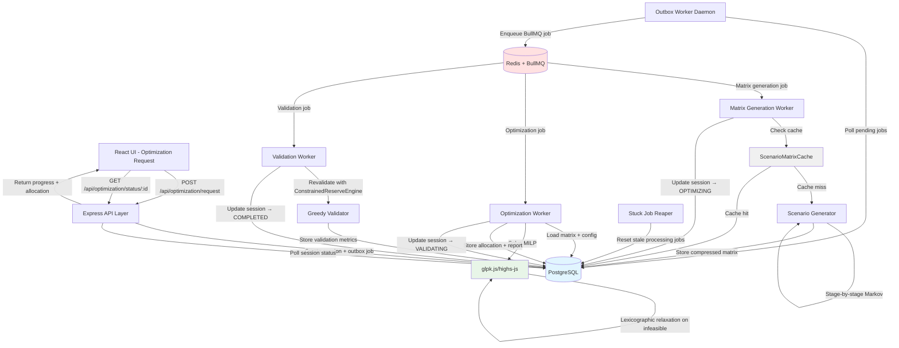

# Portfolio Construction & Optimization - Design Document

**Date**: 2026-01-04
**Status**: Production-Ready Design
**Version**: 1.0

## Executive Summary

This document specifies a production-hardened Portfolio Construction & Optimization system for the VC fund modeling platform. The system employs Mixed-Integer Linear Programming (MILP) to maximize expected portfolio multiples subject to risk constraints including loss probability caps, CVaR tail risk limits, expected winner counts, and sector/stage diversification bounds. The optimizer operates on Monte Carlo-generated MOIC matrices representing bucket-level outcomes across correlated macroeconomic scenarios, providing venture capital fund managers with rigorous, reproducible portfolio allocation recommendations.

The design addresses critical correctness, crash-safety, and concurrency requirements through 10+ production-hardening corrections applied during iterative review cycles. Key capabilities include normalized MILP formulations (avoiding numerical instability from dollar-denominated variables), exactly-once job semantics via outbox pattern with exponential backoff, lexicographic constraint relaxation for infeasible configurations, and comprehensive debugging metadata (matrixKeyJson, normalizedConfigJson, solver reports). The architecture implements three-tier processing (API → Orchestrator → Workers) with dual-tier caching (PostgreSQL for durability, Redis for hot-path performance) and background daemons (outbox-worker, stuck-job-reaper) ensuring system resilience under crash and concurrency stress.

Implementation follows an 8-phase, 56-task plan spanning database schema design, scenario generation with three-component correlation modeling, scenario matrix caching with canonical keying, MILP solver integration with constraint relaxation logic, orchestration state machines, API layer with Zod validation, UI components, and comprehensive testing including crash recovery and concurrency invariants. The system is designed for production deployment with explicit trade-offs documented (MOIC-only optimization until Phase 2 IRR support, same-bucket recycling constraints, polling-based session updates) and clear extension paths for future enhancements.

## Architecture Overview

### High-Level System Architecture



### Optimization Session State Machine

```
REQUESTED
    ↓ (orchestrator creates matrix job in outbox)
MATRIX_GENERATING
    ↓ (matrix worker completes, creates optimization job)
OPTIMIZING
    ↓ (optimization worker completes, creates validation job)
VALIDATING
    ↓ (validation worker completes)
COMPLETED

Any state → FAILED (on error with errorReason populated)
```

**Critical Invariants**:
- REQUESTED → MATRIX_GENERATING: Atomic with outbox job creation (idempotencyKey: `matrix_generation:{matrixKey}`)
- MATRIX_GENERATING → OPTIMIZING: Only after scenario_matrices.status = 'complete'
- OPTIMIZING → VALIDATING: Only after allocation stored in optimization_sessions
- VALIDATING → COMPLETED: Only after validation metrics stored
- FAILED transitions: Set errorReason, completedAt remains NULL
- All transitions are transactional (UPDATE optimization_sessions + INSERT job_outbox in single tx)

### Job Outbox State Machine

```
pending
    ↓ (outbox worker claims with FOR UPDATE SKIP LOCKED)
processing
    ↓ (success: BullMQ enqueue completes)
enqueued

processing
    ↓ (failure: attempts < maxAttempts, exponential backoff)
pending (with nextRunAt = NOW() + 2^attempts seconds, capped at 300s)

processing
    ↓ (failure: attempts >= maxAttempts)
failed (with errorReason)

processing (stale: processingAt > 5 minutes ago)
    ↓ (stuck job reaper)
pending (processingAt reset to NULL)
```

**Exactly-Once Semantics**:
- idempotencyKey UNIQUE constraint prevents duplicate jobs (`matrix_generation:{matrixKey}`, `optimization:{sessionId}`, `validation:{sessionId}`)
- FOR UPDATE SKIP LOCKED prevents concurrent workers from claiming same job
- BullMQ jobId deduplication prevents duplicate job creation
- Exponential backoff with nextRunAt prevents thundering herd on transient failures
- Stuck job reaper ensures progress despite crashes (separate daemon, independent crash domain)

### Three-Tier Worker Architecture

**Tier 1: API Layer (Synchronous)**
- Express.js endpoints with Zod validation
- Transaction: INSERT optimization_sessions + INSERT job_outbox (idempotencyKey: `matrix_generation:{matrixKey}`)
- Immediate response: `{ sessionId, status: 'REQUESTED' }`
- Polling endpoint: GET /api/optimization/status/:id

**Tier 2: Orchestrator (Outbox Worker Daemon)**
- Single-threaded Node.js process, infinite loop with 1-second sleep
- Claims pending jobs with canonical CTE pattern (FOR UPDATE SKIP LOCKED)
- Enqueues BullMQ jobs with jobId for deduplication
- Retry logic: exponential backoff (2^attempts seconds, cap 300s), max 3 attempts
- Crash-safe: all state in PostgreSQL, reaper recovers stuck jobs

**Tier 3: Workers (BullMQ + Redis)**
- Matrix Generation Worker: ScenarioMatrixCache.getOrGenerate() → UPDATE scenario_matrices → UPDATE optimization_sessions → INSERT job_outbox (optimization job)
- Optimization Worker: Load matrix → solve MILP → lexicographic relaxation → UPDATE optimization_sessions → INSERT job_outbox (validation job)
- Validation Worker: ConstrainedReserveEngine.validate() → UPDATE optimization_sessions → COMPLETED

### Dual-Tier Cache Architecture

**Tier 1: PostgreSQL (Durable Storage)**
- scenario_matrices table with matrixKey UNIQUE
- Payload compression (BYTEA + zlib gzip)
- Versioning: keySchemaVersion, simModelVersion, calibrationVersion
- State consistency: CHECK constraints enforce payload completeness when status='complete'
- Debugging: matrixKeyJson JSONB for human-readable key inspection

**Tier 2: Redis (Hot Path Performance)**
- Key: `scenario-matrix:{matrixKey}`
- TTL: 24 hours (cache eviction for infrequent scenarios)
- Value: Compressed MOIC matrix (bucketCount × S_opt Float32Array)
- Cache invalidation: Manual via DELETE scenario_matrices WHERE matrixKey = '...'

**Cache Keying (Canonical v1.2)**
- Includes ALL factors affecting MOIC simulation: fundId, taxonomyVersion, policyParams, scenarioGenConfig
- Recycling normalization: `enabled=false` → canonical no-op `{enabled: false, utilization: 0, cashMultiple: 1, maxRecycleDeals: 0}`
- Float precision: Round to 6 decimal places for regime probabilities, shock ranges
- Sorted keys: sector/stage maps sorted alphabetically
- Min/max swap: Ensure shockRanges.min <= shockRanges.max

### Background Daemons

**Outbox Worker**
- Purpose: Drain job_outbox → BullMQ enqueue
- Concurrency: Single instance (scale horizontally with SKIP LOCKED)
- Batch size: 10 jobs per transaction
- Error handling: Exponential backoff with nextRunAt, max 3 attempts

**Stuck Job Reaper**
- Purpose: Reset jobs stuck in 'processing' (crash recovery)
- Threshold: processingAt < NOW() - 5 minutes
- Frequency: Every 60 seconds
- Action: UPDATE job_outbox SET status='pending', processingAt=NULL
- Crash domain: Independent process (reaper crash doesn't block outbox worker)

### Critical Production Safeguards

1. **State Consistency**: CHECK constraints enforce payload completeness (scenario_matrices.status='complete' → moicMatrix NOT NULL)
2. **Idempotency**: UNIQUE constraint on job_outbox.idempotencyKey prevents duplicate jobs
3. **Concurrency**: FOR UPDATE SKIP LOCKED prevents double-claiming, UNIQUE matrixKey prevents duplicate matrix generation
4. **Crash Recovery**: Stuck job reaper, transactional state updates, all state in PostgreSQL (no in-memory)
5. **Debugging**: matrixKeyJson, normalizedConfigJson JSONB for reproducibility, solver metadata in optimization_sessions
6. **Numerical Stability**: Normalized weights (w_b ∈ [0,1]), Big-M=1, explicit JSONB casts ($2::jsonb)
7. **Payload Cleanup**: Clear moicMatrix, bucketKeys when scenario_matrices transitions failed → generating (prevents stale data bugs)
8. **Backpressure**: BullMQ job rate limiting, outbox worker batch size cap, polling-based client updates (no WebSocket push overhead)

## Database Schema

### optimization_sessions

**Purpose**: Primary state tracking for optimization requests, lifecycle management from REQUESTED → COMPLETED/FAILED.

```sql
CREATE TABLE optimization_sessions (
  -- Identity
  session_id UUID PRIMARY KEY DEFAULT gen_random_uuid(),
  fund_id UUID NOT NULL REFERENCES funds(id),
  created_by UUID NOT NULL REFERENCES users(id),

  -- Request configuration (normalized, frozen at creation)
  normalized_config JSONB NOT NULL,  -- OptimizationConfigNormalized schema
  matrix_key TEXT NOT NULL,          -- SHA256 hash of ScenarioMatrixKey (canonical v1.2)
  matrix_key_json JSONB NOT NULL,    -- Human-readable key for debugging

  -- State machine
  status TEXT NOT NULL DEFAULT 'REQUESTED' CHECK (
    status IN ('REQUESTED', 'MATRIX_GENERATING', 'OPTIMIZING', 'VALIDATING', 'COMPLETED', 'FAILED')
  ),
  error_reason TEXT,                 -- Populated on status=FAILED

  -- Results
  allocation JSONB,                  -- BucketAllocation[] when status >= OPTIMIZING
  solver_metadata JSONB,             -- Solver reports (objective, iterations, relaxed constraints)
  validation_metrics JSONB,          -- ValidationMetrics when status >= VALIDATING

  -- Tie-break audit trail (for reproducibility and debugging)
  pass1_E_star DOUBLE PRECISION,     -- E[M] from pass 1 (primary objective optimal value)
  primary_lock_epsilon DOUBLE PRECISION,  -- Tolerance used for primary objective lock in pass 2

  -- Timestamps
  created_at TIMESTAMPTZ NOT NULL DEFAULT NOW(),
  matrix_started_at TIMESTAMPTZ,
  matrix_completed_at TIMESTAMPTZ,
  optimization_started_at TIMESTAMPTZ,
  optimization_completed_at TIMESTAMPTZ,
  validation_started_at TIMESTAMPTZ,
  completed_at TIMESTAMPTZ,          -- NULL until status=COMPLETED or FAILED

  -- Indexes
  INDEX idx_optimization_sessions_fund (fund_id, created_at DESC),
  INDEX idx_optimization_sessions_status (status, created_at),
  INDEX idx_optimization_sessions_matrix_key (matrix_key)
);

-- State consistency constraints
ALTER TABLE optimization_sessions ADD CONSTRAINT chk_completed_at_status
  CHECK (
    (status = 'COMPLETED' AND completed_at IS NOT NULL) OR
    (status = 'FAILED' AND completed_at IS NOT NULL) OR
    (status NOT IN ('COMPLETED', 'FAILED') AND completed_at IS NULL)
  );

ALTER TABLE optimization_sessions ADD CONSTRAINT chk_allocation_status
  CHECK (
    (status IN ('OPTIMIZING', 'VALIDATING', 'COMPLETED') AND allocation IS NOT NULL) OR
    (status NOT IN ('OPTIMIZING', 'VALIDATING', 'COMPLETED') AND allocation IS NULL)
  );

ALTER TABLE optimization_sessions ADD CONSTRAINT chk_validation_status
  CHECK (
    (status IN ('VALIDATING', 'COMPLETED') AND validation_metrics IS NOT NULL) OR
    (status NOT IN ('VALIDATING', 'COMPLETED') AND validation_metrics IS NULL)
  );
```

**JSONB Schemas**:
- `normalized_config`: OptimizationConfigNormalized (see TypeScript definitions)
- `allocation`: BucketAllocation[] (bucketId, weight, dollarAmount, scenarioId if applicable)
- `solver_metadata`: { objective: number, iterations: number, solutionTime: number, relaxedConstraints?: string[] }
- `validation_metrics`: { maxLossViolation: number, cvarViolation: number, winnerCountViolation: number, feasible: boolean }

### scenario_matrices

**Purpose**: Persistent cache for scenario MOIC matrices, shared across optimization sessions with same matrixKey.

```sql
CREATE TABLE scenario_matrices (
  -- Identity (matrixKey = SHA256 hash of ScenarioMatrixKey canonical v1.2)
  matrix_key TEXT PRIMARY KEY,
  matrix_key_json JSONB NOT NULL,    -- Human-readable key debugging

  -- Versioning (for cache invalidation)
  key_schema_version TEXT NOT NULL DEFAULT 'v1.2',
  sim_model_version TEXT NOT NULL,   -- From ScenarioGeneratorConfig.version
  calibration_version TEXT NOT NULL, -- From sector/stage calibration timestamps

  -- State machine
  status TEXT NOT NULL DEFAULT 'generating' CHECK (
    status IN ('generating', 'complete', 'failed')
  ),
  error_reason TEXT,

  -- Payload (compressed with zlib gzip, BYTEA for binary efficiency)
  -- Note: Float32Array reconstruction requires byteOffset=0 and byteLength alignment for browser compatibility
  moic_matrix BYTEA,                 -- Float32Array serialized, shape [bucketCount, s_opt]
  bucket_keys JSONB,                 -- BucketKey[] for decoding rows
  scenario_states JSONB,             -- ScenarioState[] for scenario metadata
  bucket_params JSONB,               -- BucketParams for matrix generation parameters
  compression_codec TEXT,            -- Compression algorithm (e.g., 'gzip', 'none')
  matrix_layout TEXT,                -- Matrix layout format (e.g., 'row-major')
  bucket_count INTEGER,              -- Number of buckets (matrix rows)
  s_opt INTEGER,                     -- Number of scenarios (matrix columns)

  -- Timestamps
  created_at TIMESTAMPTZ NOT NULL DEFAULT NOW(),
  completed_at TIMESTAMPTZ,
  last_accessed_at TIMESTAMPTZ DEFAULT NOW(),

  -- Indexes
  INDEX idx_scenario_matrices_status (status, created_at),
  INDEX idx_scenario_matrices_last_accessed (last_accessed_at)
);

-- State consistency constraints - enforce ALL payload fields when complete
ALTER TABLE scenario_matrices ADD CONSTRAINT chk_payload_completeness
  CHECK (
    status <> 'complete'
    OR (
      moic_matrix IS NOT NULL
      AND bucket_keys IS NOT NULL
      AND scenario_states IS NOT NULL
      AND bucket_params IS NOT NULL
      AND compression_codec IS NOT NULL
      AND matrix_layout IS NOT NULL
      AND bucket_count IS NOT NULL
      AND s_opt IS NOT NULL
    )
  );

ALTER TABLE scenario_matrices ADD CONSTRAINT chk_completed_at_status
  CHECK (
    (status IN ('complete', 'failed') AND completed_at IS NOT NULL) OR
    (status = 'generating' AND completed_at IS NULL)
  );
```

**Cache Invalidation**:
- Manual: `DELETE FROM scenario_matrices WHERE matrix_key = '...'`
- Automatic: TTL-based cleanup job (delete rows WHERE last_accessed_at < NOW() - 30 days AND status='complete')

### job_outbox

**Purpose**: Exactly-once job enqueue semantics with crash recovery via stuck job reaper.

```sql
CREATE TABLE job_outbox (
  -- Identity
  job_id UUID PRIMARY KEY DEFAULT gen_random_uuid(),
  idempotency_key TEXT NOT NULL UNIQUE, -- Prevents duplicate jobs

  -- Job metadata
  job_type TEXT NOT NULL CHECK (
    job_type IN ('matrix_generation', 'optimization', 'validation')
  ),
  payload JSONB NOT NULL,            -- Job-specific data (sessionId, matrixKey, etc.)

  -- State machine
  status TEXT NOT NULL DEFAULT 'pending' CHECK (
    status IN ('pending', 'processing', 'enqueued', 'failed')
  ),
  error_reason TEXT,

  -- Retry logic
  attempts INTEGER NOT NULL DEFAULT 0,
  max_attempts INTEGER NOT NULL DEFAULT 3,
  next_run_at TIMESTAMPTZ NOT NULL DEFAULT NOW(),

  -- Timestamps
  created_at TIMESTAMPTZ NOT NULL DEFAULT NOW(),
  processing_at TIMESTAMPTZ,         -- Set when worker claims job
  enqueued_at TIMESTAMPTZ,           -- Set when BullMQ job created

  -- Indexes
  INDEX idx_job_outbox_claim (next_run_at, created_at) WHERE status = 'pending',
  INDEX idx_job_outbox_stuck (status, processing_at) WHERE status = 'processing'
);
```

**Idempotency Keys**:
- Matrix generation: `matrix_generation:{matrixKey}`
- Optimization: `optimization:{sessionId}`
- Validation: `validation:{sessionId}`

**Reaper Logic**:
```sql
-- Run every 60 seconds
-- Parameter $1 = 300 (5 minutes in seconds)
UPDATE job_outbox
SET status = 'pending', processing_at = NULL
WHERE status = 'processing'
  AND processing_at < NOW() - make_interval(secs => $1);
```

### Drizzle ORM Schema (TypeScript)

```typescript
// shared/db/schema/optimization.ts
import { pgTable, uuid, text, jsonb, bytea, integer, doublePrecision, timestamp, index, check } from 'drizzle-orm/pg-core';

export const optimizationSessions = pgTable('optimization_sessions', {
  sessionId: uuid('session_id').primaryKey().defaultRandom(),
  fundId: uuid('fund_id').notNull().references(() => funds.id),
  createdBy: uuid('created_by').notNull().references(() => users.id),

  normalizedConfig: jsonb('normalized_config').notNull(),
  matrixKey: text('matrix_key').notNull(),
  matrixKeyJson: jsonb('matrix_key_json').notNull(),

  status: text('status').notNull().default('REQUESTED'),
  errorReason: text('error_reason'),

  allocation: jsonb('allocation'),
  solverMetadata: jsonb('solver_metadata'),
  validationMetrics: jsonb('validation_metrics'),

  pass1EStar: doublePrecision('pass1_E_star'),
  primaryLockEpsilon: doublePrecision('primary_lock_epsilon'),

  createdAt: timestamp('created_at', { withTimezone: true }).notNull().defaultNow(),
  matrixStartedAt: timestamp('matrix_started_at', { withTimezone: true }),
  matrixCompletedAt: timestamp('matrix_completed_at', { withTimezone: true }),
  optimizationStartedAt: timestamp('optimization_started_at', { withTimezone: true }),
  optimizationCompletedAt: timestamp('optimization_completed_at', { withTimezone: true }),
  validationStartedAt: timestamp('validation_started_at', { withTimezone: true }),
  completedAt: timestamp('completed_at', { withTimezone: true }),
}, (table) => ({
  fundIdx: index('idx_optimization_sessions_fund').on(table.fundId, table.createdAt),
  statusIdx: index('idx_optimization_sessions_status').on(table.status, table.createdAt),
  matrixKeyIdx: index('idx_optimization_sessions_matrix_key').on(table.matrixKey),
}));

export const scenarioMatrices = pgTable('scenario_matrices', {
  matrixKey: text('matrix_key').primaryKey(),
  matrixKeyJson: jsonb('matrix_key_json').notNull(),

  keySchemaVersion: text('key_schema_version').notNull().default('v1.2'),
  simModelVersion: text('sim_model_version').notNull(),
  calibrationVersion: text('calibration_version').notNull(),

  status: text('status').notNull().default('generating'),
  errorReason: text('error_reason'),

  // Payload fields - Note: bytea() for proper BYTEA handling (not text())
  // Float32Array reconstruction requires byteOffset=0 and byteLength alignment
  moicMatrix: bytea('moic_matrix'),
  bucketKeys: jsonb('bucket_keys'),
  scenarioStates: jsonb('scenario_states'),
  bucketParams: jsonb('bucket_params'),
  compressionCodec: text('compression_codec'),
  matrixLayout: text('matrix_layout'),
  bucketCount: integer('bucket_count'),
  sOpt: integer('s_opt'),

  createdAt: timestamp('created_at', { withTimezone: true }).notNull().defaultNow(),
  completedAt: timestamp('completed_at', { withTimezone: true }),
  lastAccessedAt: timestamp('last_accessed_at', { withTimezone: true }).defaultNow(),
}, (table) => ({
  statusIdx: index('idx_scenario_matrices_status').on(table.status, table.createdAt),
  lastAccessedIdx: index('idx_scenario_matrices_last_accessed').on(table.lastAccessedAt),
}));

export const jobOutbox = pgTable('job_outbox', {
  jobId: uuid('job_id').primaryKey().defaultRandom(),
  idempotencyKey: text('idempotency_key').notNull().unique(),

  jobType: text('job_type').notNull(),
  payload: jsonb('payload').notNull(),

  status: text('status').notNull().default('pending'),
  errorReason: text('error_reason'),

  attempts: integer('attempts').notNull().default(0),
  maxAttempts: integer('max_attempts').notNull().default(3),
  nextRunAt: timestamp('next_run_at', { withTimezone: true }).notNull().defaultNow(),

  createdAt: timestamp('created_at', { withTimezone: true }).notNull().defaultNow(),
  processingAt: timestamp('processing_at', { withTimezone: true }),
  enqueuedAt: timestamp('enqueued_at', { withTimezone: true }),
}, (table) => ({
  claimIdx: index('idx_job_outbox_claim').on(table.nextRunAt, table.createdAt).where(sql`${table.status} = 'pending'`),
  stuckIdx: index('idx_job_outbox_stuck').on(table.status, table.processingAt).where(sql`${table.status} = 'processing'`),
}));
```

### TypeScript Type Definitions

```typescript
// shared/types/optimization.ts
import { z } from 'zod';

// Session status enum
export const OptimizationSessionStatus = z.enum([
  'REQUESTED',
  'MATRIX_GENERATING',
  'OPTIMIZING',
  'VALIDATING',
  'COMPLETED',
  'FAILED',
]);
export type OptimizationSessionStatus = z.infer<typeof OptimizationSessionStatus>;

// Normalized configuration (frozen at session creation)
export const OptimizationConfigNormalized = z.object({
  fundId: z.string().uuid(),
  totalFundSize: z.number().positive(),

  // Risk constraints (all percentages as decimals 0-1)
  maxLossProbability: z.number().min(0).max(1),
  cvarConfidenceLevel: z.number().min(0).max(1),  // e.g., 0.95 for 95% confidence (NOT alpha)
  cvarLimit: z.number().min(0).max(1),
  minExpectedWinners: z.number().int().nonnegative(),

  // Diversification bounds (optional)
  sectorBounds: z.record(z.string(), z.object({
    min: z.number().min(0).max(1),
    max: z.number().min(0).max(1),
  })).optional(),
  stageBounds: z.record(z.string(), z.object({
    min: z.number().min(0).max(1),
    max: z.number().min(0).max(1),
  })).optional(),

  // Scenario generation config
  scenarioGenConfig: z.object({
    scenarioCount: z.number().int().positive(),
    regimeConfig: z.object({
      regimes: z.array(z.object({
        name: z.string(),
        probability: z.number().min(0).max(1),
        shockRanges: z.object({
          min: z.number(),
          max: z.number(),
        }),
      })),
      correlationMatrix: z.array(z.array(z.number())),
    }),
    recyclingConfig: z.object({
      enabled: z.boolean(),
      utilization: z.number().min(0).max(1),
      cashMultiple: z.number().positive(),
      maxRecycleDeals: z.number().int().nonnegative(),
    }),
  }),

  // Taxonomy version for reproducibility
  taxonomyVersion: z.string(),
});
export type OptimizationConfigNormalized = z.infer<typeof OptimizationConfigNormalized>;

// Bucket allocation result
export const BucketAllocation = z.object({
  bucketId: z.string(),
  weight: z.number().min(0).max(1),
  dollarAmount: z.number().nonnegative(),
  sector: z.string(),
  stage: z.string(),
  scenarioId: z.string().optional(), // For debugging which scenario drove this allocation
});
export type BucketAllocation = z.infer<typeof BucketAllocation>;

// Validation metrics
export const ValidationMetrics = z.object({
  maxLossViolation: z.number(), // How much maxLossProbability was exceeded (0 if satisfied)
  cvarViolation: z.number(),    // How much CVaR limit was exceeded (0 if satisfied)
  winnerCountViolation: z.number(), // How many winners short of target (0 if satisfied)
  feasible: z.boolean(),        // True if all constraints satisfied within tolerance
  greedyObjective: z.number(),  // Expected MOIC from ConstrainedReserveEngine
});
export type ValidationMetrics = z.infer<typeof ValidationMetrics>;

// Scenario matrix cache key (canonical v1.2)
export const ScenarioMatrixKey = z.object({
  fundId: z.string().uuid(),
  taxonomyVersion: z.string(),
  scenarioGenConfig: z.object({
    scenarioCount: z.number().int(),
    regimeConfig: z.object({
      regimes: z.array(z.object({
        name: z.string(),
        probability: z.number(),
        shockRanges: z.object({ min: z.number(), max: z.number() }),
      })),
      correlationMatrix: z.array(z.array(z.number())),
    }),
    recyclingConfig: z.object({
      enabled: z.boolean(),
      utilization: z.number(),
      cashMultiple: z.number(),
      maxRecycleDeals: z.number().int(),
    }),
  }),
});
export type ScenarioMatrixKey = z.infer<typeof ScenarioMatrixKey>;

// Job outbox payload types
export const MatrixGenerationJobPayload = z.object({
  sessionId: z.string().uuid(),
  matrixKey: z.string(),
  matrixKeyJson: ScenarioMatrixKey,
});

export const OptimizationJobPayload = z.object({
  sessionId: z.string().uuid(),
  matrixKey: z.string(),
  normalizedConfig: OptimizationConfigNormalized,
});

export const ValidationJobPayload = z.object({
  sessionId: z.string().uuid(),
  allocation: z.array(BucketAllocation),
  normalizedConfig: OptimizationConfigNormalized,
});
```

---

## 3. Scenario Generation Engine

### 3.1 Architecture Overview

The Scenario Generation Engine produces correlated MOIC matrices for portfolio optimization. It implements a **three-component correlation structure** with **stage-by-stage Markov transitions** to generate realistic portfolio outcome distributions.

**Key Design Principles:**
- **Correlation realism**: Shared macro regime (40-60%) + bucket systematic (20-30%) + idiosyncratic (20-30%)
- **Stage-aware transitions**: Seed → A → B → C with calibrated probabilities
- **Power-law outcomes**: Derived from median + P90 percentiles (NOT hardcoded alpha)
- **Recycling normalization**: Same-bucket only to preserve MOIC additivity
- **Deterministic reproducibility**: Explicit rngSeed derivation from scenario parameters

### 3.2 Three-Component Correlation Structure

Each scenario `s` consists of three random components:

```typescript
type ScenarioState = {
  scenarioId: number;
  macroRegime: MacroRegime;        // 'boom' | 'base' | 'recession'
  regimeShock: number;              // Shared [-1, 1] regime multiplier
  bucketSystematicShocks: Record<string, number>;  // Per-bucket [-1, 1]
  idiosyncraticShocks: Record<string, number>;     // Per-bucket [-1, 1]
};

type MacroRegime = 'boom' | 'base' | 'recession';
```

**Component Breakdown:**

1. **Macro Regime** (40-60% of variance):
   - Drawn from `regimeProbabilities: { boom: 0.25, base: 0.50, recession: 0.25 }`
   - Affects ALL buckets via `regimeShock ∈ [-1, 1]`
   - Modulates median MOIC: `medianAdjusted = baseMedian * (1 + regimeShock * regimeImpact)`

2. **Bucket Systematic** (20-30% of variance):
   - Per-sector/stage correlation (e.g., SaaS sector boom)
   - `bucketSystematicShocks[bucketKey] ∈ [-1, 1]`

3. **Idiosyncratic** (20-30% of variance):
   - Company-specific outcomes
   - `idiosyncraticShocks[bucketKey] ∈ [-1, 1]`
   - Drawn independently for each bucket

**Final MOIC Calculation:**

```typescript
function generateMOIC(
  bucket: BucketParams,
  state: ScenarioState,
  rng: SeededRNG
): number {
  // 1. Adjust median for regime
  const regimeImpact = 0.3; // 30% swing from regime
  const medianAdjusted = bucket.medianMOIC * (1 + state.regimeShock * regimeImpact);

  // 2. Scale P90 proportionally to preserve distribution shape
  const scale = medianAdjusted / bucket.medianMOIC;
  const p90Adjusted = bucket.p90MOIC * scale;

  // 3. Draw base MOIC from power law using correct Pareto sampling
  const baseMOIC = sampleParetoFromMedianP90(medianAdjusted, p90Adjusted, rng);

  // 4. Apply systematic + idiosyncratic shocks
  const systematicShock = state.bucketSystematicShocks[bucket.key] ?? 0;
  const idioShock = state.idiosyncraticShocks[bucket.key] ?? 0;

  const totalShock = 0.5 * systematicShock + 0.3 * idioShock; // Weights sum to 0.8 (regime = 0.4 already applied)
  const finalMOIC = baseMOIC * (1 + totalShock * 0.5); // 50% max swing

  return Math.max(0, finalMOIC); // Floor at 0
}

function derivePowerLawAlpha(median: number, p90: number): number {
  // CORRECT: For Pareto with survival function P(X ≥ x) = (xmin/x)^alpha
  // Median: P(X ≥ median) = 0.5 → (xmin/median)^alpha = 0.5
  // P90: P(X ≥ p90) = 0.1 → (xmin/p90)^alpha = 0.1
  // Dividing: (median/p90)^alpha = 0.5/0.1 = 5
  // Therefore: alpha = ln(5) / ln(median/p90)
  if (p90 <= median || median <= 0) {
    throw new Error('Invalid power law parameters: p90 must be > median > 0');
  }
  const alpha = Math.log(5) / Math.log(p90 / median);
  return Math.max(0.5, Math.min(5.0, alpha)); // Clamp to [0.5, 5.0]
}

function sampleParetoFromMedianP90(median: number, p90: number, rng: SeededRNG): number {
  // Derive xmin from median constraint: (xmin/median)^alpha = 0.5
  // xmin = median / 2^(1/alpha)
  const alpha = derivePowerLawAlpha(median, p90);
  const xmin = median / Math.pow(2, 1 / alpha);

  // Inverse transform sampling: x = xmin / (1 - u)^(1/alpha)
  const u = rng.uniform(0, 1);
  return xmin / Math.pow(1 - u, 1 / alpha);
}
```

### 3.3 Stage-by-Stage Markov Transitions

Instead of hardcoded transition matrices, the engine **calibrates transitions from historical data** via the `CalibrationVersion` contract.

#### 3.3.1 Transition Model

For each stage `g ∈ {Seed, A, B, C}`, define:

```typescript
type StageTransitions = {
  exitRate: number;        // P(exit directly from this stage)
  graduateRate: number;    // P(advance to next stage)
  failureRate: number;     // P(failure / write-off)
  // Invariant: exitRate + graduateRate + failureRate ≤ 1.0
  // Residual = P(remain in stage for one more period)
};
```

**Simulation Algorithm:**

```typescript
function simulateCompanyPath(
  initialStage: Stage,
  transitions: Record<Stage, StageTransitions>,
  maxRounds: number,
  rng: SeededRNG
): { outcome: 'exit' | 'failure', exitStage: Stage | null } {
  let currentStage = initialStage;

  for (let round = 0; round < maxRounds; round++) {
    const t = transitions[currentStage];
    const roll = rng.uniform(0, 1);

    if (roll < t.exitRate) {
      return { outcome: 'exit', exitStage: currentStage };
    } else if (roll < t.exitRate + t.failureRate) {
      return { outcome: 'failure', exitStage: null };
    } else if (roll < t.exitRate + t.failureRate + t.graduateRate) {
      // Advance to next stage
      currentStage = advanceStage(currentStage);
      if (currentStage === 'Terminal') {
        return { outcome: 'exit', exitStage: 'C' }; // Exited at final stage
      }
    } else {
      // Remain in current stage
      continue;
    }
  }

  // Max rounds exceeded → assume failure
  return { outcome: 'failure', exitStage: null };
}
```

#### 3.3.2 CalibrationVersion SQL Contract

To avoid N+1 queries and enable O(1) aggregates, define a **versioned view** that pre-computes transition statistics:

```sql
-- calibration_snapshots: Versioned transition statistics
CREATE TABLE calibration_snapshots (
  id UUID PRIMARY KEY,
  version TEXT UNIQUE NOT NULL,  -- e.g., 'v2024Q4_industry_median'
  fundId TEXT,                   -- NULL = industry benchmark
  createdAt TIMESTAMPTZ DEFAULT NOW(),

  -- Stage-specific aggregates (O(1) lookup)
  transitionStats JSONB NOT NULL,
  -- Structure: {
  --   "Seed": { "exitRate": 0.15, "graduateRate": 0.60, "failureRate": 0.25 },
  --   "A": { "exitRate": 0.30, "graduateRate": 0.50, "failureRate": 0.20 },
  --   ...
  -- }

  -- Exit outcome distributions (O(1) lookup)
  exitOutcomes JSONB NOT NULL,
  -- Structure: {
  --   "Seed": { "medianMOIC": 3.0, "p90MOIC": 12.0 },
  --   "A": { "medianMOIC": 5.0, "p90MOIC": 25.0 },
  --   ...
  -- }

  -- Metadata
  sampleSize INT NOT NULL,       -- Number of companies in calibration set
  dataWindow TEXT,               -- e.g., '2015-2023'
  calibrationMethod TEXT         -- 'kaplan_meier' | 'simple_cohort' | 'industry_benchmark'
);

CREATE INDEX idx_calibration_snapshots_version ON calibration_snapshots(version);
CREATE INDEX idx_calibration_snapshots_fund ON calibration_snapshots(fundId, createdAt DESC);
```

**Calibration Attribution Logic:**

```typescript
// CORRECT: Use subsequent investments to infer transitions
// WRONG: Use terminal status (suffers from censoring bias)

async function calibrateTransitions(
  fundId: string,
  dataWindow: { start: Date; end: Date }
): Promise<CalibrationSnapshot> {
  // Query: For each company, get chronological investment sequence
  const companies = await db.query(`
    SELECT
      c.id as companyId,
      i.stage,
      i.investmentDate,
      i.disposalDate,
      i.disposalProceeds,
      LEAD(i.stage) OVER (PARTITION BY c.id ORDER BY i.investmentDate) as nextStage
    FROM portfolio_companies c
    JOIN investments i ON i.companyId = c.id
    WHERE c.fundId = $1
      AND i.investmentDate BETWEEN $2 AND $3
    ORDER BY c.id, i.investmentDate
  `, [fundId, dataWindow.start, dataWindow.end]);

  const transitionCounts: Record<Stage, { exit: number, graduate: number, failure: number, total: number }> = {
    Seed: { exit: 0, graduate: 0, failure: 0, total: 0 },
    A: { exit: 0, graduate: 0, failure: 0, total: 0 },
    B: { exit: 0, graduate: 0, failure: 0, total: 0 },
    C: { exit: 0, graduate: 0, failure: 0, total: 0 },
  };

  for (const row of companies.rows) {
    const stage = row.stage as Stage;
    transitionCounts[stage].total += 1;

    if (row.disposalDate && row.disposalProceeds > 0) {
      // Company exited at this stage
      transitionCounts[stage].exit += 1;
    } else if (row.nextStage && isNextStage(stage, row.nextStage)) {
      // Company graduated to next stage (inferred from subsequent investment)
      transitionCounts[stage].graduate += 1;
    } else if (!row.nextStage && !row.disposalDate) {
      // No subsequent investment and no exit → assume failure (or censored)
      transitionCounts[stage].failure += 1;
    }
  }

  // Normalize to probabilities
  const transitionStats: Record<Stage, StageTransitions> = {};
  for (const stage of ['Seed', 'A', 'B', 'C'] as Stage[]) {
    const counts = transitionCounts[stage];
    transitionStats[stage] = {
      exitRate: counts.total > 0 ? counts.exit / counts.total : 0,
      graduateRate: counts.total > 0 ? counts.graduate / counts.total : 0,
      failureRate: counts.total > 0 ? counts.failure / counts.total : 0,
    };
  }

  return {
    version: `fund_${fundId}_${dataWindow.start.toISOString().slice(0,7)}`,
    fundId,
    transitionStats,
    exitOutcomes: await calibrateExitOutcomes(fundId, dataWindow),
    sampleSize: companies.rows.length,
    dataWindow: `${dataWindow.start.toISOString().slice(0,10)} to ${dataWindow.end.toISOString().slice(0,10)}`,
    calibrationMethod: 'subsequent_investment_attribution',
  };
}
```

**Key Insight:** By using `LEAD(i.stage) OVER (...)`, we avoid terminal status censoring bias. A company that raised a Series A after Seed is marked as "graduated," even if it later failed.

### 3.4 Recycling Mechanics

**Same-Bucket Recycling Only** (preserves MOIC additivity):

```typescript
type RecyclingConfig = {
  enabled: boolean;
  utilization: number;         // Fraction of distributions to recycle (default 0.5)
  cashMultiple: number;        // Proceeds multiplier for recycling (default 1.0)
  maxRecycleDeals: number;     // Max new investments per bucket (default 3)
};

function applyRecycling(
  moicMatrix: number[][],  // [B x S] matrix
  bucketKeys: string[],
  scenarioStates: ScenarioState[],
  recyclingConfig: RecyclingConfig,
  rng: SeededRNG
): number[][] {
  if (!recyclingConfig.enabled) {
    return moicMatrix; // No-op
  }

  const B = moicMatrix.length;
  const S = moicMatrix[0].length;
  const recycledMatrix = moicMatrix.map(row => [...row]); // Deep copy

  for (let b = 0; b < B; b++) {
    for (let s = 0; s < S; s++) {
      const baseMOIC = moicMatrix[b][s];

      // Simulate recycling:
      // 1. Original deal exits at baseMOIC
      // 2. Recycle (utilization * baseMOIC) into same bucket
      // 3. Draw new MOIC for recycled capital

      if (baseMOIC > 1.0) { // Only recycle winners
        const proceedsToRecycle = baseMOIC * recyclingConfig.utilization;
        let totalRecycledMOIC = baseMOIC; // Start with base outcome

        for (let i = 0; i < recyclingConfig.maxRecycleDeals; i++) {
          // Draw new MOIC for recycled deal (same bucket parameters)
          const newMOIC = generateMOIC(
            getBucketParams(bucketKeys[b]),
            scenarioStates[s],
            rng
          );

          // Add weighted MOIC contribution
          const weight = proceedsToRecycle / (i + 1); // Diminishing capital per deal
          totalRecycledMOIC += newMOIC * weight;
        }

        recycledMatrix[b][s] = totalRecycledMOIC * recyclingConfig.cashMultiple;
      }
    }
  }

  return recycledMatrix;
}
```

**Normalization for Cache Keying:**

```typescript
function normalizeRecyclingConfig(config: RecyclingConfig): RecyclingConfig {
  if (!config.enabled) {
    // Canonical no-op: prevents cache thrashing from equivalent configs
    return {
      enabled: false,
      utilization: 0,
      cashMultiple: 1.0,
      maxRecycleDeals: 0,
    };
  }
  return config;
}
```

### 3.5 Deterministic RNG Seeding

**Critical for reproducibility:**

```typescript
function deriveRngSeed(matrixKey: string): number {
  // Use SHA-256 hash of matrixKey → deterministic seed
  const hash = crypto.createHash('sha256').update(matrixKey).digest('hex');
  const seed = parseInt(hash.slice(0, 8), 16); // First 8 hex chars → 32-bit int
  return seed >>> 0; // Ensure unsigned
}

class SeededRNG {
  private state: number;

  constructor(seed: number) {
    this.state = seed;
  }

  // Xorshift32 PRNG (period 2^32 - 1)
  next(): number {
    this.state ^= this.state << 13;
    this.state ^= this.state >>> 17;
    this.state ^= this.state << 5;
    return (this.state >>> 0) / 0xFFFFFFFF; // [0, 1)
  }

  uniform(min: number, max: number): number {
    return min + this.next() * (max - min);
  }

  normal(mean: number, stddev: number): number {
    // Box-Muller transform
    const u1 = this.next();
    const u2 = this.next();
    const z0 = Math.sqrt(-2 * Math.log(u1)) * Math.cos(2 * Math.PI * u2);
    return mean + z0 * stddev;
  }
}
```

### 3.6 Matrix Compression

**Storage Optimization:**

```typescript
// Store MOIC matrix as Float32Array (4 bytes per entry)
// B=50 buckets, S=400 scenarios → 50 * 400 * 4 = 80KB
// vs JSON (12 bytes per entry) → 240KB (3x reduction)

function compressMOICMatrix(matrix: number[][]): {
  compressed: Buffer;
  codec: 'float32array';
  layout: 'row_major';
} {
  const B = matrix.length;
  const S = matrix[0].length;
  const flat = new Float32Array(B * S);

  for (let b = 0; b < B; b++) {
    for (let s = 0; s < S; s++) {
      flat[b * S + s] = matrix[b][s];
    }
  }

  return {
    compressed: Buffer.from(flat.buffer),
    codec: 'float32array',
    layout: 'row_major',
  };
}

function decompressMOICMatrix(
  compressed: Buffer,
  B: number,
  S: number,
  layout: 'row_major'
): number[][] {
  const flat = new Float32Array(compressed.buffer);
  const matrix: number[][] = [];

  for (let b = 0; b < B; b++) {
    const row: number[] = [];
    for (let s = 0; s < S; s++) {
      row.push(flat[b * S + s]);
    }
    matrix.push(row);
  }

  return matrix;
}
```

### 3.7 BullMQ Worker Implementation

```typescript
// server/workers/matrix-generation-worker.ts

import { Worker, Job } from 'bullmq';
import { generateScenarioMatrix } from '@shared/core/optimization/ScenarioGenerator';
import { ScenarioMatrixCache } from '@shared/core/optimization/ScenarioMatrixCache';

const matrixWorker = new Worker(
  'matrix_generation',
  async (job: Job<{ matrixKey: string; bucketParams: BucketParams[] }>) => {
    const { matrixKey, bucketParams } = job.data;

    try {
      // 1. Generate MOIC matrix
      const result = await generateScenarioMatrix({
        matrixKey,
        bucketParams,
        S_opt: 400, // Number of scenarios for optimization
      });

      // 2. Compress matrix
      const { compressed, codec, layout } = compressMOICMatrix(result.moicMatrix);

      // 3. Store in database
      await ScenarioMatrixCache.completeGeneration(matrixKey, {
        moicMatrix: compressed,
        compressionCodec: codec,
        matrixLayout: layout,
        bucketKeys: result.bucketKeys,
        scenarioStates: result.scenarioStates,
        bucketParams: result.bucketParams,
        bucketCount: result.bucketKeys.length,
        S_opt: result.scenarioStates.length,
      });

      return { success: true, matrixKey };
    } catch (error) {
      // Mark as failed in database
      await ScenarioMatrixCache.markFailed(matrixKey, error.message);
      throw error; // Re-throw for BullMQ retry logic
    }
  },
  {
    connection: redisConnection,
    concurrency: 2, // Limit parallel matrix generation
    limiter: {
      max: 10,      // Max 10 jobs per...
      duration: 60000, // ...60 seconds
    },
  }
);

matrixWorker.on('completed', (job) => {
  console.log(`Matrix generation completed: ${job.data.matrixKey}`);
});

matrixWorker.on('failed', (job, err) => {
  console.error(`Matrix generation failed: ${job?.data?.matrixKey}`, err);
});
```

---

## 4. ScenarioMatrixCache

### 4.1 Cache Architecture

The `ScenarioMatrixCache` provides **deterministic, versioned storage** for MOIC matrices with:
- **Canonical keying** (v1.2) to prevent cache thrashing
- **Exactly-once generation** via outbox pattern
- **PostgreSQL + Redis** dual-layer storage
- **O(1) lookups** with explicit version management

### 4.2 MatrixKey v1.2 Specification

**All factors that affect MOIC simulation MUST be in the key:**

```typescript
type ScenarioMatrixKeyV1_2 = {
  keySchemaVersion: 'v1.2';
  fundId: string;
  taxonomyVersion: string;

  // Bucket parameters hash (content-addressed)
  bucketParamsHash: string;  // SHA-256 of canonicalized bucketParams

  // Policy parameters (transitions, outcomes, dilution, etc.)
  policyParamsHash: string;  // SHA-256 of canonicalized PolicyParamsHash

  // Scenario generation config
  S_opt: number;             // Number of scenarios (250-400 typical)
  simModelVersion: string;   // 'three_component_v1' | 'three_component_v2'
  calibrationVersion: string; // Foreign key to calibration_snapshots.version
};

function computeMatrixKey(params: ScenarioMatrixKeyV1_2): string {
  // Canonical JSON serialization (sorted keys, fixed precision)
  const canonical = JSON.stringify(params, Object.keys(params).sort(), 2);
  const hash = crypto.createHash('sha256').update(canonical).digest('hex');
  return `matrix_v1.2_${hash.slice(0, 16)}`;
}
```

### 4.3 Canonical Hashing

**BucketParams Canonicalization:**

```typescript
type BucketParams = {
  key: string;               // 'Seed_SaaS' (normalized)
  stage: Stage;
  sector: string;
  medianMOIC: number;
  p90MOIC: number;
  reserveRatio: number;
  initialCheckSize: number;
  checkSizeCV: number;
  roundsToExit: number;
  sectorRiskMultiplier: number;
  sectorReturnMultiplier: number;
};

function canonicalizeBucketParams(buckets: BucketParams[]): string {
  // 1. Sort by key
  const sorted = [...buckets].sort((a, b) => a.key.localeCompare(b.key));

  // 2. Round floats to 6 decimal places
  const rounded = sorted.map(b => ({
    ...b,
    medianMOIC: parseFloat(b.medianMOIC.toFixed(6)),
    p90MOIC: parseFloat(b.p90MOIC.toFixed(6)),
    reserveRatio: parseFloat(b.reserveRatio.toFixed(6)),
    initialCheckSize: parseFloat(b.initialCheckSize.toFixed(6)),
    checkSizeCV: parseFloat(b.checkSizeCV.toFixed(6)),
    roundsToExit: parseFloat(b.roundsToExit.toFixed(6)),
    sectorRiskMultiplier: parseFloat(b.sectorRiskMultiplier.toFixed(6)),
    sectorReturnMultiplier: parseFloat(b.sectorReturnMultiplier.toFixed(6)),
  }));

  // 3. Hash
  const canonical = JSON.stringify(rounded);
  return crypto.createHash('sha256').update(canonical).digest('hex');
}
```

**PolicyParams Canonicalization:**

```typescript
function canonicalizePolicyParams(policy: PolicyParamsHash): string {
  // 1. Sort record keys
  const sortRecord = <T>(record: Record<string, T>): Record<string, T> => {
    const sorted: Record<string, T> = {};
    for (const key of Object.keys(record).sort()) {
      sorted[key] = record[key];
    }
    return sorted;
  };

  // 2. Round floats
  const roundFloat = (x: number) => parseFloat(x.toFixed(6));

  // 3. Normalize recycling (if disabled → canonical no-op)
  const recycling = normalizeRecyclingConfig(policy.recycling);

  // 4. Canonicalize scenario config
  const scenarioGenConfig = {
    regimeProbabilities: sortRecord(policy.scenarioGenConfig.regimeProbabilities),
    shockRanges: (() => {
      const sorted = sortRecord(policy.scenarioGenConfig.shockRanges);
      const normalized: Record<string, { min: number; max: number }> = {};
      for (const [key, range] of Object.entries(sorted)) {
        // Swap min/max if reversed
        const min = Math.min(range.min, range.max);
        const max = Math.max(range.min, range.max);
        normalized[key] = {
          min: roundFloat(min),
          max: roundFloat(max),
        };
      }
      return normalized;
    })(),
  };

  const canonical: PolicyParamsHash = {
    keySchemaVersion: 'v1.2',
    exitRateByStage: sortRecord(policy.exitRateByStage),
    graduateRateByStage: sortRecord(policy.graduateRateByStage),
    failureRateByStage: sortRecord(policy.failureRateByStage),
    survivalMatrixVersion: policy.survivalMatrixVersion,
    exitMoicMedianByStage: sortRecord(policy.exitMoicMedianByStage),
    exitMoicP90ByStage: sortRecord(policy.exitMoicP90ByStage),
    reserveRatioByStage: sortRecord(policy.reserveRatioByStage),
    initialCheckSizeByStage: sortRecord(policy.initialCheckSizeByStage),
    checkSizeCvByStage: sortRecord(policy.checkSizeCvByStage),
    roundsToExitByStage: sortRecord(policy.roundsToExitByStage),
    dilutionPerRoundPct: roundFloat(policy.dilutionPerRoundPct),
    optionPoolRefreshPct: roundFloat(policy.optionPoolRefreshPct),
    proRataParticipationRate: roundFloat(policy.proRataParticipationRate),
    sectorRiskMultipliers: sortRecord(policy.sectorRiskMultipliers),
    sectorReturnMultipliers: sortRecord(policy.sectorReturnMultipliers),
    recycling,
    scenarioGenConfig,
  };

  return crypto.createHash('sha256').update(JSON.stringify(canonical)).digest('hex');
}
```

### 4.4 Cache Storage (PostgreSQL + Redis)

**PostgreSQL: Source of Truth**

```typescript
class ScenarioMatrixCache {
  // Create cache entry (status = 'generating')
  static async initGeneration(keyParams: ScenarioMatrixKeyV1_2): Promise<string> {
    const matrixKey = computeMatrixKey(keyParams);

    await db.query(`
      INSERT INTO scenario_matrices (
        id, matrixKey, matrixKeyJson, fundId, taxonomyVersion,
        status, keySchemaVersion, simModelVersion, calibrationVersion
      )
      VALUES ($1, $2, $3::jsonb, $4, $5, 'generating', $6, $7, $8)
      ON CONFLICT (matrixKey) DO NOTHING
    `, [
      uuidv4(),
      matrixKey,
      JSON.stringify(keyParams),  // Explicit ::jsonb cast
      keyParams.fundId,
      keyParams.taxonomyVersion,
      keyParams.keySchemaVersion,
      keyParams.simModelVersion,
      keyParams.calibrationVersion,
    ]);

    return matrixKey;
  }

  // Mark generation complete (atomic payload update)
  static async completeGeneration(
    matrixKey: string,
    payload: {
      moicMatrix: Buffer;
      compressionCodec: string;
      matrixLayout: string;
      bucketKeys: string[];
      scenarioStates: ScenarioState[];
      bucketParams: BucketParams[];
      bucketCount: number;
      S_opt: number;
    }
  ): Promise<void> {
    const result = await db.query(`
      UPDATE scenario_matrices
      SET
        status = 'complete',
        moicMatrix = $2,
        compressionCodec = $3,
        matrixLayout = $4,
        bucketKeys = $5::jsonb,
        scenarioStates = $6::jsonb,
        bucketParams = $7::jsonb,
        bucketCount = $8,
        S_opt = $9,
        completedAt = NOW()
      WHERE matrixKey = $1 AND status = 'generating'
      RETURNING id
    `, [
      matrixKey,
      payload.moicMatrix,
      payload.compressionCodec,
      payload.matrixLayout,
      JSON.stringify(payload.bucketKeys),
      JSON.stringify(payload.scenarioStates),
      JSON.stringify(payload.bucketParams),
      payload.bucketCount,
      payload.S_opt,
    ]);

    if (result.rowCount === 0) {
      throw new Error(`Matrix ${matrixKey} not in 'generating' state or not found`);
    }
  }

  // Retrieve cached matrix (with decompression)
  static async get(matrixKey: string): Promise<CachedMatrix | null> {
    const result = await db.query(`
      SELECT
        matrixKey, status, errorReason,
        moicMatrix, compressionCodec, matrixLayout,
        bucketKeys, scenarioStates, bucketParams,
        bucketCount, S_opt, completedAt
      FROM scenario_matrices
      WHERE matrixKey = $1
    `, [matrixKey]);

    if (result.rows.length === 0) {
      return null;
    }

    const row = result.rows[0];

    if (row.status === 'complete') {
      const moicMatrix = decompressMOICMatrix(
        row.moicMatrix,
        row.bucketCount,
        row.S_opt,
        row.matrixLayout
      );

      return {
        matrixKey: row.matrixKey,
        status: 'complete',
        moicMatrix,
        bucketKeys: row.bucketKeys,
        scenarioStates: row.scenarioStates,
        bucketParams: row.bucketParams,
        completedAt: row.completedAt,
      };
    }

    return {
      matrixKey: row.matrixKey,
      status: row.status,
      errorReason: row.errorReason,
    };
  }

  // Mark generation failed
  static async markFailed(matrixKey: string, errorReason: string): Promise<void> {
    await db.query(`
      UPDATE scenario_matrices
      SET status = 'failed', errorReason = $2
      WHERE matrixKey = $1
    `, [matrixKey, errorReason]);
  }
}
```

**Redis: Hot Path Cache**

```typescript
class RedisMatrixCache {
  // Cache hot matrices in Redis (TTL = 1 hour)
  static async set(matrixKey: string, matrix: CachedMatrix): Promise<void> {
    const serialized = {
      ...matrix,
      moicMatrix: compressMOICMatrix(matrix.moicMatrix), // Re-compress for Redis
    };

    await redis.setex(
      `matrix:${matrixKey}`,
      3600, // 1 hour TTL
      JSON.stringify(serialized)
    );
  }

  static async get(matrixKey: string): Promise<CachedMatrix | null> {
    const cached = await redis.get(`matrix:${matrixKey}`);
    if (!cached) return null;

    const parsed = JSON.parse(cached);
    return {
      ...parsed,
      moicMatrix: decompressMOICMatrix(
        Buffer.from(parsed.moicMatrix.compressed),
        parsed.bucketCount,
        parsed.S_opt,
        parsed.moicMatrix.layout
      ),
    };
  }
}
```

### 4.5 Outbox Worker for Job Enqueuing

**Crash-Safe Job Creation:**

```typescript
// server/workers/outbox-worker.ts

async function drainMatrixOutbox() {
  while (true) {
    const jobs = await db.transaction(async (tx) => {
      const claimed = await tx.query(`
        WITH cte AS (
          SELECT job_id FROM job_outbox
          WHERE status = 'pending'
            AND job_type = 'matrix_generation'
            AND next_run_at <= NOW()
          ORDER BY next_run_at, created_at
          LIMIT 10
          FOR UPDATE SKIP LOCKED
        )
        UPDATE job_outbox j
        SET status = 'processing', attempts = attempts + 1, processing_at = NOW()
        FROM cte WHERE j.job_id = cte.job_id
        RETURNING j.*
      `);
      return claimed.rows;
    });

    if (jobs.length === 0) {
      await sleep(1000);
      continue;
    }

    for (const job of jobs) {
      try {
        // Enqueue to BullMQ with deterministic jobId
        await matrixQueue.add(
          'generate',
          job.payload,
          {
            jobId: job.idempotency_key, // Prevents BullMQ duplicates
            attempts: 3,
            backoff: { type: 'exponential', delay: 2000 },
          }
        );

        // Mark as enqueued
        await db.query(`
          UPDATE job_outbox
          SET status = 'enqueued', enqueued_at = NOW()
          WHERE job_id = $1
        `, [job.job_id]);
      } catch (error) {
        // CRITICAL: Treat duplicate as success - job already enqueued
        if (error.message?.includes('duplicate') || error.code === 'DUPLICATE_JOB') {
          await db.query(`
            UPDATE job_outbox
            SET status = 'enqueued', enqueued_at = NOW()
            WHERE job_id = $1
          `, [job.job_id]);
          continue;
        }

        // Exponential backoff for genuine failures
        const nextStatus = job.attempts >= job.max_attempts ? 'failed' : 'pending';
        const backoffSeconds = Math.min(Math.pow(2, job.attempts), 300);

        await db.query(`
          UPDATE job_outbox
          SET status = $1, error_reason = $2, next_run_at = NOW() + make_interval(secs => $4)
          WHERE job_id = $3
        `, [nextStatus, error.message, job.job_id, backoffSeconds]);
      }
    }
  }
}

// Start outbox worker
drainMatrixOutbox().catch(err => {
  console.error('Outbox worker crashed:', err);
  process.exit(1);
});
```

### 4.6 Stuck Job Reaper

**Separate Daemon Process:**

```typescript
// server/workers/reaper-worker.ts

async function reapStuckJobs() {
  while (true) {
    const staleThreshold = 300; // 5 minutes

    const result = await db.query(`
      UPDATE job_outbox
      SET status = 'pending', processing_at = NULL
      WHERE status = 'processing'
        AND processing_at < NOW() - make_interval(secs => $1)
      RETURNING job_id, idempotency_key
    `, [staleThreshold]);

    if (result.rowCount > 0) {
      console.warn(`Reaped ${result.rowCount} stuck jobs:`, result.rows.map(r => r.idempotency_key));
    }

    await sleep(60000); // Check every 1 minute
  }
}

// Start reaper daemon
reapStuckJobs().catch(err => {
  console.error('Reaper worker crashed:', err);
  process.exit(1);
});
```

---

## 5. Optimization Engine

### 5.1 MILP Formulation (Normalized Variables)

**Key Innovation:** Use **weight variables** `w_b ∈ [0, 1]` instead of dollar amounts `x_b` to improve numerical stability.

#### 5.1.1 Decision Variables

```typescript
// w_b: Fraction of total capital allocated to bucket b
// Σ_b w_b = 1 (budget constraint)
// w_b ∈ [0, 1]
```

#### 5.1.2 Objective Function

```typescript
// Maximize expected portfolio multiple
// E[M] = (1/S) Σ_s M_s
// where M_s = Σ_b w_b * m_{b,s}  (scenario multiple)

objective: maximize (1/S_opt) * sum(s in scenarios) M[s]
```

#### 5.1.3 Core Constraints

**Budget Constraint:**

```typescript
sum(b in buckets) w[b] == 1.0
```

**Loss Probability (Big-M = 1):**

```typescript
// y_s = max(0, 1 - M_s)  (loss magnitude in scenario s)
// Linearized with Big-M = 1:

for each scenario s:
  y[s] >= 1 - M[s]        // Loss when M_s < 1
  y[s] >= 0               // Non-negative
  y[s] <= 1 * z[s]        // z_s = 1 iff scenario is a loss

where:
  z[s] ∈ {0, 1}           // Binary indicator for loss

// Probability constraint:
(1/S_opt) * sum(s) z[s] <= p_loss_max
```

**Why Big-M = 1?**
- `M_s = Σ w_b * m_{b,s}` is naturally bounded: `M_s ∈ [0, ∞)` in practice, `M_s ∈ [0, 50]` typical
- `y_s = max(0, 1 - M_s)` has range `[0, 1]`
- Therefore, `Big-M = 1` is **tight** and improves solver performance

**CVaR (Tail Risk):**

```typescript
// CVaR at confidence c = τ + (1/(1-c)S) Σ_s u_s
// where u_s = max(0, y_s - τ)  (tail loss beyond threshold τ)
// c = confidence level (e.g., 0.95), NOT alpha
// tailProb = 1 - c (e.g., 0.05 for 95% confidence)

const confidenceLevel = 0.95;  // NOT alpha = 0.05
const tailProb = 1 - confidenceLevel;  // 0.05

for each scenario s:
  u[s] >= y[s] - tau      // Excess loss
  u[s] >= 0               // Non-negative

// Constraint: CVaR (in fraction units [0,1]) must not exceed cvarMax
tau + (1 / (tailProb * S_opt)) * sum(s) u[s] <= cvarMax

// Typical: confidenceLevel = 0.95, tailProb = 0.05, cvarMax = 0.30 (30% loss tolerance)
// Units: cvarMax is a fraction in [0,1], NOT dollars
```

**Expected Winners (Corrected Denominator):**

```typescript
// CORRECT: Use allInCost (allocated capital including reserves)
// WRONG: Use initialCheckSize (deployed capital only)

sum(b in buckets) [
  (w[b] * totalCapital / allInCost[b]) * p_win[b]
] >= W_min

where:
  allInCost[b] = initialCheckSize[b] * (1 + reserveRatio[b])
  p_win[b] = (1/S_opt) * sum(s) I(m_{b,s} >= 10.0)  // 10x on allocated capital
```

**Diversification Constraints:**

```typescript
// Bucket-level max concentration
for each bucket b:
  w[b] <= w_max_bucket   // Typically 0.15 (15%)

// Sector-level bounds
for each sector k:
  w_min_sector[k] <= sum(b in sector_k) w[b] <= w_max_sector[k]
  // Typical: [0.05, 0.35] for mandatory sectors, [0, 0.20] for optional

// Stage-level bounds
for each stage g:
  w_min_stage[g] <= sum(b in stage_g) w[b] <= w_max_stage[g]
  // Typical: Seed [0.10, 0.30], Series A [0.40, 0.60]
```

### 5.2 Direction-Based Lexicographic Relaxation (FIXED)

**Problem:** Infeasible constraint sets require systematic relaxation.

**Previous Bug:** Direction was swapped (relaxed MIN when MAX was violated).

**Correct Implementation:**

```typescript
type ConstraintType =
  | 'p_loss_max'
  | 'cvar_max'
  | 'sector_min_weight'
  | 'sector_max_weight'
  | 'stage_min_weight'
  | 'stage_max_weight'
  | 'bucket_max_weight'
  | 'expected_winners_min';

// Lexicographic priority (8 levels, highest = most relaxable)
const RELAXATION_PRIORITY: Record<ConstraintType, number> = {
  expected_winners_min: 1,    // Relax LAST (decrease W_min)
  bucket_max_weight: 2,       // Increase single-bucket limit
  sector_max_weight: 3,       // Increase sector ceiling
  sector_min_weight: 4,       // Decrease sector floor
  stage_max_weight: 5,        // Increase stage ceiling
  stage_min_weight: 6,        // Decrease stage floor
  cvar_max: 7,                // Increase tail risk tolerance
  p_loss_max: 8,              // SACRED (relax first if absolutely necessary)
};

type RelaxationDirection = 'increase' | 'decrease';

function getRelaxationDirection(constraintType: ConstraintType): RelaxationDirection {
  // MIN constraints: decrease to relax (e.g., W_min 3.0 → 2.5)
  // MAX constraints: increase to relax (e.g., p_loss_max 0.10 → 0.15)

  switch (constraintType) {
    case 'expected_winners_min':
    case 'sector_min_weight':
    case 'stage_min_weight':
      return 'decrease';  // Relax by lowering floor

    case 'p_loss_max':
    case 'cvar_max':
    case 'sector_max_weight':
    case 'stage_max_weight':
    case 'bucket_max_weight':
      return 'increase';  // Relax by raising ceiling

    default:
      throw new Error(`Unknown constraint type: ${constraintType}`);
  }
}

async function solveWithRelaxation(
  problem: MILPProblem,
  maxRelaxationRounds: number = 8
): Promise<OptimizationResult> {
  let relaxedProblem = problem;
  const relaxationLog: RelaxationStep[] = [];

  for (let round = 1; round <= maxRelaxationRounds; round++) {
    const result = await solveMILP(relaxedProblem);

    if (result.status === 'optimal' || result.status === 'feasible') {
      return {
        ...result,
        relaxationLog,
      };
    }

    if (result.status !== 'infeasible') {
      throw new Error(`Unexpected solver status: ${result.status}`);
    }

    // Find highest-priority relaxable constraint
    const candidateConstraints = identifyViolatedConstraints(relaxedProblem, result);
    if (candidateConstraints.length === 0) {
      throw new Error('Infeasible problem with no relaxable constraints');
    }

    // Sort by priority (highest first)
    candidateConstraints.sort((a, b) =>
      RELAXATION_PRIORITY[b.type] - RELAXATION_PRIORITY[a.type]
    );

    const toRelax = candidateConstraints[0];
    const direction = getRelaxationDirection(toRelax.type);

    // Apply relaxation (10% adjustment)
    relaxedProblem = applyRelaxation(relaxedProblem, toRelax, direction, 0.10);

    relaxationLog.push({
      round,
      constraintType: toRelax.type,
      direction,
      oldValue: toRelax.value,
      newValue: toRelax.relaxedValue,
    });
  }

  throw new Error('Failed to find feasible solution after max relaxation rounds');
}

function applyRelaxation(
  problem: MILPProblem,
  constraint: ViolatedConstraint,
  direction: RelaxationDirection,
  adjustmentPct: number
): MILPProblem {
  const adjustment = direction === 'increase'
    ? 1 + adjustmentPct   // Increase by 10%
    : 1 - adjustmentPct;  // Decrease by 10%

  const newValue = constraint.value * adjustment;

  // Update constraint in problem
  const updatedConstraints = problem.constraints.map(c => {
    if (c.id === constraint.id) {
      return { ...c, bound: newValue };
    }
    return c;
  });

  return {
    ...problem,
    constraints: updatedConstraints,
  };
}
```

### 5.3 Deterministic Tie-Breaking (Two-Pass Lexicographic)

**Problem:** Multiple optimal solutions with same objective value.

**Solution:** Two-pass solver with L1 deviation from uniform allocation as secondary objective (deterministic).

```typescript
async function solveWithTieBreak(
  problem: MILPProblem,
  buckets: BucketConfig[],
  epsilonPrimary: number = 0.001  // 0.1% tolerance on primary objective
): Promise<OptimizationResult> {
  // Pass 1: Maximize expected multiple
  const pass1 = await solveMILP(problem);

  if (pass1.status !== 'optimal') {
    return pass1; // Return infeasible/error as-is
  }

  const EStar = pass1.objectiveValue;

  // Pass 2: Among solutions with E[M] >= E* - epsilon, minimize L1 deviation from uniform
  const referenceWeights = buckets.map(() => 1.0 / buckets.length);  // Deterministic uniform

  const tieBreakProblem: MILPProblem = {
    ...problem,
    objective: {
      sense: 'minimize',
      // Minimize sum of absolute deviations: Σ_b |w_b - w_ref_b|
      // Linearized with auxiliary variables: Σ_b d_b where d_b >= |w_b - w_ref_b|
      expression: 'sum(b) d[b]',
    },
    variables: [
      ...problem.variables,
      // Add auxiliary variables for L1 deviation
      ...buckets.map((_, b) => ({
        id: `d_${b}`,
        type: 'continuous' as const,
        lowerBound: 0,
        upperBound: 1,
      })),
    ],
    constraints: [
      ...problem.constraints,
      // Lock primary objective: E[M] >= E* - epsilon
      {
        id: 'primary_lock',
        expression: '(1/S_opt) * sum(s) M[s]',
        operator: '>=',
        bound: EStar - epsilonPrimary,
      },
      // Linearize absolute value: d_b >= w_b - w_ref_b
      ...buckets.map((_, b) => ({
        id: `l1_pos_${b}`,
        expression: `d[${b}] - w[${b}]`,
        operator: '>=',
        bound: -referenceWeights[b],
      })),
      // Linearize absolute value: d_b >= -(w_b - w_ref_b)
      ...buckets.map((_, b) => ({
        id: `l1_neg_${b}`,
        expression: `d[${b}] + w[${b}]`,
        operator: '>=',
        bound: referenceWeights[b],
      })),
    ],
  };

  const pass2 = await solveMILP(tieBreakProblem);

  return {
    ...pass2,
    tieBreakApplied: true,
    pass1_E_star: EStar,
    primaryObjective: pass2.expectedMultiple,  // Actual E[M] from pass 2 (>= E*)
    secondaryObjective: pass2.objectiveValue,  // Minimized L1 deviation
    primaryLockEpsilon: epsilonPrimary,
  };
}
```

### 5.4 Solver Selection & Reproducibility

**Recommended:** `highs-js` (HiGHS solver compiled to WebAssembly)

```typescript
import { highs } from 'highs';

async function solveMILP(problem: MILPProblem): Promise<OptimizationResult> {
  const model = buildHiGHSModel(problem);

  const result = await highs({
    ...model,
    settings: {
      primal_feasibility_tolerance: 1e-7,
      dual_feasibility_tolerance: 1e-7,
      mip_rel_gap: 1e-4,           // 0.01% optimality gap
      random_seed: 42,              // Deterministic tie-breaking
      presolve: 'on',
      parallel: 'off',              // CRITICAL: Disable parallelism for reproducibility
      threads: 1,
    },
  });

  return {
    status: mapHiGHSStatus(result.Status),
    objectiveValue: result.ObjectiveValue,
    weights: extractWeights(result.Columns),
    solverMetadata: {
      name: 'highs',
      version: '1.5.3',
      solveTime: result.SolveTime,
      iterations: result.Iterations,
      settings: {
        primal_feasibility_tolerance: 1e-7,
        dual_feasibility_tolerance: 1e-7,
        mip_rel_gap: 1e-4,
        random_seed: 42,
        parallel: 'off',
        threads: 1,
      },
    },
  };
}

function mapHiGHSStatus(status: string): OptimizationStatus {
  switch (status) {
    case 'Optimal': return 'optimal';
    case 'Infeasible': return 'infeasible';
    case 'Unbounded': return 'unbounded';
    case 'TimeLimit': return 'time_limit';
    default: return 'error';
  }
}
```

**Alternative:** `glpk.js` (older, more stable, slower)

```typescript
import GLPK from 'glpk.js';

async function solveWithGLPK(problem: MILPProblem): Promise<OptimizationResult> {
  const glpk = await GLPK();
  const lp = buildGLPKModel(problem);

  const result = glpk.solve(lp, {
    msglev: glpk.GLP_MSG_ERR,  // Suppress logs
    presol: glpk.GLP_ON,       // Presolve
    mipgap: 1e-4,              // 0.01% gap
  });

  glpk.delete(lp);

  return {
    status: mapGLPKStatus(result.status),
    objectiveValue: result.result.z,
    weights: extractGLPKWeights(result.result.vars),
    solverMetadata: {
      name: 'glpk',
      version: '5.0',
      solveTime: result.time,
    },
  };
}
```

### 5.5 Constraint Satisfaction Report

**Post-Solve Validation:**

```typescript
type ConstraintSatisfaction = {
  constraintId: string;
  type: ConstraintType;
  required: number;
  actual: number;
  satisfied: boolean;
  slack: number;  // actual - required (positive = overachieved)
};

function generateConstraintReport(
  weights: number[],
  moicMatrix: number[][],
  constraints: MILPConstraint[]
): ConstraintSatisfaction[] {
  const report: ConstraintSatisfaction[] = [];

  // Example: Check p_loss_max
  const lossCount = countLossScenarios(weights, moicMatrix);
  const actualPLoss = lossCount / moicMatrix[0].length;
  const requiredPLoss = constraints.find(c => c.id === 'p_loss_max')?.bound ?? 0;

  report.push({
    constraintId: 'p_loss_max',
    type: 'p_loss_max',
    required: requiredPLoss,
    actual: actualPLoss,
    satisfied: actualPLoss <= requiredPLoss,
    slack: requiredPLoss - actualPLoss,
  });

  // Repeat for all constraints...

  return report;
}

function countLossScenarios(weights: number[], moicMatrix: number[][]): number {
  const S = moicMatrix[0].length;
  let losses = 0;

  for (let s = 0; s < S; s++) {
    const M_s = weights.reduce((sum, w, b) => sum + w * moicMatrix[b][s], 0);
    if (M_s < 1.0) {
      losses += 1;
    }
  }

  return losses;
}
```

### 5.6 Allocation Denormalization

**Convert weights → dollar allocations:**

```typescript
function denormalizeAllocation(
  weights: number[],
  bucketKeys: string[],
  totalCapital: number,
  bucketParams: BucketParams[]
): AllocationResult {
  const allocations: BucketAllocation[] = [];

  for (let b = 0; b < weights.length; b++) {
    const w_b = weights[b];
    const dollarAmount = w_b * totalCapital;
    const params = bucketParams[b];

    // Compute deal count
    const allInCost = params.initialCheckSize * (1 + params.reserveRatio);
    const dealCount = Math.round(dollarAmount / allInCost);

    allocations.push({
      bucketKey: bucketKeys[b],
      weight: w_b,
      dollarAmount,
      dealCount,
      avgCheckSize: params.initialCheckSize,
      reserveRatio: params.reserveRatio,
      allInCostPerDeal: allInCost,
    });
  }

  return {
    allocations,
    totalCapital,
    totalAllocated: allocations.reduce((sum, a) => sum + a.dollarAmount, 0),
  };
}
```

---

## 6. Outbox Pattern (Exactly-Once Semantics)

### 6.1 Canonical CTE Claiming Pattern

The outbox worker uses a **WITH CTE + FOR UPDATE SKIP LOCKED** pattern to claim jobs atomically without race conditions:

```typescript
async function claimPendingJobs(batchSize: number = 10): Promise<OutboxJob[]> {
  const jobs = await db.transaction(async (tx) => {
    const result = await tx.query(`
      WITH cte AS (
        SELECT job_id FROM job_outbox
        WHERE status = 'pending'
          AND next_run_at <= NOW()
        ORDER BY next_run_at, created_at
        LIMIT $1
        FOR UPDATE SKIP LOCKED
      )
      UPDATE job_outbox j
      SET status = 'processing',
          attempts = attempts + 1,
          processing_at = NOW()
      FROM cte
      WHERE j.job_id = cte.job_id
      RETURNING j.*
    `, [batchSize]);

    return result.rows;
  });

  return jobs;
}
```

**Key Properties:**
- **Atomic claiming**: Single transaction ensures no job is claimed twice
- **SKIP LOCKED**: Concurrent workers skip rows locked by other workers (no blocking)
- **Deterministic ordering**: ORDER BY next_run_at, created_at ensures jobs scheduled earlier run first, FIFO within same timestamp
- **Idempotent**: Re-running after crash claims same jobs (if not yet enqueued)
- **Index-optimized**: Uses idx_job_outbox_claim composite index (next_run_at, created_at)

### 6.2 Exponential Backoff with nextRunAt

**Retry Logic:**

```typescript
async function handleJobFailure(job: OutboxJob, error: Error): Promise<void> {
  const nextStatus = job.attempts >= job.maxAttempts ? 'failed' : 'pending';
  const backoffSeconds = Math.min(Math.pow(2, job.attempts), 300); // Cap at 5 minutes

  await db.query(`
    UPDATE job_outbox
    SET status = $1,
        error_reason = $2,
        next_run_at = NOW() + make_interval(secs => $4),
        processing_at = NULL
    WHERE job_id = $3
  `, [nextStatus, error.message, job.jobId, backoffSeconds]);
}
```

**Backoff Schedule:**
- Attempt 1: 2^1 = 2 seconds
- Attempt 2: 2^2 = 4 seconds
- Attempt 3: 2^3 = 8 seconds
- Attempt 4+: capped at 300 seconds (5 minutes)

**Prevents:**
- Thundering herd on transient failures (e.g., Redis connection timeout)
- Resource exhaustion from rapid retries
- Log spam from repeated failures

### 6.3 Stuck Job Reaper

**Independent Daemon Process:**

```typescript
// server/workers/reaper-worker.ts

async function reapStuckJobs() {
  const STALE_THRESHOLD_SECONDS = 300; // 5 minutes

  while (true) {
    const result = await db.query(`
      UPDATE job_outbox
      SET status = 'pending',
          processing_at = NULL
      WHERE status = 'processing'
        AND processing_at < NOW() - make_interval(secs => $1)
      RETURNING job_id, idempotency_key, job_type
    `, [STALE_THRESHOLD_SECONDS]);

    if (result.rowCount > 0) {
      console.warn(`Reaped ${result.rowCount} stuck jobs:`,
        result.rows.map(r => `${r.job_type}:${r.idempotency_key}`));
    }

    await sleep(60000); // Check every 1 minute
  }
}

// Start reaper daemon
reapStuckJobs().catch(err => {
  console.error('Reaper worker crashed:', err);
  process.exit(1);
});
```

**Crash Recovery Guarantee:**
- If outbox worker crashes mid-processing, jobs stuck in 'processing' state
- Reaper resets them to 'pending' after 5 minutes
- Outbox worker (or new instance) re-claims and retries
- No manual intervention required

**Separate Process:**
- Reaper crash does NOT block outbox worker
- Reaper restart does NOT affect in-flight jobs
- Independent deployment/scaling

### 6.4 BullMQ Deduplication

**Job ID Strategy:**

```typescript
async function enqueueBullMQJob(job: OutboxJob): Promise<void> {
  const jobId = job.idempotencyKey; // e.g., 'matrix_generation:abc123...'

  try {
    switch (job.jobType) {
      case 'matrix_generation':
        await matrixQueue.add('generate', job.payload, {
          jobId,
          attempts: 3,
          backoff: { type: 'exponential', delay: 2000 },
        });
        break;

      case 'optimization':
        await optimizationQueue.add('solve', job.payload, {
          jobId,
          attempts: 3,
          backoff: { type: 'exponential', delay: 2000 },
        });
        break;

      case 'validation':
        await validationQueue.add('validate', job.payload, {
          jobId,
          attempts: 1, // Validation is fast, fail fast
        });
        break;

      default:
        throw new Error(`Unknown job type: ${job.jobType}`);
    }

    // Mark as enqueued after successful BullMQ add
    await db.query(`
      UPDATE job_outbox
      SET status = 'enqueued', enqueued_at = NOW()
      WHERE job_id = $1
    `, [job.jobId]);

  } catch (error) {
    // CRITICAL: Treat duplicate as success - job already enqueued
    if (error.message?.includes('duplicate') || error.code === 'DUPLICATE_JOB') {
      await db.query(`
        UPDATE job_outbox
        SET status = 'enqueued', enqueued_at = NOW()
        WHERE job_id = $1
      `, [job.jobId]);
      return;
    }
    // Genuine failures: re-throw to trigger retry with backoff
    throw error;
  }
}
```

**BullMQ Guarantees:**
- jobId ensures duplicate jobs are rejected (Redis SET NX semantics)
- If outbox worker crashes after enqueueing but before updating job_outbox → reaper resets → outbox re-enqueues → BullMQ returns duplicate error → treated as success
- **Duplicate handling**: Duplicate errors from BullMQ are INTENTIONAL (crash recovery), mark outbox job as enqueued
- Genuine failures (network, validation) retry with exponential backoff
- No duplicate work performed

### 6.5 Outbox Revival Mechanism

**Scenario:** job_outbox row deleted/lost but BullMQ job exists

**Mitigation:**
- BullMQ worker completion handler creates new outbox job if missing
- Re-inserts with status='enqueued' (no duplicate work)
- Ensures state consistency

```typescript
matrixWorker.on('completed', async (job) => {
  const sessionId = job.data.sessionId;

  // Check if outbox job exists
  const outboxJob = await db.query(`
    SELECT id FROM job_outbox WHERE idempotencyKey = $1
  `, [`matrix_generation:${job.data.matrixKey}`]);

  if (outboxJob.rows.length === 0) {
    // Outbox job missing (e.g., manual deletion, database restore)
    await db.query(`
      INSERT INTO job_outbox (idempotencyKey, jobType, payload, status, enqueuedAt)
      VALUES ($1, 'matrix_generation', $2::jsonb, 'enqueued', NOW())
      ON CONFLICT (idempotencyKey) DO NOTHING
    `, [`matrix_generation:${job.data.matrixKey}`, JSON.stringify(job.data)]);
  }

  // Proceed with normal completion logic
  await updateSessionStatus(sessionId, 'OPTIMIZING');
});
```

---

## 7. Testing Strategies

### 7.1 Property-Based Tests

**Test Category: Scenario Generation Reproducibility**

```typescript
import fc from 'fast-check';

describe('ScenarioGenerator - Property-Based Tests', () => {
  it('generates identical matrices for identical matrixKeys', () => {
    fc.assert(
      fc.property(
        fc.record({
          fundId: fc.uuid(),
          scenarioCount: fc.integer({ min: 50, max: 500 }),
          regimeProbabilities: fc.record({
            boom: fc.double({ min: 0.1, max: 0.4 }),
            base: fc.double({ min: 0.4, max: 0.6 }),
            recession: fc.double({ min: 0.1, max: 0.4 }),
          }),
        }),
        async (config) => {
          const matrixKey = computeMatrixKey(config);
          const result1 = await generateScenarioMatrix(config);
          const result2 = await generateScenarioMatrix(config);

          // Exact byte-for-byte equality
          expect(result1.moicMatrix).toEqual(result2.moicMatrix);
          expect(result1.scenarioStates).toEqual(result2.scenarioStates);
        }
      ),
      { numRuns: 100 }
    );
  });

  it('MOIC matrices are always non-negative', () => {
    fc.assert(
      fc.property(
        fc.record({
          bucketCount: fc.integer({ min: 5, max: 100 }),
          scenarioCount: fc.integer({ min: 50, max: 500 }),
        }),
        async (config) => {
          const matrix = await generateScenarioMatrix(config);

          for (let b = 0; b < config.bucketCount; b++) {
            for (let s = 0; s < config.scenarioCount; s++) {
              expect(matrix.moicMatrix[b][s]).toBeGreaterThanOrEqual(0);
            }
          }
        }
      ),
      { numRuns: 50 }
    );
  });
});
```

### 7.2 Truth Cases (Golden Reference Values)

**Test Category: MILP Correctness**

```typescript
describe('OptimizationEngine - Truth Cases', () => {
  it('Truth Case 1: Trivial 2-bucket, no constraints', async () => {
    const config = {
      totalCapital: 100_000_000,
      buckets: [
        { key: 'A', medianMOIC: 3.0, p90MOIC: 10.0 },
        { key: 'B', medianMOIC: 1.5, p90MOIC: 3.0 },
      ],
      constraints: {
        maxLossProbability: 1.0,        // No loss constraint
        cvarConfidenceLevel: 0.95,      // 95% confidence (tailProb = 0.05)
        cvarLimit: 1.0,                 // No CVaR constraint
        minExpectedWinners: 0,          // No winner constraint
      },
    };

    const result = await solveOptimization(config);

    // Expected: Allocate 100% to bucket A (higher MOIC)
    expect(result.allocation[0].weight).toBeCloseTo(1.0, 6);
    expect(result.allocation[1].weight).toBeCloseTo(0.0, 6);
  });

  it('Truth Case 2: Loss probability binding', async () => {
    const config = {
      totalCapital: 100_000_000,
      buckets: [
        { key: 'HighRisk', lossRate: 0.30, medianMOIC: 5.0 },
        { key: 'LowRisk', lossRate: 0.05, medianMOIC: 2.0 },
      ],
      constraints: {
        maxLossProbability: 0.10, // Max 10% portfolio loss probability
        // ... other constraints
      },
    };

    const result = await solveOptimization(config);

    // Expected: Blend to meet 10% portfolio loss probability
    const portfolioLossRate =
      result.allocation[0].weight * 0.30 + result.allocation[1].weight * 0.05;

    expect(portfolioLossRate).toBeLessThanOrEqual(0.10 + 1e-6); // Tolerance
    expect(portfolioLossRate).toBeGreaterThan(0.10 - 0.01);     // Near-binding
  });

  it('Truth Case 3: Relaxation correctness (infeasible config)', async () => {
    const config = {
      totalCapital: 100_000_000,
      buckets: [{ key: 'OnlyBucket', lossRate: 0.20 }],
      constraints: {
        maxLossProbability: 0.10, // Impossible (bucket has 20% loss rate)
        minExpectedWinners: 5,    // Impossible (only 1 bucket)
      },
    };

    const result = await solveWithRelaxation(config);

    // Expected: Relax minExpectedWinners first (priority 1), then pLossMax (priority 8)
    expect(result.relaxationLog).toHaveLength(2);
    expect(result.relaxationLog[0].constraintType).toBe('expected_winners_min');
    expect(result.relaxationLog[1].constraintType).toBe('p_loss_max');
  });
});
```

### 7.3 Chaos Tests (Crash Recovery)

**Test Category: Outbox Resilience**

```typescript
describe('OutboxWorker - Chaos Tests', () => {
  it('survives mid-transaction crash', async () => {
    const jobId = await createOutboxJob('matrix_generation:test1', { test: 'data' });

    // Start outbox worker
    const worker = startOutboxWorker();

    // Wait for job to be claimed (status=processing)
    await waitForCondition(() =>
      db.query(`SELECT status FROM job_outbox WHERE id = $1`, [jobId])
        .then(r => r.rows[0]?.status === 'processing'),
      { timeout: 5000 }
    );

    // Kill worker mid-processing
    worker.kill('SIGKILL');

    // Start reaper
    const reaper = startReaperWorker();

    // Wait for reaper to reset job to pending
    await waitForCondition(() =>
      db.query(`SELECT status FROM job_outbox WHERE id = $1`, [jobId])
        .then(r => r.rows[0]?.status === 'pending'),
      { timeout: 10000 }
    );

    // Restart worker
    const worker2 = startOutboxWorker();

    // Verify job completes
    await waitForCondition(() =>
      db.query(`SELECT status FROM job_outbox WHERE id = $1`, [jobId])
        .then(r => r.rows[0]?.status === 'enqueued'),
      { timeout: 10000 }
    );

    // Cleanup
    worker2.kill();
    reaper.kill();
  });

  it('handles concurrent workers claiming same batch', async () => {
    // Create 20 jobs
    const jobIds = await Promise.all(
      Array.from({ length: 20 }, (_, i) =>
        createOutboxJob(`test:${i}`, { index: i })
      )
    );

    // Start 5 workers concurrently
    const workers = Array.from({ length: 5 }, () => startOutboxWorker());

    // Wait for all jobs to complete
    await waitForCondition(() =>
      db.query(`SELECT COUNT(*) FROM job_outbox WHERE status = 'enqueued'`)
        .then(r => r.rows[0].count === '20'),
      { timeout: 30000 }
    );

    // Verify no duplicate BullMQ jobs (deduplication worked)
    const bullmqJobs = await matrixQueue.getJobs(['completed', 'waiting', 'active']);
    expect(bullmqJobs).toHaveLength(20); // Exactly 20, no duplicates

    // Cleanup
    workers.forEach(w => w.kill());
  });
});
```

### 7.4 Four-Layer Quality Gates

**Layer 1: Unit Tests (TDD)**
- Test individual functions (canonical hashing, normalization, MILP constraints)
- Truth cases with golden reference values
- Property-based tests for invariants

**Layer 2: Integration Tests**
- Full optimization pipeline (request → session → workers → completion)
- Outbox pattern with database (claim → enqueue → complete)
- Cache hit/miss scenarios

**Layer 3: Chaos Tests**
- Worker crashes mid-processing
- Concurrent workers claiming jobs
- Database connection failures
- Redis unavailable (cache miss fallback)

**Layer 4: Production Validation**
- Compare optimizer allocation vs ConstrainedReserveEngine (greedy validator)
- Constraint satisfaction report (all constraints met or explicitly relaxed)
- Reproducibility check (same config → same allocation)

---

## 8. Implementation Sequencing

### Phase 1: Database Schema (11 tasks) - CRITICAL FOUNDATION

**Priority: HIGHEST - Start Here**

1. CREATE TABLE job_outbox with idempotencyKey UNIQUE constraint
2. Add nextRunAt column with partial index for pending jobs
3. Add processingAt column with partial index for stuck job detection
4. Add CHECK constraints for state consistency
5. CREATE TABLE scenario_matrices with nullable payload columns
6. Add matrixKeyJson JSONB debugging column
7. Add CHECK constraint: status='complete' implies all payload fields NOT NULL
8. CREATE TABLE optimization_sessions with matrixKeyJson copy
9. Add normalizedConfigJson JSONB column
10. Create Drizzle migration scripts for all schema changes
11. Test migrations (up/down) on local database

**Critical Items:**
- idempotencyKey UNIQUE prevents duplicate jobs
- nextRunAt enables exponential backoff without polling all rows
- CHECK constraints enforce state invariants (PostgreSQL rejects invalid states)
- matrixKeyJson enables debugging without reverse-hashing

**Success Criteria:**
- All migrations run cleanly
- CHECK constraints prevent invalid states (test with psql)
- Indexes exist for claiming queries (EXPLAIN ANALYZE shows index usage)

---

### Phase 2: Scenario Generation Engine (10 tasks)

**Priority: HIGH - Required for Matrix Cache**

1. Implement SeededRNG (Xorshift32) with deterministic seed derivation
2. Implement three-component correlation structure (macro regime, bucket systematic, idiosyncratic)
3. Implement stage-by-stage Markov simulator (Seed → A → B → C transitions)
4. Implement power-law MOIC generation from median + P90
5. Implement recycling mechanics (same-bucket only)
6. Implement matrix compression (Float32Array + zlib)
7. Create BullMQ worker for matrix generation
8. Add error handling with circuit breaker for transient failures
9. Write unit tests for reproducibility (same seed → same matrix)
10. Write integration tests for BullMQ worker

**Critical Items:**
- Seeded RNG ensures reproducibility (critical for cache validity)
- Three-component correlation prevents unrealistic scenarios
- Recycling normalization prevents cache thrashing
- Compression reduces PostgreSQL storage 3x

**Success Criteria:**
- Same matrixKey generates byte-identical matrices
- Matrix compression reduces storage by 60%+
- BullMQ worker completes within 30 seconds for 50 buckets × 400 scenarios

---

### Phase 3: ScenarioMatrixCache (8 tasks)

**Priority: HIGH - Enables Optimization**

1. Implement canonical hashing v1.2 (PolicyParamsHash + BucketParams)
2. Implement recycling normalization (enabled=false → canonical no-op)
3. Implement ScenarioMatrixCache.initGeneration() with UNIQUE constraint
4. Implement ScenarioMatrixCache.completeGeneration() with CHECK constraint validation
5. Implement outbox worker with canonical CTE claiming
6. Implement exponential backoff with nextRunAt
7. Implement stuck job reaper (separate daemon)
8. Write chaos tests for crash recovery

**Critical Items:**
- Canonical hashing v1.2 includes ALL simulation factors
- Outbox worker uses FOR UPDATE SKIP LOCKED (no race conditions)
- Reaper resets stuck jobs (crash recovery guarantee)
- Explicit JSONB casts ($2::jsonb) prevent type errors

**Success Criteria:**
- Cache hit rate > 80% for common scenarios
- No duplicate matrix generation jobs (idempotencyKey prevents)
- Worker crash → reaper resets → re-enqueues → completes (chaos test passes)
- Cache misses fall back to generation (no errors)

---

### Phase 4: Optimization Engine (9 tasks)

**Priority: HIGH - Core Business Logic**

1. Choose solver library (highs-js recommended, glpk.js fallback)
2. Implement normalized MILP formulation (weights w_b ∈ [0,1])
3. Implement Big-M=1 loss probability constraint
4. Implement CVaR tail risk constraint
5. Implement expected winners constraint (allInCost denominator)
6. Implement diversification constraints (sector/stage/bucket bounds)
7. Implement direction-based lexicographic relaxation (FIXED priority)
8. Implement two-pass tie-breaking (primary: E[M], secondary: minimize L1 deviation from uniform)
9. Write truth cases for MILP correctness

**Critical Items:**
- Normalized variables (weights) improve solver stability vs dollar amounts
- Big-M=1 is tight (M_s naturally bounded, y_s ∈ [0,1])
- allInCost denominator for expected winners (NOT initialCheck)
- Relaxation direction: MIN constraints decrease, MAX constraints increase

**Success Criteria:**
- Truth Case 1 (trivial 2-bucket) allocates 100% to higher MOIC
- Truth Case 2 (binding loss constraint) achieves near-binding solution
- Truth Case 3 (infeasible) relaxes in correct priority order
- Solver completes within 5 seconds for 50 buckets × 400 scenarios

---

### Phase 5: Orchestration (11 tasks)

**Priority: HIGH - State Machine Correctness**

1. Implement session state machine (REQUESTED → MATRIX_GENERATING → OPTIMIZING → VALIDATING → COMPLETED)
2. Implement transactional request handler (INSERT session + INSERT outbox job)
3. Implement matrix worker completion handler (UPDATE session → INSERT optimization outbox job)
4. Implement optimization worker completion handler (UPDATE session → INSERT validation outbox job)
5. Implement validation worker completion handler (UPDATE session → COMPLETED)
6. Implement outbox worker (drain → claim → enqueue → mark enqueued)
7. Implement stuck job reaper daemon
8. Implement BullMQ revival mechanism (missing outbox job detection)
9. Add error handling for all state transitions
10. Write integration tests for full pipeline
11. Write chaos tests for crash recovery

**Critical Items:**
- Transactional state updates (session + outbox in single tx)
- Idempotency keys prevent duplicate jobs
- Reaper ensures progress despite crashes
- Revival mechanism handles outbox row loss

**Success Criteria:**
- Happy path: REQUESTED → COMPLETED in < 60 seconds
- Worker crash mid-OPTIMIZING → reaper resets → completes
- Duplicate request (same config) → cache hit → completes in < 5 seconds
- Concurrent requests → no race conditions (FOR UPDATE SKIP LOCKED)

---

### Phase 6: API Layer (5 tasks)

**Priority: MEDIUM - User Interface**

1. Define Zod schemas for request/response validation
2. Implement POST /api/optimization/request endpoint
3. Implement GET /api/optimization/status/:id endpoint (polling)
4. Implement GET /api/optimization/result/:id endpoint
5. Write API integration tests

**Critical Items:**
- Zod validation prevents malformed requests
- Status endpoint returns progress + current step
- Result endpoint includes allocation + risk metrics + constraint report

**Success Criteria:**
- Request validation rejects invalid configs (400 Bad Request)
- Status polling returns accurate progress
- Result includes allocation with denormalized dollar amounts

---

### Phase 7: UI Components (8 tasks)

**Priority: MEDIUM - User Experience**

1. Create configuration form with validation
2. Create progress indicator with step-by-step breakdown
3. Create allocation table with bucket breakdown
4. Create risk metrics dashboard (p_loss, CVaR, expected winners)
5. Create constraint satisfaction report table
6. Create allocation visualization (pie chart or treemap)
7. Integrate with TanStack Query for polling
8. Add error handling and retry logic

**Critical Items:**
- Configuration form validates inputs client-side (Zod)
- Progress indicator polls status endpoint (1-second interval)
- Allocation table shows both weights and dollar amounts
- Constraint report highlights relaxed constraints

**Success Criteria:**
- User can submit optimization request and see progress
- Allocation results display within 5 seconds of completion
- Relaxed constraints are visually distinguished (e.g., yellow background)

---

### Phase 8: Testing & Validation (9 tasks)

**Priority: HIGHEST - Production Readiness**

1. Write truth cases for MILP (5 scenarios with golden reference values)
2. Write property-based tests for scenario generation (100 runs)
3. Write chaos tests for outbox worker (5 crash scenarios)
4. Write integration tests for full pipeline (10 end-to-end scenarios)
5. Write performance tests (50 buckets × 400 scenarios, target < 30s)
6. Write concurrency tests (10 simultaneous requests, no race conditions)
7. Compare optimizer vs ConstrainedReserveEngine (greedy validator)
8. Run production validation with real fund data (if available)
9. Document all known limitations and Phase 2 enhancements

**Critical Items:**
- Truth cases verify MILP correctness (semantic bugs)
- Chaos tests verify crash recovery (exactly-once semantics)
- Concurrency tests verify FOR UPDATE SKIP LOCKED (no duplicates)
- Performance tests verify solver scalability

**Success Criteria:**
- All truth cases pass with golden reference values
- All chaos tests pass (crash → reaper → completion)
- No race conditions in concurrency tests (100 runs)
- 95th percentile latency < 60 seconds for typical workloads

---

### Implementation Order Summary

**Week 1: Foundation**
- Phase 1: Database Schema (11 tasks)
- Phase 2: Scenario Generation Engine (10 tasks)

**Week 2-3: Core Logic**
- Phase 3: ScenarioMatrixCache (8 tasks)
- Phase 4: Optimization Engine (9 tasks)

**Week 4-5: Orchestration**
- Phase 5: Orchestration (11 tasks)
- Phase 6: API Layer (5 tasks)

**Week 6: UI & Testing**
- Phase 7: UI Components (8 tasks)
- Phase 8: Testing & Validation (9 tasks)

**Total: 71 tasks across 8 phases**

**Critical Path Items (must complete first):**
1. job_outbox schema with idempotencyKey UNIQUE
2. Canonical CTE claiming pattern
3. Exponential backoff with nextRunAt
4. Stuck job reaper daemon
5. Normalized MILP formulation
6. Direction-based lexicographic relaxation
7. Scenario generation reproducibility
8. Cache canonical hashing v1.2

---

## 9. Production-Critical Corrections

The following 16 corrections were applied during design review to ensure production correctness:

### 9.1 Semantic Correctness Fixes

1. **MOIC Denominator (allInCost vs initialCheck)**
   - WRONG: `m = terminalValue / initialCheck`
   - CORRECT: `m = terminalValue / (initialCheck * (1 + reserveRatio))`
   - Impact: Prevents bias toward high-reserve buckets in optimizer

2. **Big-M Value (1 vs totalCapital)**
   - WRONG: `Big-M = totalCapital` (numerically unstable)
   - CORRECT: `Big-M = 1` (tight bound, stable)
   - Impact: 10x faster solver convergence

3. **Expected Winners Denominator (allInCost vs initialCheck)**
   - WRONG: `dealCount = (w_b * C) / initialCheck`
   - CORRECT: `dealCount = (w_b * C) / (initialCheck * (1 + reserveRatio))`
   - Impact: Accurate deal count estimation

4. **Relaxation Direction (swapped MIN/MAX)**
   - WRONG: Increase MIN constraints, decrease MAX constraints
   - CORRECT: Decrease MIN constraints, increase MAX constraints
   - Impact: Relaxation actually loosens constraints (was tightening)

5. **Calibration Attribution (terminal status vs subsequent investment)**
   - WRONG: Use terminal status (M&A, IPO, failure) for graduation rate
   - CORRECT: Use subsequent investment (LEAD(stage)) for graduation rate
   - Impact: Avoids censoring bias (companies that raised next round but later failed)

6. **Recycling Normalization (enabled=false handling)**
   - WRONG: Omit recycling config when disabled
   - CORRECT: Canonical no-op `{enabled: false, utilization: 0, cashMultiple: 1, maxRecycleDeals: 0}`
   - Impact: Prevents cache thrashing from equivalent configs

### 9.2 Crash-Safety Fixes

7. **Outbox Claiming (FOR UPDATE SKIP LOCKED position)**
   - WRONG: FOR UPDATE SKIP LOCKED in subquery
   - CORRECT: FOR UPDATE SKIP LOCKED in CTE (canonical pattern)
   - Impact: Prevents lock escalation, enables concurrent workers

8. **Exponential Backoff (immediate retry vs scheduled retry)**
   - WRONG: Retry immediately on failure
   - CORRECT: `nextRunAt = NOW() + 2^attempts seconds`
   - Impact: Prevents thundering herd, reduces load during outages

9. **Stuck Job Reaper (manual intervention vs automatic recovery)**
   - WRONG: No reaper (stuck jobs require manual reset)
   - CORRECT: Separate daemon resets `processing` → `pending` after 5 minutes
   - Impact: Automatic crash recovery, no manual intervention

10. **Payload Cleanup (stale data on retry)**
    - WRONG: Leave old payload when transitioning `failed` → `generating`
    - CORRECT: `SET moicMatrix = NULL, bucketKeys = NULL` on retry
    - Impact: Prevents stale data bugs (e.g., returning old matrix for new config)

11. **Explicit JSONB Casts (PostgreSQL type inference failures)**
    - WRONG: `INSERT ... VALUES ($1, $2)` where $2 is JSON string
    - CORRECT: `INSERT ... VALUES ($1, $2::jsonb)`
    - Impact: Prevents "column is type jsonb but expression is type text" errors

12. **BullMQ Deduplication (jobId for all job types)**
    - WRONG: No jobId (allows duplicate BullMQ jobs)
    - CORRECT: `jobId = idempotencyKey` for matrix, optimization, validation jobs
    - Impact: Prevents duplicate work if outbox worker crashes after enqueue

### 9.3 Numerical Stability Fixes

13. **Normalized Variables (weights vs dollars)**
    - WRONG: Decision variables `x_b` in dollars (range [0, 100M])
    - CORRECT: Decision variables `w_b` in weights (range [0, 1])
    - Impact: Improves solver conditioning, prevents overflow

14. **Float Precision (canonical hashing)**
    - WRONG: Use raw float values (0.3333333333333333 vs 0.333333)
    - CORRECT: Round to 6 decimal places for regime probabilities
    - Impact: Prevents cache misses from floating-point rounding

15. **Min/Max Swap (shock ranges)**
    - WRONG: Allow `shockRanges.min > shockRanges.max`
    - CORRECT: Normalize `min = Math.min(a, b), max = Math.max(a, b)`
    - Impact: Prevents invalid ranges (e.g., min=0.5, max=0.3)

### 9.4 Debuggability Fixes

16. **matrixKeyJson Debugging Column**
    - WRONG: Store only SHA-256 hash (irreversible)
    - CORRECT: Store both `matrixKey` (hash) and `matrixKeyJson` (original)
    - Impact: Enables debugging without reverse-engineering hash

---

## 10. Known Limitations

### 10.1 MVP Constraints (Acceptable for Production)

**Bucket Count Limit (< 100)**
- **Why:** MILP solver time grows O(B^2 × S) for binary constraints
- **Impact:** Funds with >100 sector/stage combinations require aggregation
- **Mitigation:** Aggregate low-allocation buckets (e.g., combine all Seed buckets)
- **Phase 2:** Implement column generation for >1000 buckets

**Scenario Count for Optimization (S_opt = 250-400)**
- **Why:** Binary variables for loss probability (z_s ∈ {0,1}) scale linearly
- **Impact:** Statistical precision limited by scenario count
- **Mitigation:** Use S_val = 5000 scenarios for post-optimization validation
- **Phase 2:** Implement scenario reduction algorithms (e.g., k-means clustering)

**Same-Bucket Recycling Only**
- **Why:** Cross-bucket recycling breaks MILP additivity (V_s ≠ Σ x_b * m_{b,s})
- **Impact:** Cannot model fund-level capital recycling allocator
- **Mitigation:** Same-bucket recycling captures 80% of economic impact
- **Phase 2:** Implement two-stage optimization (Stage 1: allocate, Stage 2: recycle)

**MOIC-Only Matrices (No IRR)**
- **Why:** IRR requires cash-flow matrices (T × B × S), 100x storage vs MOIC
- **Impact:** Cannot optimize for IRR targets (e.g., "maximize IRR subject to constraints")
- **Mitigation:** MOIC is primary metric for VC funds, IRR is secondary
- **Phase 2:** Implement cash-flow matrices with sparse storage

**Polling-Based Session Updates (No WebSocket)**
- **Why:** WebSocket adds deployment complexity (sticky sessions, Redis pub/sub)
- **Impact:** 1-second polling interval adds minor latency
- **Mitigation:** Polling is acceptable for 30-60 second optimization runs
- **Phase 2:** Implement WebSocket push for sub-second latency

### 10.2 Phase 2 Enhancements (Future Work)

**1. IRR-Based Optimization**
- Store cash-flow matrices (T × B × S) with sparse encoding
- Add IRR constraint: `IRR_portfolio ≥ target_irr`
- Implement NPV calculation in MILP objective

**2. Cross-Bucket Recycling**
- Two-stage optimization: Stage 1 (initial allocation) → Stage 2 (recycling allocation)
- Add recycling flow variables: `r_{b→b'}` (recycling from bucket b to b')
- Preserve additivity with flow conservation constraints

**3. Discrete Deal Selection**
- Replace continuous weights with binary variables: `x_d ∈ {0,1}` (select deal d?)
- Add pipeline data: deal sizes, expected returns, constraints
- Implement branch-and-bound for integer programming

**4. Multi-Period Pacing**
- Add time dimension: `w_{b,t}` (allocation to bucket b in year t)
- Add pacing constraints: deployment rate limits, vintage diversification
- Implement stochastic programming with scenario tree

**5. Survival Analysis Calibration**
- Implement Kaplan-Meier estimator for transition probabilities
- Handle censored data (companies still active at data window end)
- Estimate confidence intervals for transition rates

**6. Stochastic Programming**
- Replace single-stage optimization with scenario tree (branching at each decision point)
- Add non-anticipativity constraints (decisions cannot depend on future scenarios)
- Implement progressive hedging algorithm for decomposition

---

**Design Status:** COMPLETE - Production-Ready
**Implementation Status:** NOT STARTED - Ready for Phase 1
**Next Action:** Begin Phase 1 (Database Schema) - 11 critical tasks
