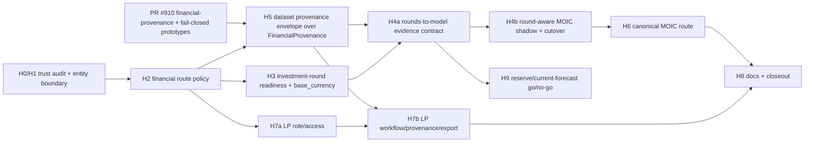

# Trust-First Development Milestones for `nikhillinit/Updog_restore`

**Revision:** v3.3 — rebased onto PR #910 (financial-actionability P0) and
corrected against verified repository state **Status:** HISTORICAL — superseded
by v3.4 (debate-amended) **Repo:**
<https://github.com/nikhillinit/Updog_restore> **Primary product flow:**
`/fund-setup -> review -> publish -> /fund-model-results/:fundId` **Design
owner:** Platform / GP Modeling **Review lanes:** Security, Analytics, LP
Reporting, Frontend Routing, Data Engineering, Product Trust

> This document is the design deliverable. It is currently held in the plan
> file. On approval it should be committed to the repo at
> `docs/design/trust-first-milestones-v3.3.md` on branch
> `claude/plan-review-d30szm`, superseding the v3.2 draft (mark v3.2 historical,
> do not delete).

---

## 0. What changed in v3.3 (relative to v3.2)

v3.3 rebases the milestone stack onto **PR #910 ("Codex/financial actionability
P0")**, which merges a generic financial-provenance foundation and a fail-closed
prototype-route pattern. It also corrects four current-state errors in v3.2 that
made headline rules unimplementable, and right-sizes the cross-cutting
infrastructure to reuse what now exists.

**Adopted from PR #910 (no longer to be reinvented):**

1. `FinancialProvenance` (`shared/contracts/financial-provenance.contract.ts`)
   is the **single base provenance contract**. v3.2's standalone
   `ProvenanceEnvelopeV1` is redefined as a dataset-level envelope that
   **composes** `FinancialProvenance` rather than a third parallel model.
2. The fail-closed vocabulary is now code: `sourceKind: 'prototype_blocked'`,
   `actionability: 'non_actionable' | 'quarantined'`,
   `isFinanciallyActionable: false`, 501 `PROTOTYPE_FINANCIAL_OUTPUT_BLOCKED`
   (`server/lib/portfolio-prototype-block.ts`). All milestone fail-closed states
   map onto this vocabulary.
3. Route classification reuses the `portfolioIntelligenceRouteClassifications`
   fixture pattern (`durable_crud | prototype_501 | static_template`) and its
   inventory test, instead of a parallel registry concept.
4. New CI guardrails follow the established `scripts/guardrails/*.mjs` +
   `guard:*:check` pattern (e.g. `guard:financial-placeholders:check`), wired
   into `guardrails:check`.
5. `enable_portfolio_intelligence` (prod-off, `exposeToClient: false`, alias
   `ENABLE_PORTFOLIO_INTELLIGENCE`) joins `enable_investment_rounds` in the flag
   inventory and is the route-layer enforcement of the H9 deferral.
6. Flag-type generation is deterministic (timestamps removed); all
   `flags:generate` output must remain byte-stable in CI.

**Corrections to v3.2 current-state errors (verified against code):**

7. **B1 — `funds` has no currency column.** `shared/schema/fund.ts` has no
   `base_currency`. The currency-block rule cannot reference `fund.baseCurrency`
   until a column is added. v3.3 adds that migration to H3 and, until it lands,
   blocks against the literal `'USD'`.
8. **B2/B3 — entity layering.** MOIC ranks `portfoliocompanies`
   (`server/services/fund-moic-ranking-service.ts:36`), but rounds FK to
   `investments` (`shared/schema/portfolio.ts:62`), which itself already has a
   `round`/`amount`/`investmentDate` shape and an `investment_lots` child. v3.3
   defines the canonical
   `investment_rounds -> investments -> portfoliocompanies` roll-up and the
   relationship to existing round modeling. Without this, H4a/H4b were not
   buildable.
9. **B4 — money precision.** Round amounts are `numeric(20,6)`; company amounts
   are `decimal(15,2)`; reserves are `bigint` cents. v3.3 mandates Decimal.js
   with explicit units for all reconciliation arithmetic, per CLAUDE.md.

**Structural fixes folded in:**

10. `exportEligibility` is split out of the provenance envelope (consistency
    with the same purity argument that removed `shadowDiff`).
11. The tri-state runtime mode (`off | shadow | on`) gets a concrete persistence
    home (`fund_calculation_modes` table); the boolean flag registry stays
    boolean.
12. The H4b cutover gate's shadow-residency clock is decoupled from the prod-off
    UI flag, and the reconciliation-acceptance action is given an owner
    milestone.

---

## 1. Executive summary

`Updog_restore` has made the right product-trust pivot, now reinforced in code
by PR #910: prototype financial surfaces fail closed with explicit,
non-actionable provenance rather than emitting placeholder numbers, and
investment rounds are persisted as real financing events. The next wave should
ship **one trustworthy vertical slice** — round-aware MOIC — on top of the #910
provenance foundation, not retrofit every engine at once:

```text
persisted investment_rounds
  -> access-hardened event lifecycle
  -> auditable rounds-to-model evidence contract
  -> FinancialProvenance-based dataset envelope
  -> round-aware MOIC in shadow mode
  -> canonical fund-results MOIC route
  -> qualified LP/reporting export controls
```

Reserve / current-forecast round consumption remains a later go/no-go decision
gate (H9). PR #910 has already fail-closed the prototype
reserve/scenario/forecast routes (`enable_portfolio_intelligence`, default off),
so the H9 deferral is now enforced at the route layer rather than by convention.
First-tranche round data still lacks ownership, security-conversion,
valuation-event, cap-table, liquidation-preference, and FX semantics; those gaps
are acceptable for a contained MOIC evidence slice with fail-closed behavior,
not for round-aware reserve math.

---

## 2. Current-state anchors (verified)

The product spine is
`/fund-setup -> review -> publish -> /fund-model-results/:fundId`
(`client/src/app/app-routes.tsx:82`). MOIC rankings come from live fund-scoped
data with provenance (`server/services/fund-moic-ranking-service.ts`); sample
rankings are not a production fallback. Round UI is production-off
(`enable_investment_rounds = false`).

### 2.1 Financial actionability foundation (PR #910)

- `shared/contracts/financial-provenance.contract.ts` defines
  `FinancialProvenanceSchema` (`.strict()` + `.superRefine`) with:
  - `sourceKind: 'computed' | 'imported_actual' | 'user_assumption' | 'static_template' | 'demo_seed' | 'prototype_blocked' | 'legacy_unknown'`
  - `actionability: 'actionable' | 'input_only' | 'non_actionable' | 'quarantined' | 'unknown_legacy'`
  - `isFinanciallyActionable: boolean`, `warnings: string[]`, `generatedAt`
    (datetime), and optional
    `sourceEngine / engineVersion / calculationVersion / inputHash / assumptionsHash / scenarioHash / generatedBy / sourceRoute / sourceCommitSha / quarantineReason`.
  - Invariants: actionable <-> `isFinanciallyActionable`; actionable =>
    sourceKind in {computed, imported_actual}; computed-actionable requires
    `sourceEngine, engineVersion, inputHash, assumptionsHash`; quarantined or
    prototype-blocked requires `quarantineReason`; actionable forbids
    `quarantineReason`.
- `server/lib/portfolio-prototype-block.ts` provides
  `makePrototypeBlockedProvenance`, `makeStaticTemplateProvenance`, and
  `buildPrototypeFinancialBlockedError` (501, code
  `PROTOTYPE_FINANCIAL_OUTPUT_BLOCKED`, optional `replacement`).
- `tests/fixtures/portfolio-intelligence-route-classification.ts` classifies
  every portfolio route as `durable_crud | prototype_501 | static_template`,
  with an inventory test asserting the live route table matches.
- `scripts/guardrails/no-portfolio-placeholder-financial-success.mjs` +
  `guard:financial-placeholders:check` (in `guardrails:check`) statically blocks
  hardcoded financial placeholder literals.

### 2.2 Round persistence (verified, complete)

`shared/schema/investment-rounds.ts` +
`server/migrations/20260621_z_investment_rounds_v1.up.sql` contain the full
schema: `investment_id`, denormalized `fund_id`, `currency varchar(3)`, money
`numeric(20,6)`, `idempotency_key`, `request_hash`, `supersedes_round_id`,
composite `(investment_id, fund_id) -> investments(id, fund_id)` FK,
`(fund_id, idempotency_key)` unique, and the partial unique supersede index.
`server/services/investments/investment-round-service.ts` implements idempotent
create, replay (hash compare), list, read, and supersede preflight (target
exists, same investment, not already superseded). Cross-fund supersede is
already prevented structurally (composite FK + route-level
`resolveInvestmentRoundRouteScope`); v3.3 adds an explicit same-fund check as
cheap defense-in-depth, not as a fix for an open hole.

### 2.3 Entity model (the round-aware MOIC crux)

Three distinct tables (`shared/schema/portfolio.ts`):

- `portfoliocompanies` (`id serial`, `fund_id`,
  `investment_amount decimal(15,2)`, `investment_date`,
  `planned_reserves_cents bigint`, `exit_moic_bps`, `current_valuation`) — **the
  unit MOIC ranks**.
- `investments` (`id serial`, `fund_id`, `company_id -> portfoliocompanies.id`,
  `amount decimal(15,2)`, `round text`, `investment_date`,
  `ownership_percentage`, `valuation_at_investment`) — **what
  `investment_rounds.investment_id` FKs to**.
- `investment_lots` (lot-level MOIC child of `investments`).

So the round-aware join is **three hops**:
`investment_rounds.investment_id -> investments.id -> investments.company_id -> portfoliocompanies.id`.
This is specified concretely in section 9.

### 2.4 What does NOT exist (must be built)

- No `funds.base_currency` (no currency column on `funds` at all).
- No generic dataset-level trust envelope (only `FinancialProvenance` per-result
  and `FundMoicRankingsProvenanceV1` for MOIC).
- No tri-state runtime flag store, no shadow/reconciliation infra for MOIC, no
  HMAC/signed-envelope export, no monetary-field telemetry redaction.
- New npm scripts `policy:verify`, `test:golden-fixtures`, `test:shadow-parity`,
  `test:no-client-derived-math`, `test:telemetry-redaction` do not exist.

---

## 3. Scope lock

### In scope

- Financial-surface inventory and access-boundary proof.
- Route-policy MVP layered over the existing route-classification + governance
  registries (no third parallel registry).
- Investment-round lifecycle hardening + explicit same-fund supersede check +
  deterministic concurrency tests.
- `funds.base_currency` column + backfill.
- Runtime calculation modes `off | shadow | on` in a dedicated store.
- Rounds-to-model evidence adapter with the three-hop join.
- Dataset provenance envelope composing `FinancialProvenance`.
- Round-aware MOIC input builder + shadow reconciliation.
- Canonical MOIC child route under `/fund-model-results/:fundId`.
- LP role/workflow/provenance/export qualification, signed envelopes, audit
  logs.
- No-client-derived-financial-math guardrail (guardrail-script pattern).
- Golden fixtures and lane closeout packets.
- ADR-FX-001 placeholder.

### Out of scope

- Production enablement of `enable_investment_rounds` or
  `enable_portfolio_intelligence`.
- Reserve / current-forecast round-aware calculation changes (H9 gate).
- Valuation-event, ownership-event, cap-table, liquidation-preference,
  performance-case, FX implementations.
- Reviving any prototype financial route #910 fail-closed.
- Client-side computation of any financial value or trust state.

---

## 4. Principles

1. **Code wins over stale docs.** Current code, accepted ADRs, merged PRs
   (including #910) outrank historical plans.
2. **Financial outputs fail closed**, using the #910 vocabulary: missing,
   invalid, stale-blocked, quarantined, or failed provenance hides values and
   sets `isFinanciallyActionable: false`.
3. **Route mount is not qualification.** Client `isProtected`
   (`route-governance-registry.ts`) never counts as API auth or fund access.
4. **Actuals become evidence before engine truth.** Rounds are normalized,
   warned, and proven before any engine claims to consume them.
5. **Pure engines stay pure.** DB access, provenance, policy, and shadow
   comparison live in services/adapters, not calculators (`MOICCalculator` stays
   pure).
6. **Supersede, do not mutate.**
7. **Semantic changes ship dark.** Round-aware calculations begin in `shadow`,
   persist diffs, and cut over per fund only after review.
8. **Watermark is deterrent; signature + audit are control.**
9. **No client-derived financial math.**
10. **One provenance contract.** Everything composes `FinancialProvenance`; no
    new parallel provenance vocabularies.
11. **Docs change with code.**

---

## 5. Dependency graph



H5 depends on PR #910 (it composes `FinancialProvenance`). H9 is a decision
gate; PR #910 already enforces the deferral at the route layer.

---

## 6. Cross-cutting contracts

### 6.1 Route policy contract (layered, not parallel)

Reuse, do not replace:

- `client/src/app/route-governance-registry.ts` (existing `isProtected`,
  `RouteSurface`, `RouteExposure`).
- `server/lib/auth/provided-fund-scope.ts` (`enforceProvidedFundScope`),
  `server/middleware/requireLPAccess.ts`, JWT `fundIds` claims.
- `tests/fixtures/portfolio-intelligence-route-classification.ts` pattern.

Create only the **policy overlay** and verifier:

- `shared/contracts/route-policy.contract.ts`
- `server/route-policy/api-route-policy-registry.ts` (references the governance
  registry as source of truth for mount/protection; adds API-side fields)
- `scripts/verify-route-policy.ts` + npm `policy:verify`

```ts
type FinancialSurface =
  | 'none'
  | 'fund_modeling'
  | 'portfolio_management'
  | 'moic_reserves'
  | 'lp_reporting'
  | 'export_artifact';

type ApiAuthBoundary =
  | 'none_public'
  | 'signed_public_share'
  | 'require_auth'
  | 'require_auth_and_fund_access'
  | 'require_auth_and_lp_access'
  | 'admin_only'
  | 'dev_only';

type FundScopeMode =
  | 'none'
  | 'route_param_fund_id'
  | 'query_param_fund_id'
  | 'parent_entity_lookup'
  | 'lp_claim_scope'
  | 'share_token_scope'
  | 'not_applicable';

type ExportPolicy =
  | 'not_exportable'
  | 'preview_only'
  | 'admin_only_watermarked'
  | 'qualified_exportable';

type Role =
  | 'admin'
  | 'gp_partner'
  | 'gp_analyst'
  | 'lp_full'
  | 'lp_limited'
  | 'service';

// Reuse the #910 route-classification taxonomy verbatim for lifecycle status.
type RouteLifecycle = 'durable_crud' | 'prototype_501' | 'static_template';

interface RoutePolicyEntry {
  id: string;
  method?: string;
  path: string;
  lifecycle: RouteLifecycle; // aligned with #910 fixture
  governanceRef: string; // key into route-governance-registry
  surface: string;
  owner: string;
  telemetryKey: string;
  financialSurface: FinancialSurface;
  apiAuthBoundary: ApiAuthBoundary;
  fundScopeMode: FundScopeMode;
  rolesAllowed: Role[];
  workflowRequirement: string | null;
  exportPolicy: ExportPolicy;
  provenanceRequired: boolean;
  staleBlocksExport: boolean;
  staleBlocksRender: boolean;
  humanReviewRequired: boolean;
  performanceBudgetMs: number | null;
  notes?: string;
}
```

`policy:verify` rules:

- `financialSurface !== 'none'` is the financial predicate (no redundant
  boolean).
- `isProtected` cannot satisfy `apiAuthBoundary` or `fundScopeMode`.
- Every `lifecycle: 'prototype_501'` route must declare a `non_actionable`
  provenance and return 501 (consistency with #910).
- LP export routes must set `staleBlocksExport: true`.
- AI-tagged PRs touching `humanReviewRequired: true` routes require a human
  `Reviewed-by` trailer.
- Verifier fails on: missing active financial policy, stale/unmounted active
  entries, client-auth-as-API-auth claims, and policy/governance drift.

### 6.2 Dataset provenance envelope (composes FinancialProvenance)

Create `shared/contracts/provenance-envelope.contract.ts`. The envelope is a
**dataset/ranking-level** wrapper; the **core trust unit is the merged
`FinancialProvenance`** from PR #910. v3.2's
`ProvenanceState`/`sourceAuthority`/ `calculationMode` are reconciled into this
composition:

```ts
import {
  FinancialProvenanceSchema,
  type FinancialProvenance,
} from '@shared/contracts/financial-provenance.contract';

type DatasetTrustState =
  | 'LIVE' // core.isFinanciallyActionable === true
  | 'PARTIAL' // actionable subset + non-actionable remainder, disclosed
  | 'UNAVAILABLE' // fail-closed (e.g. currency block); no values
  | 'FAILED'; // adapter/engine error

interface StructuredWarning {
  code: string;
  severity: 'info' | 'warning' | 'blocking';
  message: string;
  source?: string;
}

interface ProvenanceEnvelopeV1 {
  version: 1;
  trustState: DatasetTrustState;
  core: FinancialProvenance; // PR #910 contract, validated
  calculationMode:
    | 'planned_reserves_moic'
    | 'rounds_aware_moic'
    | 'construction_forecast'
    | 'current_forecast'
    | 'lp_report_package'
    | 'export_artifact';
  sourceAsOf: string | null;
  staleAfterSeconds: number | null;
  sourceRecordCounts: Record<string, number>;
  sourceHashes: Record<string, string>;
  warnings: StructuredWarning[];
}
```

Notes:

- `shadowDiff` is **not** present. Shadow comparison is controller-internal.
- `exportEligibility` is **not** in the envelope (see 6.2.1) -- same purity
  logic that excluded `shadowDiff`.
- The envelope **must** validate `core` with `FinancialProvenanceSchema` at
  construction.

Invariants:

```ts
// LIVE requires an actionable, hash-bound computed core.
if (trustState === 'LIVE') {
  assert(core.isFinanciallyActionable === true);
  assert(
    core.sourceKind === 'computed' || core.sourceKind === 'imported_actual'
  );
  assert(Object.keys(sourceHashes).length > 0 || !!core.inputHash);
}
// UNAVAILABLE / FAILED must be non-actionable with a quarantine/failure reason.
if (trustState === 'UNAVAILABLE' || trustState === 'FAILED') {
  assert(core.isFinanciallyActionable === false);
  assert(!!core.quarantineReason);
}
```

Staleness helper (unchanged intent; emits a `StructuredWarning`):

```ts
if (env.sourceAsOf && env.staleAfterSeconds) {
  const ageMs = Date.now() - new Date(env.sourceAsOf).getTime();
  if (ageMs > env.staleAfterSeconds * 1000) {
    warnings.push({
      code: 'DATA_STALE',
      severity:
        routePolicy.staleBlocksRender || routePolicy.staleBlocksExport
          ? 'blocking'
          : 'warning',
      message: 'Source data may be outdated.',
    });
  }
}
```

`staleBlocksRender` UI contract: if true and `DATA_STALE` present, render
`FinancialProvenanceBanner` (blocking), replace all financial metrics with a
"stale data" placeholder, hide export controls and interactive charts, compute
no derived values; last-cached figures only under an explicit greyed "stale /
not current" overlay.

#### 6.2.1 Export eligibility (separate object)

Create `shared/contracts/export-eligibility.contract.ts`:

```ts
interface ExportEligibility {
  eligible: boolean;
  policy: ExportPolicy;
  blockers: string[];
  watermark: string | null;
  signedEnvelope: string | null;
}
```

`staleBlocksExport`: if true and `DATA_STALE` present, force `eligible = false`
and add blocker `DATA_STALE`. Export eligibility is **server-declared** and
rides alongside the provenance envelope, not inside it.

### 6.3 Shadow-mode response contract

Create `server/services/modeling/shadow-mode-controller.ts`:

```ts
interface ShadowModeResponse<Legacy, Candidate> {
  legacyResponse: Legacy; // returned to user while in shadow
  candidateResponse: Candidate; // persisted for reconciliation only
  diffPersistedTo: number; // reconciliation_runs.id
}
```

Clients never receive `candidateResponse`. Shadow metadata lives in
`reconciliation_runs`, surfaced only via admin diagnostics.

### 6.4 Rounds-to-model evidence contract

Create `shared/contracts/modeling/rounds-to-model.contract.ts`.

```ts
type RoundMappingState =
  | 'mapped'
  | 'mapped_initial_reconciled_to_parent'
  | 'mapped_follow_on_incremental'
  | 'mapped_amount_only'
  | 'mapped_amount_only_currency_blocked'
  | 'ignored_superseded'
  | 'ignored_wrong_fund'
  | 'ignored_currency_mismatch'
  | 'ignored_unsupported_security_type'
  | 'ignored_by_model_override'
  | 'ambiguous_initial_follow_on'
  | 'unavailable_missing_parent'
  | 'failed';

interface RoundsToModelResponse {
  fundId: number;
  generatedAt: string;
  provenance: ProvenanceEnvelopeV1;
  mappings: RoundToModelMapping[];
  coverage: {
    activeRoundsLoaded: number;
    roundsMapped: number;
    roundsIgnored: number;
    roundsBlockedForCurrency: number;
    overrideCount: number;
    warningsByCode: Record<string, number>;
  };
  consumers: Record<
    string,
    'uses_rounds' | 'ignores_rounds' | 'blocked_until_modeling_pr'
  >;
}
```

Adapter exceptions return `provenance.trustState = 'FAILED'`,
`core.sourceKind = 'prototype_blocked'`-style failure
(`isFinanciallyActionable: false`, `quarantineReason: 'round_adapter_failed'`),
`mappings = []`, and blocking warning `ROUND_ADAPTER_FAILED`. No caller may
silently fall back to legacy math while claiming round awareness.

---

## 7. Runtime flags and modes

Boolean feature flags stay in `flags/registry.yaml` (boolean-only, deterministic
generation). Tri-state runtime calculation modes get a **dedicated store** --
they are not representable in the boolean registry.

Flag inventory (booleans):

```ts
enable_investment_rounds: boolean; // UI/CRUD exposure; prod-off
enable_portfolio_intelligence: boolean; // PR #910; prototype routes; prod-off
```

Runtime modes (new store `fund_calculation_modes`):

```ts
type RuntimeMode = 'off' | 'shadow' | 'on';
// keyed by (fund_id, calc_key); calc_key in:
//   'moic_consumes_rounds'              -> starts 'off'
//   'reserve_consumes_rounds'           -> registered; blocked until H9
//   'current_forecast_consumes_rounds'  -> registered; blocked until H9
```

```sql
CREATE TABLE IF NOT EXISTS fund_calculation_modes (
  id BIGSERIAL PRIMARY KEY,
  fund_id INTEGER NOT NULL REFERENCES funds(id),
  calc_key TEXT NOT NULL CHECK (calc_key IN
    ('moic_consumes_rounds','reserve_consumes_rounds','current_forecast_consumes_rounds')),
  mode TEXT NOT NULL CHECK (mode IN ('off','shadow','on')) DEFAULT 'off',
  kill_switch BOOLEAN NOT NULL DEFAULT false,
  updated_by BIGINT NULL,
  updated_at TIMESTAMPTZ NOT NULL DEFAULT now(),
  UNIQUE (fund_id, calc_key)
);
```

Cutover residency (clarified, see I1):

- Shadow residency accrues wherever rounds exist with the mode in `shadow` --
  **including staging/dev pilot funds** -- because `enable_investment_rounds` is
  prod-off. The residency clock is the age of the **oldest unbroken `shadow`
  window** in `fund_calculation_modes`, not a production-only clock.
- At least seven days of continuous `shadow` for a fund before `on`.
- `reconciliation_runs` must show zero unresolved diffs or accepted diffs.
- `kill_switch = true` forces `off` even if `mode = 'on'`.

---

## 8. Data and migrations

All new tables ship as **Drizzle schema entries + paired `.up.sql`/`.down.sql`**
(repo convention), with integer key types matching existing PKs (`serial` /
`integer`), not `BIGINT`, where they reference `funds.id` / `investments.id` /
`investment_rounds.id`.

### 8.1 `funds.base_currency` (new -- unblocks the currency rule)

```sql
-- up
ALTER TABLE funds ADD COLUMN IF NOT EXISTS base_currency varchar(3) NOT NULL DEFAULT 'USD';
-- down
ALTER TABLE funds DROP COLUMN IF EXISTS base_currency;
```

Add to `shared/schema/fund.ts`. Backfill is trivial (default `'USD'`). Until
this migration is deployed, the currency rule compares against the literal
`'USD'`.

### 8.2 Round operational indexes (verify/add)

```sql
CREATE INDEX IF NOT EXISTS investment_rounds_fund_round_order_idx
  ON investment_rounds (fund_id, investment_id, round_date, created_at, id);
```

(The supersede partial-unique and fund/idempotency constraints already exist.)

### 8.3 Reconciliation table

```sql
CREATE TABLE IF NOT EXISTS reconciliation_runs (
  id BIGSERIAL PRIMARY KEY,
  fund_id INTEGER NOT NULL REFERENCES funds(id),
  mode TEXT NOT NULL CHECK (mode IN ('moic','reserve','current_forecast')),
  generated_at TIMESTAMPTZ NOT NULL DEFAULT now(),
  legacy_hash TEXT NOT NULL,
  candidate_hash TEXT NOT NULL,
  differs BOOLEAN NOT NULL,
  diff_summary JSONB NOT NULL,
  acceptance_signature TEXT NULL,
  accepted_by BIGINT NULL,
  accepted_at TIMESTAMPTZ NULL
);
CREATE INDEX IF NOT EXISTS reconciliation_runs_fund_mode_time_idx
  ON reconciliation_runs (fund_id, mode, generated_at DESC);
```

### 8.4 Modeling override table

```sql
CREATE TABLE IF NOT EXISTS investment_round_model_overrides (
  id BIGSERIAL PRIMARY KEY,
  fund_id INTEGER NOT NULL REFERENCES funds(id),
  round_id INTEGER NOT NULL REFERENCES investment_rounds(id),
  override_role TEXT NOT NULL CHECK (override_role IN
    ('initial_reconciled_to_parent','follow_on_incremental','ignore_for_modeling')),
  reason TEXT NOT NULL,
  created_by BIGINT NOT NULL,
  created_at TIMESTAMPTZ NOT NULL DEFAULT now(),
  supersedes_override_id BIGINT NULL REFERENCES investment_round_model_overrides(id)
);
CREATE INDEX IF NOT EXISTS investment_round_model_overrides_active_idx
  ON investment_round_model_overrides (fund_id, round_id, created_at DESC);
```

Append-only; active override = a row not superseded by another.

### 8.5 LP export audit

```sql
CREATE TABLE IF NOT EXISTS lp_export_audit (
  id BIGSERIAL PRIMARY KEY,
  subject_id BIGINT NOT NULL,
  fund_id INTEGER NOT NULL REFERENCES funds(id),
  package_id BIGINT NOT NULL,
  eligibility TEXT NOT NULL,
  signed_envelope TEXT NOT NULL,
  generated_at TIMESTAMPTZ NOT NULL DEFAULT now()
);
```

### 8.6 FX ADR placeholder

`docs/adr/ADR-FX-001-multi-currency-round-support.md`. Until accepted, MOIC
rankings block when any post-override active round currency differs from
`funds.base_currency`.

---

## 9. Rounds-to-model mapping rules

### 9.1 Canonical join and active-round query

The ranked unit is `portfoliocompanies`. Rounds attach to `investments`. The
adapter loads, per fund, in bounded batches:

1. Active rounds (below).
2. Their parent `investments` rows
   (`investment_rounds.investment_id = investments.id`), carrying
   `investments.company_id`, `amount`, `investment_date`.
3. The `portfoliocompanies` rows MOIC ranks (`company_id`).

Active-round query (supersede-aware):

```sql
SELECT r.*
FROM investment_rounds r
WHERE r.fund_id = $1
  AND NOT EXISTS (
    SELECT 1 FROM investment_rounds newer
    WHERE newer.fund_id = r.fund_id
      AND newer.supersedes_round_id = r.id
  )
ORDER BY r.investment_id ASC, r.round_date ASC, r.created_at ASC, r.id ASC;
```

No per-investment round loading. "Parent" for reconciliation is the
`investments` row (`amount`, `investment_date`), and the **MOIC aggregate** is
the `portfoliocompanies` row whose `investment_amount`/reserves feed
`MOICCalculator`. Round amounts roll up: per company, summed follow-on rounds
become the `followOnInvestment` input that today is hardcoded `null`
(`fund-moic-ranking-service.ts:52`).

### 9.2 Currency rule for MOIC ranking (post-override)

The currency check runs on the **post-override** active set (after 9.4 removes
`ignore_for_modeling` rounds), so an operator can rescue a single stray-currency
row instead of one row blocking the fund:

```text
If any post-override active round has currency !== funds.base_currency
(until 8.1 ships: !== 'USD'),
then the whole fund MOIC ranking response is UNAVAILABLE.
```

Response: `trustState = 'UNAVAILABLE'`, `core.isFinanciallyActionable = false`,
`core.quarantineReason = 'currency_mismatch'`,
`sourceRecordCounts.activeRounds`, `sourceRecordCounts.currencyBlockedRounds`,
blocking warning `CURRENCY_MISMATCH_BLOCK`, no ranking values. Audit/evidence
views may show `PARTIAL` with offending rows `ignored_currency_mismatch`, but
rankings must not silently re-rank the remainder.

### 9.3 Initial/follow-on reconciliation arithmetic (Decimal, explicit units)

All money is normalized to a single canonical Decimal in **dollars** (round
`numeric(20,6)` and company `decimal(15,2)` both parsed via Decimal.js; never JS
float). The parent amount is `investments.amount` (the field is named `amount`,
not `initialInvestment`).

```ts
import Decimal from 'decimal.js';

const parentAmount = new Decimal(parent.amount);
const roundAmount = new Decimal(round.investmentAmount);

const amountTolerance = Decimal.max(
  parentAmount.mul('0.01'),
  new Decimal(fundSettings.minRoundReconciliationToleranceUsd ?? 25_000)
);
const dateToleranceDays =
  fundSettings.roundReconciliationDateToleranceDays ?? 14;
```

A round is `initial_reconciled_to_parent` only when:

```ts
roundAmount.minus(parentAmount).abs().lte(amountTolerance) &&
  Math.abs(daysBetween(round.roundDate, parent.investmentDate)) <=
    dateToleranceDays;
```

If `parent.amount` is null, non-finite, or `0`, the adapter cannot reconcile:

- emit warning `ROLE_TOLERANCE_OVERRIDDEN` (severity `warning`),
- treat all non-overridden active rounds as `follow_on_incremental`,
- if multiple plausible initial rounds exist, emit
  `ROLE_CLASSIFICATION_AMBIGUOUS` and resolve **fail-closed** (see 9.3.1).

#### 9.3.1 Ambiguous-initial resolution (was undefined in v3.2)

When `ambiguous_initial_follow_on` holds (multiple plausible initials, no
override), the adapter does **not** guess: it maps the affected company's rounds
as `mapped_amount_only`, sets that company's contribution to
`actionability: 'input_only'`, and emits blocking warning
`ROLE_CLASSIFICATION_AMBIGUOUS`. If an ambiguous company would otherwise be
ranked, the dataset degrades to `PARTIAL` with that company disclosed as
non-actionable; it is never silently ranked.

### 9.4 Override resolution order

1. Load active, fund-scoped, non-superseded rounds.
2. Load active `investment_round_model_overrides` for those rounds.
3. Apply overrides first:
   - `ignore_for_modeling` removes the round (also from the 9.2 currency check).
   - `initial_reconciled_to_parent` / `follow_on_incremental` override
     tolerance.
4. Run tolerance reconciliation (9.3) on the remainder.
5. Run the currency rule (9.2) on the post-override set.
6. Emit `ROUND_MODEL_OVERRIDE_APPLIED` per overridden round (non-sensitive
   `created_by`, `override_id`, reason code only).

Supersession via `supersedes_override_id`, no mutation.

### 9.5 Security-type behavior

- Equity rounds -> MOIC evidence if currency and reconciliation pass.
- SAFE / convertible / warrant / other -> amount-only evidence
  (`mapped_amount_only`), never valuation-sensitive claims until conversion
  economics exist.
- Any security-type blocker on a ranked company -> `UNAVAILABLE` unless the
  output explicitly stays planned-only and makes no round-aware claim.

---

## 10. Milestones

### H0/H1 -- Trust audit and entity access verification

- Cross-fund denial: `GET /api/investments/:id`, round
  list/read/create/supersede.
- Fund-B superseding fund-A round -> `403`/`400`, no side effects.
- Concurrent supersede race proof (deterministic DB test: lock target with
  `SELECT ... FOR UPDATE` or orchestrate two inserts against the partial unique
  index; assert exactly one success, loser `409 round_already_superseded`, no
  ambiguous active chain).
- Mock-surface quarantine proof -- **extended to assert PR #910 prototype routes
  still 501** and emit `non_actionable` provenance.
- LP export inventory; `/moic-analysis?fundId=` caller inventory.
- Deliverables: `docs/design/audits/2026-06-23-trust-audit.md`,
  `...-entity-access-boundary.md`, `docs/closeout-packets/H0-H1.md`, negative
  security integration tests.

### H2 -- Financial route-policy MVP

- Route-policy overlay (6.1) referencing the existing governance registry + #910
  classification fixture; `policy:verify`; `isProtected` anti-rule; LP mount
  parity test; CODEOWNERS; AI-author guardrail.
- Acceptance: every active financial route has policy coverage; new financial
  route without policy fails CI; client-protection-as-API-auth fails CI; every
  `prototype_501` route asserts 501 + `non_actionable` provenance.

### H3 -- Investment-round operational readiness + base currency

- Create/replay/key-reuse/missing-target/already-superseded/cross-fund-target/
  other-investment-target/double-supersede/empty-list/access-denial coverage.
- Explicit same-fund supersede check.
- `funds.base_currency` migration (8.1) + schema + backfill.
- Deterministic concurrency test; telemetry redaction schema; backfill script
  and flag governance; support runbook.

### H5 -- Dataset provenance envelope over FinancialProvenance

- `ProvenanceEnvelopeV1` (6.2) composing and validating `FinancialProvenance`.
- `ExportEligibility` (6.2.1) as a separate object.
- Server builders; LIVE/UNAVAILABLE/FAILED invariants; `DATA_STALE` generation;
  `staleBlocksRender`/`staleBlocksExport` enforcement; client banner +
  blocked-state renderer; signed-envelope helper.

### H4a -- Rounds-to-model evidence contract

- Adapter service implementing the three-hop join (9.1), mapping
  states/warnings, override resolution (9.4), currency block (9.2), Decimal
  arithmetic (9.3), ambiguous resolution (9.3.1), consumer/claim registries,
  golden fixtures, no-client-math guardrail.

### H4b -- Round-aware MOIC shadow and cutover

- `round-aware-moic-input-builder.ts` (sets `followOnInvestment` from summed
  follow-on rounds per company, replacing the `followOnAmount: null` at
  `fund-moic-ranking-service.ts:52`).
- `fund_calculation_modes.moic_consumes_rounds in {off, shadow, on}` + per-fund
  kill switch.
- Shadow controller + `reconciliation_runs` persistence; client never sees diff.
- Currency mismatch blocks ranking; claim-bound UI copy.
- **Reconciliation acceptance action** (endpoint + `gp_partner`/`admin` role
  gate
  - audit) -- owned here, since the cutover gate requires it.
- Cutover gate: seven-day continuous shadow residency, no unresolved blockers,
  accepted reconciliation diff if values differ, `LIVE` or approved `PARTIAL`
  provenance, tested runtime rollback.

### H6 -- Canonical MOIC placement

- Add `/fund-model-results/:fundId/moic-analysis` (route-param fund context),
  refactoring `client/src/pages/moic-analysis.tsx` from `useSearch()`/`?fundId=`
  to route params.
- Keep `/moic-analysis?fundId=` as a compatibility wrapper that redirects to
  canonical while telemetry proves callers exist.

### H7a -- LP role/access qualification

Roles: `admin`, `gp_partner`, `gp_analyst`, `lp_full`, `lp_limited`, `service`.

### H7b -- LP workflow, provenance, signed export, audit

Workflow `draft -> approved -> locked -> report_package_ready -> export_ready`;
`export_blocked` orthogonal.

### H8 -- Documentation and closeout hygiene

Per-lane closeout packets.

### H9 -- Reserve/current-forecast go/no-go

Decision gate, not a lane. PR #910 already route-blocks the prototype surfaces.

---

## 11. Testing strategy

New npm scripts following established patterns. Performance budgets defined.

---

## 12. Observability and retention

Events, telemetry schema, retention policies defined.

---

## 13. Rollout and rollback

Surface-specific rollback paths defined.

---

## 14. PR sequence

1. PR-A: H0/H1 audits
2. PR-B: H2 route-policy
3. PR-C: H3 lifecycle + base_currency
4. PR-D: H5 envelope
5. PR-E: H4a evidence contract
6. PR-F: H4b MOIC shadow
7. PR-G: H6 canonical route
8. PR-H: H7a LP role
9. PR-I: H7b workflow/export
10. PR-J: H8 docs
11. PR-K: H9 decision packet

---

## 15. Final acceptance criteria

21 acceptance criteria defined covering provenance, security, precision,
shadow/cutover, LP export, guardrails, and documentation.
