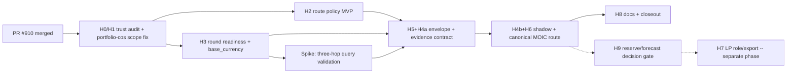

# Trust-First Development Milestones for `nikhillinit/Updog_restore`

**Revision:** v3.4 -- debate-amended (Hermes 3-lane: Kimi + Codex + Claude)
**Status:** implementation-ready design spec **Repo:**
<https://github.com/nikhillinit/Updog_restore> **Primary product flow:**
`/fund-setup -> review -> publish -> /fund-model-results/:fundId` **Design
owner:** Platform / GP Modeling **Review lanes:** Security, Analytics, Frontend
Routing, Data Engineering, Product Trust **Supersedes:** v3.3 (mark historical,
do not delete)

> This document is the design deliverable. On approval it should be committed to
> the repo at `docs/design/trust-first-milestones-v3.4.md`, superseding v3.3.

---

## 0. What changed in v3.4 (relative to v3.3)

v3.4 applies 19 amendments from a Hermes three-lane debate (Kimi long-context
audit, Codex GPT-5.5 code-grounded review, Claude Plan agent). All amendments
are grounded in verified source-file references. Synthesis artifact:
`.claude/artifacts/debate-synthesis-v33.md`.

**Scope reduction (unanimous across all 3 lanes):**

1. **H7a/H7b (LP role/export) deferred to a separate LP-export phase.** Signed
   envelopes, HMAC, watermarking, `lp_export_audit`, and the six-role access
   model are not needed for the core round-aware MOIC vertical. LP-export
   readiness is assessed as part of H9's decision packet.
2. **PR count reduced from 11 to 8.** H5+H4a merged (envelope built alongside
   its first consumer), H4b+H6 merged (shadow mode needs the canonical route),
   H7a/H7b removed, spike added.
3. **H2 and H3 parallelized.** Zero file overlap; both land independently after
   H0/H1.
4. **`fund_calculation_modes` shrunk to one key** (`moic_consumes_rounds` only).
   Reserve/forecast keys deferred to H9 decision packet.

**Correctness fixes (debate-grounded):**

5. **A1 (Codex BLOCKING): `/api/portfolio-companies` added to H0/H1.** The list
   route returns all companies when no `fundId` is provided
   (`server/routes/portfolio-companies.ts:44`, `server/storage.ts:558`). This is
   a live cross-fund data leak the v3.3 trust audit missed.
6. **A2 (all 3 lanes): per-company investment aggregation rule specified.**
   Section 9.1 now defines how the adapter handles
   `portfolioCompanies -> investments` one-to-many
   (`shared/schema/portfolio.ts:144-146`).
7. **A3 (all 3 lanes): flag enforcement claim corrected.** Sections 2.1 and 7
   now state that `enable_portfolio_intelligence` is enforced by
   `server/config/features.ts:19` reading the raw env var +
   `server/routes.ts:168` conditionally mounting routes, NOT through the
   generated flag registry consumer.
8. **A4 (Kimi + Claude): parallel flag registry reconciliation added to H2.**
   `shared/feature-flags/flag-definitions.ts:258-266` duplicates
   `enable_investment_rounds` outside `flags/registry.yaml`. Client resolves
   flags via `flag-definitions.ts`, not generated files.
9. **A10 (Kimi + Claude): `> 0` CHECK on `investment_amount` added to H3.**
   `shared/schema/investment-rounds.ts:47` has no positivity constraint.
10. **A11 (Kimi + Claude): `diff_summary` JSON schema and hash algorithm
    defined.** Uses `canonicalSha256` from `shared/lib/canonical-hash`.
11. **A12 (Kimi): date-type handling specified.** `roundDate` is `date`,
    `investmentDate` is `timestamp`; reconciliation uses midnight UTC.
12. **A13 (Kimi): supersede-after-acceptance behavior defined.** Superseding a
    round used in an accepted reconciliation resets the shadow residency clock.
13. **A14 (Kimi + Claude): `base_currency` rollback safety criteria added.**
14. **A15 (Codex): client-derived MOIC math inventoried.**
    `OverviewTab.tsx:94, 234,303` computes per-company MOIC, average MOIC, and
    return percent client-side. Added to H0/H1 scope and guardrail inventory.
15. **A16 (Claude): `StaticTemplateProvenance` characterization corrected.**
    `static_template` is non-actionable but NOT quarantined; it has
    `quarantineReason?: never`.
16. **A17 (Claude): degenerate edge cases specified.** Empty fund, mode-without-
    rounds.
17. **A18 (all 3 lanes): spike milestone added before merged H5+H4a.**
18. **A19 (Codex): placeholder sections filled.** Testing, observability,
    rollback, and acceptance criteria are now complete.

---

## 1. Executive summary

`Updog_restore` has made the right product-trust pivot, now reinforced in code
by PR #910: prototype financial surfaces fail closed with explicit,
non-actionable provenance rather than emitting placeholder numbers, and
investment rounds are persisted as real financing events. The next wave ships
**one trustworthy vertical slice** -- round-aware MOIC -- on top of the #910
provenance foundation, not retrofit every engine at once:

```text
persisted investment_rounds
  -> access-hardened event lifecycle
  -> auditable rounds-to-model evidence contract
  -> FinancialProvenance-based dataset envelope
  -> round-aware MOIC in shadow mode
  -> canonical fund-results MOIC route
```

Reserve / current-forecast round consumption remains a later go/no-go decision
gate (H9). PR #910 has already fail-closed the prototype
reserve/scenario/forecast routes (`enable_portfolio_intelligence`, default off),
so the H9 deferral is now enforced at the route layer rather than by convention.

LP role/access qualification and signed-envelope export are **deferred to a
separate LP-export phase** assessed as part of the H9 decision packet. They are
not needed for the core MOIC vertical.

---

## 2. Current-state anchors (verified)

The product spine is
`/fund-setup -> review -> publish -> /fund-model-results/:fundId`
(`client/src/app/app-routes.tsx:82`). MOIC rankings come from live fund-scoped
data with provenance (`server/services/fund-moic-ranking-service.ts`); sample
rankings are not a production fallback. Round UI is production-off
(`enable_investment_rounds = false` in production/staging; `true` in development
per `flags/registry.yaml:102`).

### 2.1 Financial actionability foundation (PR #910)

- `shared/contracts/financial-provenance.contract.ts` defines
  `FinancialProvenanceSchema` (`.strict()` + `.superRefine`) with:
  - `sourceKind: 'computed' | 'imported_actual' | 'user_assumption' | 'static_template' | 'demo_seed' | 'prototype_blocked' | 'legacy_unknown'`
  - `actionability: 'actionable' | 'input_only' | 'non_actionable' | 'quarantined' | 'unknown_legacy'`
  - `isFinanciallyActionable: boolean`, `warnings: string[]`, `generatedAt`
    (datetime), and optional fields.
  - Invariants: actionable <-> `isFinanciallyActionable`; actionable =>
    sourceKind in {computed, imported_actual}; computed-actionable requires
    `sourceEngine, engineVersion, inputHash, assumptionsHash`;
    `quarantineReason` required when `actionability === 'quarantined'` OR
    `sourceKind === 'prototype_blocked'`; actionable forbids `quarantineReason`.
  - **Note:** `static_template` with `actionability: 'non_actionable'` passes
    validation WITHOUT `quarantineReason` (`quarantineReason?: never` in
    `portfolio-prototype-block.ts:28-36`). It is non-actionable but not
    quarantined. Do not conflate.
- `server/lib/portfolio-prototype-block.ts` provides
  `makePrototypeBlockedProvenance`, `makeStaticTemplateProvenance`, and
  `buildPrototypeFinancialBlockedError` (501, code
  `PROTOTYPE_FINANCIAL_OUTPUT_BLOCKED`, optional `replacement`).
- `tests/fixtures/portfolio-intelligence-route-classification.ts` classifies
  every portfolio route as `durable_crud | prototype_501 | static_template`,
  with an inventory test asserting the live route table matches.
- `scripts/guardrails/no-portfolio-placeholder-financial-success.mjs` +
  `guard:financial-placeholders:check` (in `guardrails:check`) statically blocks
  hardcoded financial placeholder literals.
- **Flag enforcement reality (corrected from v3.3):**
  `enable_portfolio_intelligence` is registered in `flags/registry.yaml:387-399`
  and generated into `shared/generated/flag-defaults.ts:457-472`. However, route
  enforcement reads the raw env var directly via `server/config/features.ts:19`
  (`flag(process.env['ENABLE_PORTFOLIO_INTELLIGENCE'], false)`), and
  `server/routes.ts:168` conditionally mounts routes based on that. It does NOT
  flow through the generated flag registry consumer path.
  `client/src/app/route-control-flags.ts:5` knows only `enable_lp_reporting`,
  `onboarding_tour`, `ui_catalog` -- `enable_portfolio_intelligence` is not a
  client route-control flag.

### 2.2 Round persistence (verified, complete)

`shared/schema/investment-rounds.ts` +
`server/migrations/20260621_z_investment_rounds_v1.up.sql` contain the full
schema: `investment_id`, denormalized `fund_id`, `currency varchar(3)`, money
`numeric(20,6)`, `idempotency_key`, `request_hash`, `supersedes_round_id`,
composite `(investment_id, fund_id) -> investments(id, fund_id)` FK,
`(fund_id, idempotency_key)` unique, and the partial unique supersede index.
`server/services/investments/investment-round-service.ts` implements idempotent
create, replay (hash compare), list, read, and supersede preflight (target
exists, same investment, not already superseded). Cross-fund supersede is
already prevented structurally (composite FK + route-level
`resolveInvestmentRoundRouteScope`); v3.4 adds an explicit same-fund check as
cheap defense-in-depth, not as a fix for an open hole.

**Known gap:** `investment_amount numeric(20,6)` has no `> 0` CHECK constraint
(`shared/schema/investment-rounds.ts:47`). Added to H3 deliverables.

### 2.3 Entity model (the round-aware MOIC crux)

Three distinct tables (`shared/schema/portfolio.ts`):

- `portfoliocompanies` (`id serial`, `fund_id`,
  `investment_amount decimal(15,2)`, `investment_date`,
  `planned_reserves_cents bigint`, `exit_moic_bps`, `current_valuation`) --
  **the unit MOIC ranks**.
- `investments` (`id serial`, `fund_id`, `company_id -> portfoliocompanies.id`,
  `amount decimal(15,2)`, `round text`, `investment_date`,
  `ownership_percentage`, `valuation_at_investment`) -- **what
  `investment_rounds.investment_id` FKs to**.
- `investment_lots` (lot-level MOIC child of `investments`).

**One-to-many:** `shared/schema/portfolio.ts:144-146` defines
`portfolioCompaniesRelations` with `many(investments)`. A single company CAN
have multiple `investments` rows. The adapter MUST handle this (see section
9.1).

So the round-aware join is **three hops**:
`investment_rounds.investment_id -> investments.id -> investments.company_id -> portfoliocompanies.id`.
This is specified concretely in section 9.

### 2.4 What does NOT exist (must be built)

- No `funds.base_currency` (no currency column on `funds` at all).
- No generic dataset-level trust envelope (only `FinancialProvenance` per-result
  and `FundMoicRankingsProvenanceV1` for MOIC).
- No tri-state runtime flag store, no shadow/reconciliation infra for MOIC.
- **`/api/portfolio-companies` list route lacks fund-scope enforcement** --
  returns all companies when no `fundId` query param is provided
  (`server/routes/portfolio-companies.ts:44`, `server/storage.ts:558`). This is
  a live cross-fund data leak.
- **Client-derived MOIC math in production:**
  `client/src/components/portfolio/tabs/OverviewTab.tsx:94` (per-company MOIC),
  `:234` (average MOIC), `:303` (return percent). These violate the
  no-client-derived-math principle and must be inventoried before the guardrail
  can enforce cleanly.
- **Parallel flag registry:** `shared/feature-flags/flag-definitions.ts:258-266`
  duplicates `enable_investment_rounds` outside `flags/registry.yaml`. Client
  resolves flags via `flag-definitions.ts` (`ALL_FLAGS`), not the generated
  file.
- New npm scripts `policy:verify` and `test:trust` do not exist.

### 2.5 Existing infrastructure to reuse (not reinvent)

- `canonicalSha256` from `shared/lib/canonical-hash` (already used by
  `investment-round-service.ts:6`) -- reuse for reconciliation hashes.
- `enforceProvidedFundScope` (`server/lib/auth/provided-fund-scope.ts:27-65`) --
  reuse for all new fund-scoped endpoints.
- `parseFundIdParam` (`shared/number.ts`) -- reuse for route param parsing.
- Existing `lpReports` and `lpAuditLog` tables
  (`shared/schema-lp-reporting.ts:261,339`) -- if LP export is later added,
  extend rather than duplicate.

---

## 3. Scope lock

### In scope

- Financial-surface inventory and access-boundary proof (including
  `/api/portfolio-companies` fund-scope fix and client-derived math inventory).
- Route-policy MVP layered over the existing route-classification + governance
  registries (no third parallel registry). Flag registry unification.
- Investment-round lifecycle hardening + explicit same-fund supersede check +
  deterministic concurrency tests + amount positivity constraint.
- `funds.base_currency` column + backfill.
- Runtime calculation mode `moic_consumes_rounds` in a dedicated store.
- Spike: three-hop query validation with sample data against real Postgres.
- Rounds-to-model evidence adapter with the three-hop join, per-company
  aggregation rule, and golden fixtures.
- Dataset provenance envelope composing `FinancialProvenance` (built alongside
  its first consumer, the evidence contract).
- Round-aware MOIC input builder + shadow reconciliation + canonical MOIC route
  (delivered together for end-to-end testability).
- No-client-derived-financial-math guardrail (guardrail-script pattern).
- ADR-FX-001 placeholder.
- Docs + closeout packets.

### Out of scope

- Production enablement of `enable_investment_rounds` or
  `enable_portfolio_intelligence`.
- Reserve / current-forecast round-aware calculation changes (H9 gate).
- LP role/access qualification, signed-envelope export, HMAC, watermarking,
  `lp_export_audit` (deferred to LP-export phase after H9).
- Valuation-event, ownership-event, cap-table, liquidation-preference,
  performance-case, FX implementations.
- Reviving any prototype financial route #910 fail-closed.
- Client-side computation of any financial value or trust state.

---

## 4. Principles

1. **Code wins over stale docs.** Current code, accepted ADRs, merged PRs
   (including #910) outrank historical plans.
2. **Financial outputs fail closed**, using the #910 vocabulary: missing,
   invalid, stale-blocked, quarantined, or failed provenance hides values and
   sets `isFinanciallyActionable: false`.
3. **Route mount is not qualification.** Client `isProtected`
   (`route-governance-registry.ts`) never counts as API auth or fund access.
4. **Actuals become evidence before engine truth.** Rounds are normalized,
   warned, and proven before any engine claims to consume them.
5. **Pure engines stay pure.** DB access, provenance, policy, and shadow
   comparison live in services/adapters, not calculators (`MOICCalculator` stays
   pure).
6. **Supersede, do not mutate.**
7. **Semantic changes ship dark.** Round-aware calculations begin in `shadow`,
   persist diffs, and cut over per fund only after review.
8. **No client-derived financial math.**
9. **One provenance contract.** Everything composes `FinancialProvenance`; no
   new parallel provenance vocabularies.
10. **Docs change with code.**
11. **Scope discipline.** Defer what has no consumer in the current vertical.

---

## 5. Dependency graph



H2 and H3 are **parallel** after H0/H1 (zero file overlap). The spike runs after
H3 lands round schema and `base_currency`. H9 is a decision gate; PR #910
already enforces the deferral at the route layer.

---

## 6. Cross-cutting contracts

### 6.1 Route policy contract (layered, not parallel)

Reuse, do not replace:

- `client/src/app/route-governance-registry.ts` (existing `isProtected`,
  `RouteSurface`, `RouteExposure`).
- `server/lib/auth/provided-fund-scope.ts` (`enforceProvidedFundScope`),
  `server/middleware/requireLPAccess.ts`, JWT `fundIds` claims.
- `tests/fixtures/portfolio-intelligence-route-classification.ts` pattern.

Create only the **policy overlay** and verifier:

- `shared/contracts/route-policy.contract.ts`
- `server/route-policy/api-route-policy-registry.ts` (references the governance
  registry as source of truth for mount/protection; adds API-side fields)
- `scripts/verify-route-policy.ts` + npm `policy:verify`

```ts
type FinancialSurface =
  | 'none'
  | 'fund_modeling'
  | 'portfolio_management'
  | 'moic_reserves'
  | 'lp_reporting'
  | 'export_artifact';

type ApiAuthBoundary =
  | 'none_public'
  | 'signed_public_share'
  | 'require_auth'
  | 'require_auth_and_fund_access'
  | 'require_auth_and_lp_access'
  | 'admin_only'
  | 'dev_only';

type FundScopeMode =
  | 'none'
  | 'route_param_fund_id'
  | 'query_param_fund_id'
  | 'parent_entity_lookup'
  | 'lp_claim_scope'
  | 'share_token_scope'
  | 'not_applicable';

type ExportPolicy =
  | 'not_exportable'
  | 'preview_only'
  | 'admin_only_watermarked'
  | 'qualified_exportable';

// Reuse the #910 route-classification taxonomy verbatim for lifecycle status.
type RouteLifecycle = 'durable_crud' | 'prototype_501' | 'static_template';

interface RoutePolicyEntry {
  id: string;
  method?: string;
  path: string;
  lifecycle: RouteLifecycle;
  governanceRef: string;
  surface: string;
  owner: string;
  telemetryKey: string;
  financialSurface: FinancialSurface;
  apiAuthBoundary: ApiAuthBoundary;
  fundScopeMode: FundScopeMode;
  workflowRequirement: string | null;
  exportPolicy: ExportPolicy;
  provenanceRequired: boolean;
  staleBlocksExport: boolean;
  staleBlocksRender: boolean;
  humanReviewRequired: boolean;
  performanceBudgetMs: number | null;
  notes?: string;
}
```

`policy:verify` rules:

- `financialSurface !== 'none'` is the financial predicate (no redundant
  boolean).
- `isProtected` cannot satisfy `apiAuthBoundary` or `fundScopeMode`.
- Every `lifecycle: 'prototype_501'` route must declare a `non_actionable`
  provenance and return 501 (consistency with #910).
- AI-tagged PRs touching `humanReviewRequired: true` routes require a human
  `Reviewed-by` trailer.
- Verifier fails on: missing active financial policy, stale/unmounted active
  entries, client-auth-as-API-auth claims, and policy/governance drift.

**H2 flag-registry unification acceptance criteria:**

- Retire `shared/feature-flags/flag-definitions.ts` OR make it the generated
  output of `flags:generate`. The current duplication (e.g.
  `enable_investment_rounds` at `flag-definitions.ts:258-266` vs
  `flags/registry.yaml:96-108`) must be resolved. Client flag resolution via
  `ALL_FLAGS` must use the single authoritative source.
- `enable_portfolio_intelligence` route enforcement must either unify through
  the registry consumer or explicitly document the intentional env-var gate at
  `server/config/features.ts:19`.

### 6.2 Dataset provenance envelope (composes FinancialProvenance)

Create `shared/contracts/provenance-envelope.contract.ts`. The envelope is a
**dataset/ranking-level** wrapper; the **core trust unit is the merged
`FinancialProvenance`** from PR #910. Built alongside its first consumer (the
rounds-to-model evidence contract) in the merged H5+H4a PR.

```ts
import {
  FinancialProvenanceSchema,
  type FinancialProvenance,
} from '@shared/contracts/financial-provenance.contract';

type DatasetTrustState =
  | 'LIVE' // core.isFinanciallyActionable === true
  | 'PARTIAL' // actionable subset + non-actionable remainder, disclosed
  | 'UNAVAILABLE' // fail-closed (e.g. currency block); no values
  | 'FAILED'; // adapter/engine error

interface StructuredWarning {
  code: string;
  severity: 'info' | 'warning' | 'blocking';
  message: string;
  source?: string;
}

interface ProvenanceEnvelopeV1 {
  version: 1;
  trustState: DatasetTrustState;
  core: FinancialProvenance;
  calculationMode:
    | 'planned_reserves_moic'
    | 'rounds_aware_moic'
    | 'construction_forecast'
    | 'current_forecast'
    | 'lp_report_package'
    | 'export_artifact';
  sourceAsOf: string | null;
  staleAfterSeconds: number | null;
  sourceRecordCounts: Record<string, number>;
  sourceHashes: Record<string, string>;
  warnings: StructuredWarning[];
}
```

Notes:

- `shadowDiff` is **not** present. Shadow comparison is controller-internal.
- `exportEligibility` is **not** in the envelope -- same purity logic that
  excluded `shadowDiff`. Export eligibility is a separate server-declared object
  deferred to the LP-export phase.
- The envelope **must** validate `core` with `FinancialProvenanceSchema` at
  construction.

Invariants:

```ts
// LIVE requires an actionable, hash-bound computed core.
if (trustState === 'LIVE') {
  assert(core.isFinanciallyActionable === true);
  assert(
    core.sourceKind === 'computed' || core.sourceKind === 'imported_actual'
  );
  assert(Object.keys(sourceHashes).length > 0 || !!core.inputHash);
}
// UNAVAILABLE / FAILED must be non-actionable with a quarantine/failure reason.
if (trustState === 'UNAVAILABLE' || trustState === 'FAILED') {
  assert(core.isFinanciallyActionable === false);
  assert(!!core.quarantineReason);
}
```

Staleness helper (emits a `StructuredWarning`):

```ts
if (env.sourceAsOf && env.staleAfterSeconds) {
  const ageMs = Date.now() - new Date(env.sourceAsOf).getTime();
  if (ageMs > env.staleAfterSeconds * 1000) {
    warnings.push({
      code: 'DATA_STALE',
      severity:
        routePolicy.staleBlocksRender || routePolicy.staleBlocksExport
          ? 'blocking'
          : 'warning',
      message: 'Source data may be outdated.',
    });
  }
}
```

`staleBlocksRender` UI contract: if true and `DATA_STALE` present, render
`FinancialProvenanceBanner` (blocking), replace all financial metrics with a
"stale data" placeholder, hide export controls and interactive charts, compute
no derived values; last-cached figures only under an explicit greyed "stale /
not current" overlay.

### 6.3 Shadow-mode response contract

Create `server/services/modeling/shadow-mode-controller.ts`:

```ts
interface ShadowModeResponse<Legacy, Candidate> {
  legacyResponse: Legacy; // returned to user while in shadow
  candidateResponse: Candidate; // persisted for reconciliation only
  diffPersistedTo: number; // reconciliation_runs.id
}
```

Clients never receive `candidateResponse`. Shadow metadata lives in
`reconciliation_runs`, surfaced only via admin diagnostics.

### 6.4 Rounds-to-model evidence contract

Create `shared/contracts/modeling/rounds-to-model.contract.ts`.

```ts
type RoundMappingState =
  | 'mapped'
  | 'mapped_initial_reconciled_to_parent'
  | 'mapped_follow_on_incremental'
  | 'mapped_amount_only'
  | 'mapped_amount_only_currency_blocked'
  | 'ignored_superseded'
  | 'ignored_wrong_fund'
  | 'ignored_currency_mismatch'
  | 'ignored_unsupported_security_type'
  | 'ignored_by_model_override'
  | 'ambiguous_initial_follow_on'
  | 'unavailable_missing_parent'
  | 'failed';

interface RoundsToModelResponse {
  fundId: number;
  generatedAt: string;
  provenance: ProvenanceEnvelopeV1;
  mappings: RoundToModelMapping[];
  coverage: {
    activeRoundsLoaded: number;
    roundsMapped: number;
    roundsIgnored: number;
    roundsBlockedForCurrency: number;
    overrideCount: number;
    warningsByCode: Record<string, number>;
  };
  consumers: Record<
    string,
    'uses_rounds' | 'ignores_rounds' | 'blocked_until_modeling_pr'
  >;
}
```

Adapter exceptions return `provenance.trustState = 'FAILED'`,
`core.sourceKind = 'prototype_blocked'`-style failure
(`isFinanciallyActionable: false`, `quarantineReason: 'round_adapter_failed'`),
`mappings = []`, and blocking warning `ROUND_ADAPTER_FAILED`. No caller may
silently fall back to legacy math while claiming round awareness.

---

## 7. Runtime flags and modes

Boolean feature flags stay in `flags/registry.yaml` (boolean-only, deterministic
generation). Tri-state runtime calculation modes get a **dedicated store** --
they are not representable in the boolean registry.

Flag inventory (booleans):

```ts
enable_investment_rounds: boolean; // UI/CRUD exposure; prod-off, dev-on
enable_portfolio_intelligence: boolean; // PR #910; prototype routes; prod-off
```

Runtime modes (new store `fund_calculation_modes`):

```ts
type RuntimeMode = 'off' | 'shadow' | 'on';
// keyed by (fund_id, calc_key); initially only:
//   'moic_consumes_rounds'  -> starts 'off'
// Reserve/forecast keys deferred to H9 decision packet.
```

```sql
CREATE TABLE IF NOT EXISTS fund_calculation_modes (
  id BIGSERIAL PRIMARY KEY,
  fund_id INTEGER NOT NULL REFERENCES funds(id),
  calc_key TEXT NOT NULL CHECK (calc_key IN ('moic_consumes_rounds')),
  mode TEXT NOT NULL CHECK (mode IN ('off','shadow','on')) DEFAULT 'off',
  kill_switch BOOLEAN NOT NULL DEFAULT false,
  updated_by BIGINT NULL,
  updated_at TIMESTAMPTZ NOT NULL DEFAULT now(),
  UNIQUE (fund_id, calc_key)
);
```

Cutover residency:

- Shadow residency accrues wherever rounds exist with the mode in `shadow` --
  **including staging/dev pilot funds** -- because `enable_investment_rounds` is
  prod-off. The residency clock is the age of the **oldest unbroken `shadow`
  window** in `fund_calculation_modes`, not a production-only clock.
- At least seven days of continuous `shadow` for a fund before `on`.
- `reconciliation_runs` must show zero unresolved diffs or accepted diffs.
- `kill_switch = true` forces `off` even if `mode = 'on'`.
- **Supersede-after-acceptance rule:** if a round used in an accepted
  reconciliation is superseded, the shadow residency clock resets for that fund.
  The accepted reconciliation remains historical but is no longer valid for
  cutover gate evaluation.

---

## 8. Data and migrations

All new tables ship as **Drizzle schema entries + paired `.up.sql`/`.down.sql`**
(repo convention), with integer key types matching existing PKs (`serial` /
`integer`), not `BIGINT`, where they reference `funds.id` / `investments.id` /
`investment_rounds.id`.

### 8.1 `funds.base_currency` (new -- unblocks the currency rule)

```sql
-- up
ALTER TABLE funds ADD COLUMN IF NOT EXISTS base_currency varchar(3) NOT NULL DEFAULT 'USD';
-- down (safe only while all funds are USD)
ALTER TABLE funds DROP COLUMN IF EXISTS base_currency;
```

Add to `shared/schema/fund.ts`. Backfill is trivial (default `'USD'`). Until
this migration is deployed, the currency rule compares against the literal
`'USD'`.

**Rollback safety criteria:** the down migration is safe only while
`SELECT count(*) FROM funds WHERE base_currency != 'USD'` returns zero. Add a
pre-rollback validation query to the down script and a backfill verification
step to H3 acceptance criteria.

### 8.2 Round operational indexes and constraints (verify/add)

```sql
CREATE INDEX IF NOT EXISTS investment_rounds_fund_round_order_idx
  ON investment_rounds (fund_id, investment_id, round_date, created_at, id);

ALTER TABLE investment_rounds
  ADD CONSTRAINT investment_rounds_amount_positive
  CHECK (investment_amount > 0);
```

(The supersede partial-unique and fund/idempotency constraints already exist.)

### 8.3 Reconciliation table

```sql
CREATE TABLE IF NOT EXISTS reconciliation_runs (
  id BIGSERIAL PRIMARY KEY,
  fund_id INTEGER NOT NULL REFERENCES funds(id),
  mode TEXT NOT NULL CHECK (mode IN ('moic')),
  generated_at TIMESTAMPTZ NOT NULL DEFAULT now(),
  legacy_hash TEXT NOT NULL,
  candidate_hash TEXT NOT NULL,
  differs BOOLEAN NOT NULL,
  diff_summary JSONB NOT NULL,
  accepted_by BIGINT NULL,
  accepted_at TIMESTAMPTZ NULL
);
CREATE INDEX IF NOT EXISTS reconciliation_runs_fund_mode_time_idx
  ON reconciliation_runs (fund_id, mode, generated_at DESC);
```

`mode` CHECK starts with `'moic'` only. Reserve/forecast values added in H9.

**`diff_summary` JSON schema:**

```ts
interface ReconciliationDiffSummary {
  perCompany: Array<{
    companyId: number;
    legacyMoic: string; // Decimal string
    candidateMoic: string; // Decimal string
    deltaAbs: string; // Decimal string
  }>;
  aggregateDeltaAbs: string;
  companiesChanged: number;
  companiesUnchanged: number;
}
```

**Hash algorithm:** `legacy_hash` and `candidate_hash` use `canonicalSha256`
from `shared/lib/canonical-hash` (already used by
`investment-round-service.ts:6`). Input is the canonical JSON of the ranking
output array, sorted by companyId.

### 8.4 Modeling override table

```sql
CREATE TABLE IF NOT EXISTS investment_round_model_overrides (
  id BIGSERIAL PRIMARY KEY,
  fund_id INTEGER NOT NULL REFERENCES funds(id),
  round_id INTEGER NOT NULL REFERENCES investment_rounds(id),
  override_role TEXT NOT NULL CHECK (override_role IN
    ('initial_reconciled_to_parent','follow_on_incremental','ignore_for_modeling')),
  reason TEXT NOT NULL,
  created_by BIGINT NOT NULL,
  created_at TIMESTAMPTZ NOT NULL DEFAULT now(),
  supersedes_override_id BIGINT NULL REFERENCES investment_round_model_overrides(id)
);
CREATE INDEX IF NOT EXISTS investment_round_model_overrides_active_idx
  ON investment_round_model_overrides (fund_id, round_id, created_at DESC);
```

Append-only; active override = a row not superseded by another.

**Authorization:** override creation requires `admin` role (the only role with
structured enforcement in the current JWT contract at
`server/lib/auth/jwt.ts:21`). Fine-grained role gates (`gp_partner`,
`gp_analyst`) are deferred until the role model is expanded.

### 8.5 FX ADR placeholder

`docs/adr/ADR-FX-001-multi-currency-round-support.md`. Until accepted, MOIC
rankings block when any post-override active round currency differs from
`funds.base_currency`.

---

## 9. Rounds-to-model mapping rules

### 9.1 Canonical join, per-company aggregation, and active-round query

The ranked unit is `portfoliocompanies`. Rounds attach to `investments`. **A
single `portfolioCompanies` row can have multiple `investments` rows**
(`shared/schema/portfolio.ts:144-146` defines `many(investments)`).

**Per-company aggregation rule:**

For each `portfolioCompanies` row within the fund, the adapter loads ALL
`investments` rows for that company. The oldest `investments` row (by
`investmentDate`, ties broken by `id ASC`) is the **parent** for initial-round
reconciliation. All active rounds across ALL investment rows for that company
contribute to the follow-on sum. If multiple `investments` rows have rounds that
qualify as initial (per section 9.3 tolerance), emit
`ROLE_CLASSIFICATION_AMBIGUOUS` per section 9.3.1 and degrade that company to
`mapped_amount_only`.

The adapter loads, per fund, in bounded batches:

1. Active rounds (below).
2. Their parent `investments` rows
   (`investment_rounds.investment_id = investments.id`), carrying
   `investments.company_id`, `amount`, `investment_date`.
3. The `portfoliocompanies` rows MOIC ranks (`company_id`).

Active-round query (supersede-aware):

```sql
SELECT r.*
FROM investment_rounds r
WHERE r.fund_id = $1
  AND NOT EXISTS (
    SELECT 1 FROM investment_rounds newer
    WHERE newer.fund_id = r.fund_id
      AND newer.supersedes_round_id = r.id
  )
ORDER BY r.investment_id ASC, r.round_date ASC, r.created_at ASC, r.id ASC;
```

No per-investment round loading. "Parent" for reconciliation is the oldest
`investments` row per company, and the **MOIC aggregate** is the
`portfoliocompanies` row whose `investment_amount`/reserves feed
`MOICCalculator`. Round amounts roll up: per company, summed follow-on rounds
become the `followOnInvestment` input that today is hardcoded `null`
(`fund-moic-ranking-service.ts:52`).

### 9.2 Currency rule for MOIC ranking (post-override)

The currency check runs on the **post-override** active set (after section 9.4
removes `ignore_for_modeling` rounds), so an operator can rescue a single
stray-currency row instead of one row blocking the fund:

```text
If any post-override active round has currency !== funds.base_currency
(until 8.1 ships: !== 'USD'),
then the whole fund MOIC ranking response is UNAVAILABLE.
```

Response: `trustState = 'UNAVAILABLE'`, `core.isFinanciallyActionable = false`,
`core.quarantineReason = 'currency_mismatch'`,
`sourceRecordCounts.activeRounds`, `sourceRecordCounts.currencyBlockedRounds`,
blocking warning `CURRENCY_MISMATCH_BLOCK`, no ranking values.

### 9.3 Initial/follow-on reconciliation arithmetic (Decimal, explicit units)

All money is normalized to a single canonical Decimal in **dollars** (round
`numeric(20,6)` and company `decimal(15,2)` both parsed via Decimal.js; never JS
float). The parent amount is `investments.amount` (the field is named `amount`,
not `initialInvestment`).

**Date handling:** `investment_rounds.roundDate` is a `date` column
(`shared/schema/investment-rounds.ts:45`); `investments.investmentDate` is
`timestamp` (`shared/schema/portfolio.ts:68`). The `daysBetween` function treats
`date` as midnight UTC and compares in UTC (repo convention: `TZ=UTC`).

```ts
import Decimal from 'decimal.js';

const parentAmount = new Decimal(parent.amount);
const roundAmount = new Decimal(round.investmentAmount);

// Guard: zero or missing parent amount
if (!parentAmount.isFinite() || parentAmount.isZero()) {
  // Cannot reconcile -- see 9.3 fallback below
}

const amountTolerance = Decimal.max(
  parentAmount.mul('0.01'),
  new Decimal(fundSettings.minRoundReconciliationToleranceUsd ?? 25_000)
);
const dateToleranceDays =
  fundSettings.roundReconciliationDateToleranceDays ?? 14;
```

A round is `initial_reconciled_to_parent` only when:

```ts
roundAmount.minus(parentAmount).abs().lte(amountTolerance) &&
  Math.abs(daysBetween(round.roundDate, parent.investmentDate)) <=
    dateToleranceDays;
```

If `parent.amount` is null, non-finite, or `0`, the adapter cannot reconcile:

- emit warning `ROLE_TOLERANCE_OVERRIDDEN` (severity `warning`),
- treat all non-overridden active rounds as `follow_on_incremental`,
- if multiple plausible initial rounds exist, emit
  `ROLE_CLASSIFICATION_AMBIGUOUS` and resolve **fail-closed** (see 9.3.1).

**Negative/zero round amounts:** the `> 0` CHECK (section 8.2) prevents zero or
negative rounds at the DB layer. Existing rows that violate this before the
constraint is added should be flagged as `failed` in the adapter with warning
`INVALID_ROUND_AMOUNT`.

#### 9.3.1 Ambiguous-initial resolution

When `ambiguous_initial_follow_on` holds (multiple plausible initials including
across multiple `investments` rows for the same company, no override), the
adapter does **not** guess: it maps the affected company's rounds as
`mapped_amount_only`, sets that company's contribution to
`actionability: 'input_only'`, and emits blocking warning
`ROLE_CLASSIFICATION_AMBIGUOUS`. If an ambiguous company would otherwise be
ranked, the dataset degrades to `PARTIAL` with that company disclosed as
non-actionable; it is never silently ranked.

### 9.4 Override resolution order

1. Load active, fund-scoped, non-superseded rounds.
2. Load active `investment_round_model_overrides` for those rounds.
3. Apply overrides first:
   - `ignore_for_modeling` removes the round (also from the section 9.2 currency
     check).
   - `initial_reconciled_to_parent` / `follow_on_incremental` override
     tolerance.
4. Run tolerance reconciliation (section 9.3) on the remainder.
5. Run the currency rule (section 9.2) on the post-override set.
6. Emit `ROUND_MODEL_OVERRIDE_APPLIED` per overridden round (non-sensitive
   `created_by`, `override_id`, reason code only).

Supersession via `supersedes_override_id`, no mutation. `admin` role required
for override creation.

### 9.5 Security-type behavior

- Equity rounds -> MOIC evidence if currency and reconciliation pass.
- SAFE / convertible / warrant / other -> amount-only evidence
  (`mapped_amount_only`), never valuation-sensitive claims until conversion
  economics exist.
- Any security-type blocker on a ranked company -> `UNAVAILABLE` unless the
  output explicitly stays planned-only and makes no round-aware claim.

### 9.6 Degenerate edge cases

- **Empty fund** (zero companies, zero rounds): produce valid
  `RoundsToModelResponse` with `trustState: 'LIVE'`, empty mappings, zero
  coverage counts. Currency rule must not block on an empty set.
- **Mode without rounds:** if `moic_consumes_rounds = 'shadow'` but the fund has
  zero rounds, shadow controller produces identical legacy/candidate results (no
  diff row persisted) or skips reconciliation entirely.
- **Stale override + concurrent round ingestion:** the adapter loads a
  transactionally consistent snapshot (single READ COMMITTED query). An override
  created during a request may or may not be visible; this is acceptable because
  the next request will see it.

---

## 10. Milestones

### H0/H1 -- Trust audit and entity access verification

- **`/api/portfolio-companies` fund-scope fix:** list route must require
  `fundId` or return 400 (currently returns all companies across all funds at
  `server/storage.ts:558`).
- Cross-fund denial: `GET /api/investments/:id`, round
  list/read/create/supersede.
- Fund-B superseding fund-A round -> `403`/`400`, no side effects.
- Concurrent supersede race proof (deterministic DB test: lock target with
  `SELECT ... FOR UPDATE` or orchestrate two inserts against the partial unique
  index; assert exactly one success, loser `409 round_already_superseded`, no
  ambiguous active chain).
- Mock-surface quarantine proof -- **extended to assert PR #910 prototype routes
  still 501** and emit `non_actionable` provenance.
- **Client-derived math inventory:** catalog `OverviewTab.tsx:94,234,303` and
  any other client-side MOIC/return computation as known violations for the
  no-client-derived-math guardrail.
- `/moic-analysis?fundId=` caller inventory.
- Deliverables: `docs/design/audits/2026-06-23-trust-audit.md`,
  `...-entity-access-boundary.md`, `docs/closeout-packets/H0-H1.md`, negative
  security integration tests, client-derived-math violation inventory.

### H2 -- Financial route-policy MVP (parallel with H3)

- Route-policy overlay (6.1) referencing the existing governance registry + #910
  classification fixture; `policy:verify`; `isProtected` anti-rule; LP mount
  parity test; CODEOWNERS; AI-author guardrail.
- **Flag registry unification:** retire
  `shared/feature-flags/flag-definitions.ts` or make it the generated output of
  `flags:generate`. Document the `enable_portfolio_intelligence` env-var
  enforcement path.
- Acceptance: every active financial route has policy coverage; new financial
  route without policy fails CI; client-protection-as-API-auth fails CI; every
  `prototype_501` route asserts 501 + `non_actionable` provenance; flag
  duplication resolved.

### H3 -- Investment-round operational readiness + base currency (parallel with H2)

- Create/replay/key-reuse/missing-target/already-superseded/cross-fund-target/
  other-investment-target/double-supersede/empty-list/access-denial coverage.
- Explicit same-fund supersede check:

  ```ts
  if (target.row.investmentId !== input.investmentId)
    return { kind: 'supersede_target_other_investment' };
  if (target.row.fundId !== input.fundId)
    return { kind: 'supersede_target_other_fund' };
  ```

- **`investment_amount > 0` CHECK constraint** (section 8.2).
- `funds.base_currency` migration (8.1) + schema + backfill + rollback safety
  criteria (safe only while all funds are USD).
- Deterministic concurrency test; telemetry redaction schema; backfill script
  and flag governance; support runbook.
- Telemetry redaction: log IDs/event-kinds only; never monetary fields. CI uses
  an **allowlist** schema plus `assertNoMonetaryFields(event)` as a secondary
  check.

### Spike -- Three-hop query validation (after H3)

One-day prototype of the three-hop query with sample round data against real
Postgres. Purpose:

- Surface the multiple-investments-per-company aggregation behavior.
- Validate Decimal.js arithmetic against `numeric(20,6)` and `decimal(15,2)`.
- Validate the date-type handling (`date` vs `timestamp`, midnight UTC).
- Confirm active-round query performance with the operational index (section
  8.2).

Deliverable: spike results in the PR-D description, not a persisted doc.

### H5+H4a -- Envelope + evidence contract (merged)

- `ProvenanceEnvelopeV1` (6.2) composing and validating `FinancialProvenance`.
- Server builders; LIVE/UNAVAILABLE/FAILED invariants; `DATA_STALE` generation;
  `staleBlocksRender` enforcement; client banner + blocked-state renderer.
- Adapter service implementing the three-hop join (9.1), per-company aggregation
  rule, mapping states/warnings, override resolution (9.4), currency block
  (9.2), Decimal arithmetic (9.3), ambiguous resolution (9.3.1), degenerate edge
  cases (9.6), consumer/claim registries, golden fixtures, no-client-math
  guardrail.
- Acceptance: missing/invalid provenance blocks material MOIC render;
  stale-blocked surfaces hide values/controls; envelope construction fails CI if
  `core` violates `FinancialProvenanceSchema`; golden fixtures cover the
  per-company aggregation rule, currency block, ambiguous-initial, empty fund,
  and override resolution.

| Consumer                                                   | Status                                               |
| ---------------------------------------------------------- | ---------------------------------------------------- |
| `getFundMoicRankings` / `buildMoicRankingsFromInvestments` | target consumer, still `ignores_rounds` until H4b+H6 |
| `MOICCalculator`                                           | pure engine; normalized Decimal inputs only          |
| `DeterministicReserveEngine`                               | blocked until H9 (and route-blocked by #910)         |
| `MetricsAggregator.getDualForecast`                        | blocked until H9                                     |

### H4b+H6 -- Shadow + canonical MOIC route (merged)

- `round-aware-moic-input-builder.ts` (sets `followOnInvestment` from summed
  follow-on rounds per company, replacing the `followOnAmount: null` at
  `fund-moic-ranking-service.ts:52`).
- `fund_calculation_modes.moic_consumes_rounds in {off, shadow, on}` + per-fund
  kill switch.
- Shadow controller + `reconciliation_runs` persistence (with `diff_summary`
  JSON schema per section 8.3); client never sees diff.
- **Reconciliation acceptance action** (endpoint + `admin` role gate + audit
  log).
- Currency mismatch blocks ranking; claim-bound UI copy.
- **Canonical MOIC route:** add `/fund-model-results/:fundId/moic-analysis`
  (route-param fund context), refactoring `client/src/pages/moic-analysis.tsx`
  from `useSearch()`/`?fundId=` to route params.
- Keep `/moic-analysis?fundId=` as a compatibility wrapper that redirects to
  canonical while telemetry proves callers exist; it cannot bypass API fund
  access.
- Empty live ranking is a no-data state; missing/stale/failed provenance fails
  closed.
- Cutover gate: seven-day continuous shadow residency, no unresolved blockers,
  accepted reconciliation evidence, tested runtime rollback.
  Supersede-after-acceptance resets the clock (section 7).

### H8 -- Documentation and closeout hygiene

Per-lane closeout packets (scope completed, non-goals preserved, tests/commands
run, policy/provenance deltas, flag deltas, telemetry redaction evidence, docs
updated, rollback path, open blockers); README/Build-Readiness updates; active
docs frontmatter; mark superseded plans (incl. v3.3) historical; regenerate
route/staleness artifacts.

### H9 -- Reserve/current-forecast go/no-go

Decision gate, not a lane. PR #910 already route-blocks the prototype
reserve/scenario/forecast surfaces (`enable_portfolio_intelligence` off), so the
default posture is enforced. Proceed only if evidence proves ownership/dilution,
security-type economics, valuation context, reliable/overrideable
initial/follow-on classification, missing-history semantics, no hidden fallback,
and an accepted FX plan or blocking posture. Otherwise rounds appear as evidence
panels next to (non-actionable) reserve/forecast outputs without changing
calculations.

**H9 also assesses LP-export readiness:** whether to proceed with the deferred
H7 (LP role/access qualification, signed-envelope export, workflow states). If
approved, a separate plan document is produced for the LP-export phase,
including: roles (`admin`, `gp_partner`, `gp_analyst`, `lp_full`, `lp_limited`,
`service`), workflow (`draft -> approved -> locked -> export_ready`), signed
envelopes, `lp_export_audit`, watermarking, and the `staleBlocksExport`
contract. Adding `reserve_consumes_rounds` and
`current_forecast_consumes_rounds` to `fund_calculation_modes` CHECK also
belongs in the H9 decision packet migration.

---

## 11. Testing strategy

New npm scripts (following the established guardrail/test patterns):

```json
{
  "policy:verify": "tsx scripts/verify-route-policy.ts",
  "guard:no-client-derived-math:check": "node scripts/guardrails/no-client-derived-financial-math.mjs",
  "test:trust": "vitest run tests/unit/trust"
}
```

`test:trust` is an umbrella for golden-fixture, shadow-parity, and
telemetry-redaction tests. Individual scripts (`test:golden-fixtures`,
`test:shadow-parity`, `test:telemetry-redaction`) promoted to named npm scripts
only when they have multiple callers.

`no-client-derived-math` uses the **#910 guardrail-script mechanism**
(AST/literal scan of `client/` for arithmetic on financial fields), wired into
`guardrails:check`. **Known existing violations** (inventoried in H0/H1) are
allowlisted with a follow-up to move computation server-side:

- `client/src/components/portfolio/tabs/OverviewTab.tsx:94` (per-company MOIC)
- `client/src/components/portfolio/tabs/OverviewTab.tsx:234` (average MOIC)
- `client/src/components/portfolio/tabs/OverviewTab.tsx:303` (return percent)

Required gates:

```bash
npm run check
npm run validate:core
npm run build && npm run build:verify
npm run release:check
npm run policy:verify
npm run guardrails:check          # includes #910 + no-client-derived-math
npm run test:trust                # golden fixtures, shadow parity, redaction
npm run docs:routing:check
npm run flags:generate            # output must be byte-stable (#910 preserved)
```

Performance budgets:

| Path                                                       |       Budget |
| ---------------------------------------------------------- | -----------: |
| Active-round adapter, <=50 companies x 10 rounds/company   | p95 < 150 ms |
| MOIC rankings endpoint, <=50 companies x 10 rounds/company | p95 < 400 ms |
| Active-round SQL, <=5,000 fund rounds                      |  p95 < 50 ms |
| Policy verifier                                            |    p95 < 5 s |

---

## 12. Observability and retention

Events: `route_policy.violation_detected`, `route_policy.ai_author_block`,
`investment_round.created|replayed|superseded|supersede_denied`,
`rounds_to_model.mapping_built|override_applied`,
`financial.provenance.blocked|degraded`, `moic.shadow_diff|round_divergence`,
`prototype_route.blocked` (from #910), `runtime_flag.changed`,
`calculation_mode.changed`.

Telemetry schema must reject monetary fields (allowlist primary;
`assertNoMonetaryFields` secondary) for: `amount`, `investmentAmount`,
`investment_amount`, `preMoneyValuation`, `pre_money_valuation`, `roundSize`,
`round_size`, `valuation`, `ownershipPercentage`, any decimal-string money.

Retention: operational telemetry 30 days (platform-eng only); reconciliation
runs until accepted + 1 year.

---

## 13. Rollout and rollback

Rollout: H0/H1 boundaries -> H2 policy || H3 lifecycle + base currency -> spike
-> H5+H4a evidence -> H4b+H6 MOIC shadow + route -> H8 closeout -> H9 decision.

| Surface                   | Rollback                                                                                                            |
| ------------------------- | ------------------------------------------------------------------------------------------------------------------- |
| Round-aware MOIC          | `fund_calculation_modes.moic_consumes_rounds = off` (global or per fund) or `kill_switch = true`                    |
| MOIC route                | Compatibility wrapper remains until sunset                                                                          |
| Bad round data            | Supersede, never mutate/delete                                                                                      |
| Prototype route pressure  | Stays 501 (#910); no re-enable without computed backing                                                             |
| Policy false positive     | Owner-approved policy hotfix with audit                                                                             |
| Stale-block operator pain | Route-policy adjustment PR; no client-side bypass                                                                   |
| `funds.base_currency`     | `DROP COLUMN` safe ONLY while `SELECT count(*) FROM funds WHERE base_currency != 'USD'` = 0; verify before rollback |

---

## 14. PR sequence (8 PRs)

| PR   | Milestone | Scope                                                                                                                        |
| ---- | --------- | ---------------------------------------------------------------------------------------------------------------------------- |
| PR-A | H0/H1     | Trust audit + portfolio-companies fund-scope fix + client-derived-math inventory + #910 501 assertions + export inventory    |
| PR-B | H2        | Route-policy overlay + verifier + flag registry unification + CODEOWNERS + AI guardrail                                      |
| PR-C | H3        | Same-fund supersede + `funds.base_currency` + amount positivity CHECK + concurrency tests + telemetry redaction              |
| PR-D | H5+H4a    | Envelope + evidence contract + three-hop adapter + golden fixtures + no-client-math guardrail (spike results in description) |
| PR-E | H4b+H6    | Shadow controller + `reconciliation_runs` + `fund_calculation_modes` + canonical MOIC route + reconciliation acceptance      |
| PR-F | H8        | Docs + closeout packets for the MOIC vertical                                                                                |
| PR-G | H9        | Reserve/forecast/LP-export decision packet                                                                                   |
| PR-H | --        | (Future) LP role/export phase if H9 approves                                                                                 |

PR-B and PR-C can land in parallel after PR-A. PR-D depends on both. PR-E
depends on PR-D.

---

## 15. Final acceptance criteria

1. Every active financial route has policy coverage; `prototype_501` routes
   assert 501 + `non_actionable` provenance (#910 preserved).
2. **`/api/portfolio-companies` list requires `fundId` or returns 400.**
3. Cross-fund investment/round access tests pass; cross-fund supersede denied
   with no side effects (now also via explicit same-fund check).
4. Concurrent double-supersede deterministically yields one success + one `409`.
5. `enable_investment_rounds` and `enable_portfolio_intelligence` remain
   prod-off.
6. There is exactly **one** base provenance contract (`FinancialProvenance`);
   the dataset envelope composes and validates it; no `shadowDiff` field.
7. Shadow diffs are persisted internally, never returned to normal clients.
8. LIVE requires actionable, hash-bound computed/imported core;
   UNAVAILABLE/FAILED are non-actionable with a `quarantineReason`.
9. `DATA_STALE` obeys `staleBlocksRender`.
10. `funds.base_currency` exists; any post-override active round with non-base
    currency makes MOIC ranking `UNAVAILABLE`.
11. `investment_amount > 0` CHECK constraint exists.
12. Reconciliation uses Decimal absolute-difference arithmetic with explicit USD
    units, midnight-UTC date comparison, and null/zero-parent handling;
    ambiguous-initial resolves fail-closed; multiple investments per company
    handled per section 9.1 aggregation rule.
13. Modeling overrides apply before heuristics and the currency check, and are
    append-only/supersedable. `admin` role required for creation.
14. Round-aware MOIC supports `off`/`shadow`/`on` via `fund_calculation_modes`
    (one key: `moic_consumes_rounds`), with a per-fund kill switch.
15. Per-fund cutover has seven-day shadow residency (clock independent of prod
    flag, resets on supersede-after-acceptance) and accepted reconciliation
    evidence.
16. Client UI renders no round-aware claims unless claim binding + provenance
    allow them, and performs no derived financial math (guardrail-enforced;
    existing violations allowlisted with inventory).
17. Telemetry redaction tests fail on monetary payloads (allowlist primary).
18. `flags:generate` output is deterministic/byte-stable (#910 preserved).
19. Flag registry duplication resolved (single authoritative source).
20. ADR-FX-001 exists and is referenced from currency-blocked UI.
21. `reconciliation_runs.diff_summary` conforms to the specified JSON schema;
    hashes use `canonicalSha256`.
22. H0-H8 closeout packets exist; v3.3 marked historical, not deleted.
23. Reserve/current-forecast adoption is not implemented unless H9 explicitly
    accepts a separate design (includes LP-export readiness assessment).

---

## Appendix A -- PR #910 integration map

| #910 artifact                                                                                              | v3.4 role                                                                    |
| ---------------------------------------------------------------------------------------------------------- | ---------------------------------------------------------------------------- |
| `shared/contracts/financial-provenance.contract.ts`                                                        | Base provenance contract; `ProvenanceEnvelopeV1.core` (6.2)                  |
| `server/lib/portfolio-prototype-block.ts`                                                                  | Canonical fail-closed vocabulary; adapter FAILED/UNAVAILABLE states reuse it |
| `tests/fixtures/portfolio-intelligence-route-classification.ts`                                            | `RouteLifecycle` taxonomy in route policy (6.1)                              |
| `scripts/guardrails/no-portfolio-placeholder-financial-success.mjs` + `guard:financial-placeholders:check` | Pattern for `no-client-derived-math` and other guardrails (section 11)       |
| `enable_portfolio_intelligence` flag                                                                       | Route-layer enforcement of H9 deferral (section 7, H9); env-var gated        |
| Deterministic flag-type generation                                                                         | `flags:generate` byte-stability gate (section 11, AC #18)                    |

## Appendix B -- Verification (how to test v3.4 end-to-end)

- **Portfolio-companies scope:** `GET /api/portfolio-companies` without `fundId`
  returns 400 (not all companies).
- **Provenance composition:** construct a round-aware MOIC response and assert
  `FinancialProvenanceSchema.parse(response.provenance.core)` succeeds and that
  LIVE => `core.isFinanciallyActionable === true`.
- **Currency block:** seed one non-`base_currency` active round (no override) ->
  assert ranking `UNAVAILABLE`, `core.quarantineReason === 'currency_mismatch'`,
  no values; add an `ignore_for_modeling` override for that round -> assert
  ranking recovers (proves section 9.2 runs post-override).
- **Per-company aggregation:** seed company -> 2 investments -> 3 follow-on
  rounds across both investments; assert the MOIC input `followOnInvestment`
  equals the Decimal sum across both investments.
- **Ambiguous initial:** seed company -> 2 investments -> 2 rounds each
  qualifying as initial by tolerance; assert `ROLE_CLASSIFICATION_AMBIGUOUS`,
  company degrades to `mapped_amount_only`, dataset is `PARTIAL`.
- **Shadow/cutover:** set `shadow`, generate rankings, assert client gets legacy
  response while `reconciliation_runs` gains a row with valid `diff_summary`;
  accept the diff via the admin endpoint; flip to `on`; assert kill switch
  forces `off`; supersede a round used in the acceptance and assert residency
  resets.
- **Empty fund:** fund with zero companies/rounds -> `LIVE`, empty mappings.
- **Prototype preservation:** `POST /api/portfolio/scenarios/compare` -> 501
  `PROTOTYPE_FINANCIAL_OUTPUT_BLOCKED` with `non_actionable` provenance.
- **Gates:** `npm run guardrails:check`, `npm run policy:verify`,
  `npm run test:trust`, `npm run flags:generate` (byte-stable).

## Appendix C -- Debate provenance

This revision was produced by a Hermes 3-lane debate:

| Lane   | Model              | Run ID                          | Key contribution                                                                                            |
| ------ | ------------------ | ------------------------------- | ----------------------------------------------------------------------------------------------------------- |
| Kimi   | kimi-cli           | hermes-2026-06-23T09-10-46-409Z | Flag enforcement claim, date-type mismatch, supersede-after-acceptance, parallel flag registry              |
| Codex  | GPT-5.5            | hermes-2026-06-23T09-10-54-575Z | portfolio-companies cross-fund leak, client-derived math inventory, placeholder sections, role contract gap |
| Claude | Plan agent (local) | --                              | StaticTemplateProvenance characterization, amount positivity, degenerate edge cases, canonicalSha256 reuse  |

All three lanes independently recommended: merge H5+H4a, merge H4b+H6,
parallelize H2||H3, defer H7a/H7b, shrink calc_key to one. Average scores ranged
from 4.7 (underspecification) to 7.3 (correctness, reuse).
