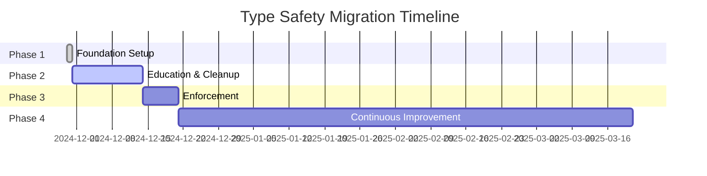

# Type Safety Migration Guide

## Overview
This document outlines our phased approach to improving TypeScript type safety across the codebase, moving from permissive `any` usage to strict type checking.

## Migration Phases

### Phase 1: Foundation (Current)
**Status:** ✅ Complete
- ESLint rules set to `warn` level
- Safe type improvements applied (PII scrubber, nullish coalescing)
- BMAD agent workflow configured
- Metrics tracking implemented

### Phase 2: Education & Cleanup (Week 2-3)
**Status:** 🔄 In Progress
- Team education on type safety best practices
- Fix high-priority type issues identified by BMAD agent
- Address TypeScript compilation errors
- Monitor metrics for improvement trends

### Phase 3: Enforcement (Week 4)
**Status:** ⏳ Planned
- Escalate ESLint rules from `warn` to `error`
- Enable additional strict TypeScript compiler options
- Require type annotations for all new code
- Block PRs with type safety violations

### Phase 4: Continuous Improvement (Ongoing)
**Status:** ⏳ Planned
- Automated BMAD agent runs in CI
- Weekly type safety metrics reports
- Gradual reduction of `unknown` to specific types
- Goal: >90% type coverage

## Commands

### Run Type Safety Agent
```bash
# Preview changes without applying
npm run ai:type-safety:dry

# Apply fixes (max 10 by default)
npm run ai:type-safety

# Apply more fixes
npm run ai:type-safety -- --max-fixes=50

# Lower confidence threshold for more aggressive fixes
npm run ai:type-safety -- --confidence=0.6
```

### Check Type Safety Metrics
```bash
# Generate metrics report
npm run metrics:type-safety
```

### Manual Type Checking
```bash
# Fast type check
npm run check:fast

# Full type check
npm run check
```

## ESLint Rules

### Phase 1 (Warnings) - CURRENT
```javascript
"@typescript-eslint/no-explicit-any": "warn"
"@typescript-eslint/no-unsafe-assignment": "warn"
"@typescript-eslint/no-unsafe-member-access": "warn"
"@typescript-eslint/no-unsafe-call": "warn"
"@typescript-eslint/no-unsafe-return": "warn"
```

### Phase 3 (Errors) - FUTURE
```javascript
"@typescript-eslint/no-explicit-any": "error"
"@typescript-eslint/no-unsafe-assignment": "error"
"@typescript-eslint/no-unsafe-member-access": "error"
"@typescript-eslint/no-unsafe-call": "error"
"@typescript-eslint/no-unsafe-return": "error"
"@typescript-eslint/explicit-function-return-type": "warn"
```

## Common Patterns & Fixes

### 1. Replace `any` with `unknown`
```typescript
// ❌ Before
function processData(data: any) {
  return data.value;
}

// ✅ After
function processData(data: unknown) {
  if (typeof data === 'object' && data !== null && 'value' in data) {
    return (data as { value: unknown }).value;
  }
  return undefined;
}
```

### 2. Type Express/Fastify Requests
```typescript
// ❌ Before
async function handler(req: any, res: any) {
  const userId = req.user.id;
}

// ✅ After
import type { Request, Response } from 'express';

interface AuthenticatedRequest extends Request {
  user?: { id: string; email?: string };
}

async function handler(req: AuthenticatedRequest, res: Response) {
  const userId = req.user?.id ?? 'anonymous';
}
```

### 3. Use Proper Type Assertions
```typescript
// ❌ Before
const result = apiResponse as any;

// ✅ After
interface ApiResponse {
  data: { id: string; name: string };
  status: number;
}
const result = apiResponse as ApiResponse;
```

### 4. Replace `Record<string, any>`
```typescript
// ❌ Before
const config: Record<string, any> = {};

// ✅ After
const config: Record<string, unknown> = {};
// Or better, define specific types
interface Config {
  apiUrl: string;
  timeout: number;
  features: string[];
}
const config: Config = { ... };
```

## Metrics Targets

| Metric | Current | Phase 2 Target | Phase 3 Target | Goal |
|--------|---------|----------------|----------------|------|
| Explicit `any` usage | TBD | <100 | <50 | 0 |
| TypeScript errors | TBD | <20 | 0 | 0 |
| ESLint violations | TBD | <200 | <50 | 0 |
| Type coverage | TBD | >70% | >80% | >90% |
| Unsafe operations | TBD | <20 | <10 | 0 |

## Business Impact

### Why Type Safety Matters
1. **Reduced Production Errors**: Type checking catches bugs at compile time
2. **Improved Developer Experience**: Better IDE support and autocomplete
3. **Easier Refactoring**: Type system ensures changes don't break contracts
4. **Documentation**: Types serve as inline documentation
5. **Financial Platform Requirements**: Critical for handling monetary calculations

### Success Metrics
- **50% reduction** in type-related production errors
- **30% faster** development velocity with better IDE support
- **90% reduction** in "cannot read property of undefined" errors
- **100% type coverage** for critical financial calculations

## Resources

- [TypeScript Handbook](https://www.typescriptlang.org/docs/handbook/intro.html)
- [TypeScript Do's and Don'ts](https://www.typescriptlang.org/docs/handbook/declaration-files/do-s-and-don-ts.html)
- [Type Safety Best Practices](https://github.com/typescript-cheatsheets/react)

## Support

For questions or issues with the type safety migration:
1. Check this guide first
2. Run `npm run ai:type-safety:dry` to see suggested fixes
3. Review metrics with `npm run metrics:type-safety`
4. Ask in #typescript-migration Slack channel

## Appendix: Type Safety Checklist

Before merging any PR:
- [ ] No new `any` types introduced
- [ ] All function parameters have type annotations
- [ ] Return types are explicit for public APIs
- [ ] No `@ts-ignore` or `@ts-nocheck` comments
- [ ] ESLint type safety rules pass (warnings OK in Phase 1)
- [ ] Type coverage hasn't decreased

## Timeline

