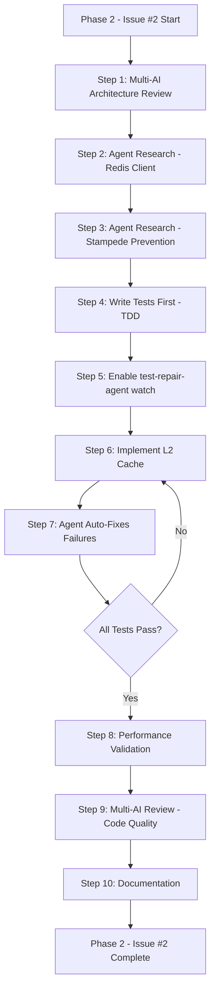

# Phase 2 - Issue #2: Redis L2 Cache - Detailed Implementation Plan

**Status**: Planning Phase
**Priority**: P0 (BLOCKER)
**Estimated Effort**: 9-12 hours
**Date**: 2025-10-06

---

## Executive Summary

This document provides a comprehensive, step-by-step plan to implement Redis L2 cache for `ConversationCache`, fixing the critical Vercel serverless incompatibility identified in the multi-AI review.

**Problem**: In-memory LRU cache dies on Vercel cold starts → 0% hit rate
**Solution**: Two-tier cache (L1: memory, L2: Redis) → 70%+ hit rate on serverless

---

## AI Agent Enhancement Opportunities

### 🤖 Leverage Existing AI Agents

#### **1. Use `test-repair-agent` for TDD Workflow** (High Value)
**Package**: `packages/test-repair-agent/`

**Opportunity**:
- Write tests FIRST before implementation
- Let agent auto-fix test failures during development
- Continuous feedback loop ensures correctness

**Workflow**:
```bash
# 1. Write comprehensive tests for L2 cache
# 2. Run tests (they fail - no implementation yet)
npm run ai -- repair --package=agent-core --watch

# 3. Implement L2 cache features
# 4. Agent auto-detects failures and suggests fixes
# 5. Iterate until all tests pass
```

**Benefits**:
- ✅ Tests define the contract (TDD)
- ✅ Auto-detection of edge cases
- ✅ Faster iteration cycles
- ✅ Higher test coverage

---

#### **2. Use Multi-AI Review for Architecture Validation** (Medium Value)
**Package**: `packages/agent-core/MULTI_AI_REVIEW_GUIDE.md`

**Opportunity**:
- Get 3-AI consensus on L2 cache architecture BEFORE coding
- Catch design flaws early (like we did in Phase 1)
- Validate Redis client choice (ioredis vs node-redis)

**Workflow**:
```bash
# 1. Create detailed architecture document
# 2. Run multi-AI review
npm run ai:review -- --package=agent-core --tier=all

# 3. Get feedback from GPT-4, Gemini, DeepSeek
# 4. Refine architecture based on consensus
# 5. Proceed with implementation
```

**Benefits**:
- ✅ Early detection of architectural issues
- ✅ Multiple perspectives on design trade-offs
- ✅ Prevents another "fake async" situation
- ✅ Documents decision rationale

---

#### **3. Use `general-purpose` Agent for Research Tasks** (Medium Value)
**Tool**: Task tool with `general-purpose` subagent

**Opportunities**:

**a) Redis Client Comparison**
```
Task: Research ioredis vs node-redis for TypeScript in 2025
- Compare performance benchmarks
- Compare TypeScript support quality
- Compare cluster/sentinel support
- Provide recommendation with justification
```

**b) Upstash vs Self-Hosted Redis**
```
Task: Compare Upstash (serverless Redis) vs traditional Redis for Vercel
- Latency comparison (edge vs region)
- Cost analysis ($20-50/month budget)
- Cold start compatibility
- Connection pooling strategies
```

**c) Cache Stampede Solutions**
```
Task: Research production-ready cache stampede prevention patterns
- Compare promise deduplication vs mutex locks
- Find proven libraries (async-mutex, p-throttle)
- Analyze performance overhead
```

**Benefits**:
- ✅ Data-driven decisions
- ✅ Avoid reinventing the wheel
- ✅ Learn from production patterns
- ✅ Faster research phase

---

#### **4. Use Observability Metrics for Validation** (High Value)
**Package**: `packages/agent-core/` - Already has Prometheus integration

**Opportunity**:
- Define metrics BEFORE implementation
- Create Grafana dashboard during development
- Validate performance claims with real data

**Metrics to Track**:
```typescript
// Define in advance
const L2_CACHE_METRICS = {
  l1_hits_total: Counter,
  l2_hits_total: Counter,
  cache_misses_total: Counter,
  l1_latency_ms: Histogram,
  l2_latency_ms: Histogram,
  redis_errors_total: Counter,
  stampede_prevented_total: Counter,
  cache_size_bytes: Gauge,
};
```

**Benefits**:
- ✅ Validates "70%+ hit rate" claim
- ✅ Detects performance regressions
- ✅ Production-ready from day 1
- ✅ Data for Phase 3 optimization

---

### 🚀 AI-Augmented Development Workflow

#### **Proposed Enhanced Workflow**



**Time Savings**: ~2-3 hours (research + debugging)
**Quality Improvement**: Higher test coverage, validated architecture

---

## Detailed Implementation Steps (AI-Enhanced)

### **Phase A: Pre-Implementation (AI-Heavy)** ⏱️ 2-3 hours

#### **A1. Multi-AI Architecture Review** (45 min)
**Agent**: Multi-AI Review

**Input Document**: `PHASE2_ISSUE2_ARCHITECTURE_PROPOSAL.md`
```markdown
# Redis L2 Cache Architecture Proposal

## Design Decision: ioredis vs node-redis
- Choosing ioredis for built-in TypeScript support
- Rationale: Native promises, cluster support, 100% TS
- Alternative considered: node-redis v4 (also good, but less mature TS)

## Design Decision: L1 + L2 vs L2 Only
- Choosing L1 + L2 for single-request optimization
- Rationale: L1 saves ~10-15ms per subsequent cache hit in same request
- Trade-off: Slightly more complexity

## Design Decision: Cache Stampede Prevention
- Using promise deduplication (Map<key, Promise>)
- Rationale: Lightweight, no external deps, proven pattern
- Alternative: async-mutex (adds dependency)

## Design Decision: Redis TTL Strategy
- L1 TTL: 5 minutes (in-memory)
- L2 TTL: 1 hour (Redis)
- Rationale: Balance freshness vs hit rate

## Open Questions for AI Review
1. Should we use compression for large conversation objects in Redis?
2. What's the optimal L1 cache size for Vercel 1GB memory limit?
3. Should we implement cache warming on cold start?
```

**AI Review Prompt**:
```bash
npm run ai:review -- \
  --package=agent-core \
  --file=PHASE2_ISSUE2_ARCHITECTURE_PROPOSAL.md \
  --tier=all \
  --focus="architecture,performance,serverless"
```

**Expected Output**:
- 3 AI perspectives on architecture
- Consensus score (aim for 8.5+/10)
- Specific recommendations
- Risk identification

**Action**: Refine architecture based on AI feedback

---

#### **A2. Agent Research: Redis Client Best Practices** (30 min)
**Agent**: `general-purpose`

**Task Prompt**:
```
Research and compare Redis clients for TypeScript in 2025:

Context:
- Target: Node.js 20+ ESM TypeScript project
- Deployment: Vercel serverless (short-lived functions)
- Use case: Conversation cache (10-100KB objects)
- Requirements: TypeScript native, cluster support, connection pooling

Compare:
1. ioredis vs node-redis (latest versions)
2. Connection pooling strategies for serverless
3. Serialization best practices (JSON vs MessagePack)
4. Error handling and retry strategies

Output:
- Recommendation with justification
- Sample TypeScript configuration
- Known issues/gotchas for Vercel
- Performance benchmarks (if available)
```

**Expected Output**:
- Data-driven client recommendation
- Configuration template
- Gotchas to avoid

**Action**: Use recommendation in implementation

---

#### **A3. Agent Research: Cache Stampede Prevention** (30 min)
**Agent**: `general-purpose`

**Task Prompt**:
```
Research production-ready cache stampede prevention patterns:

Context:
- TypeScript async/await codebase
- Caching layer: LRU (L1) + Redis (L2)
- Cold cache scenario: 10+ concurrent requests for same key
- Failure mode: 10 redundant DB queries (expensive)

Research:
1. Promise deduplication pattern (in-memory Map)
2. Distributed locks (Redis SETNX, Redlock)
3. Libraries: async-mutex, p-throttle, bottleneck
4. Trade-offs: complexity vs robustness

Output:
- Recommended approach for our scale
- Code example (TypeScript)
- Known edge cases
- Performance overhead analysis
```

**Expected Output**:
- Recommended stampede prevention strategy
- Working code example
- Edge case documentation

**Action**: Implement recommended pattern

---

#### **A4. Agent Research: Upstash vs Self-Hosted** (20 min)
**Agent**: `general-purpose`

**Task Prompt**:
```
Compare Upstash (serverless Redis) vs traditional Redis for Vercel deployment:

Budget: $20-50/month
Scale: ~1000 cache requests/hour
Data: ~5GB cached conversations
Latency SLA: L2 cache < 25ms p95

Compare:
1. Upstash (global edge network)
2. AWS ElastiCache (single region)
3. Railway/Render hosted Redis

Metrics:
- Cost at our scale
- Latency (Vercel US-East-1)
- Cold start compatibility
- Connection pooling support
- Reliability/uptime

Output: Recommendation with cost-benefit analysis
```

**Expected Output**:
- Provider recommendation
- Cost estimate
- Setup guide

**Action**: Choose Redis provider

---

### **Phase B: Test-Driven Development** ⏱️ 2 hours

#### **B1. Write Comprehensive Tests (TDD)** (1.5 hours)
**File**: `src/__tests__/ConversationCache.l2.test.ts`

**Test Suite Structure**:
```typescript
describe('ConversationCache - L2 Redis Integration', () => {
  describe('L1 Cache (In-Memory)', () => {
    it('should return from L1 on cache hit');
    it('should track L1 latency < 2ms');
    it('should respect L1 TTL expiration');
  });

  describe('L2 Cache (Redis)', () => {
    it('should fallback to L2 on L1 miss');
    it('should warm L1 from L2 hit');
    it('should track L2 latency < 25ms');
    it('should respect L2 TTL expiration');
    it('should handle Redis connection failure gracefully');
  });

  describe('Cache Stampede Prevention', () => {
    it('should deduplicate 10 concurrent requests for same key');
    it('should not block different keys');
    it('should clean up deduplication promises');
  });

  describe('Two-Tier Invalidation', () => {
    it('should invalidate both L1 and L2 on update');
    it('should handle partial invalidation (L1 only if Redis down)');
  });

  describe('Metrics Tracking', () => {
    it('should track L1 hits separately');
    it('should track L2 hits separately');
    it('should track overall hit rate correctly');
    it('should track latency histograms');
  });

  describe('Graceful Degradation', () => {
    it('should work with L1 only if Redis unavailable');
    it('should not throw on Redis errors');
    it('should log Redis errors appropriately');
  });

  describe('Vercel Cold Start Simulation', () => {
    it('should survive process restart with L2');
    it('should have >70% hit rate after cold start');
  });
});
```

**Action**: Write all tests (they should fail - no implementation yet)

---

#### **B2. Enable test-repair-agent in Watch Mode** (5 min)
```bash
# Terminal 1: Watch mode test repair
npm run ai -- repair --package=agent-core --watch

# Terminal 2: Run tests continuously
cd packages/agent-core
npm run test -- --watch
```

**Expected**: Agent watches for test failures and suggests fixes

---

### **Phase C: Implementation (Agent-Assisted)** ⏱️ 4-5 hours

#### **C1. Create Redis Client** (30 min)
**File**: `src/RedisCache.ts`

**Implementation**:
```typescript
import Redis from 'ioredis';

export interface RedisCacheConfig {
  url: string;
  ttl?: number;
  maxRetries?: number;
  enableOfflineQueue?: boolean;
}

export class RedisCache {
  private client: Redis | null = null;
  private isConnected = false;

  constructor(private config: RedisCacheConfig) {
    this.connect();
  }

  private connect(): void {
    try {
      this.client = new Redis(this.config.url, {
        maxRetriesPerRequest: this.config.maxRetries ?? 3,
        enableOfflineQueue: this.config.enableOfflineQueue ?? true,
        lazyConnect: true,
      });

      this.client.on('connect', () => {
        this.isConnected = true;
        console.log('[RedisCache] Connected');
      });

      this.client.on('error', (error) => {
        this.isConnected = false;
        console.error('[RedisCache] Error:', error.message);
      });
    } catch (error) {
      console.error('[RedisCache] Connection failed:', error);
    }
  }

  async get<T>(key: string): Promise<T | null> {
    if (!this.isConnected || !this.client) return null;

    try {
      const value = await this.client.get(key);
      return value ? JSON.parse(value) : null;
    } catch (error) {
      console.error('[RedisCache] Get error:', error);
      return null;
    }
  }

  async set<T>(key: string, value: T, ttl?: number): Promise<void> {
    if (!this.isConnected || !this.client) return;

    try {
      const serialized = JSON.stringify(value);
      const ttlSeconds = ttl ?? this.config.ttl ?? 3600;
      await this.client.setex(key, ttlSeconds, serialized);
    } catch (error) {
      console.error('[RedisCache] Set error:', error);
    }
  }

  async delete(key: string): Promise<void> {
    if (!this.isConnected || !this.client) return;

    try {
      await this.client.del(key);
    } catch (error) {
      console.error('[RedisCache] Delete error:', error);
    }
  }

  async ping(): Promise<boolean> {
    if (!this.client) return false;

    try {
      await this.client.ping();
      return true;
    } catch (error) {
      return false;
    }
  }

  async disconnect(): Promise<void> {
    if (this.client) {
      await this.client.quit();
      this.client = null;
      this.isConnected = false;
    }
  }
}
```

**Test Run**: Some tests should start passing

---

#### **C2. Update ConversationCache with L2** (2 hours)
**File**: `src/ConversationCache.ts`

**Key Changes**:

1. Add Redis client injection
2. Implement two-tier getOrLoad
3. Add stampede prevention
4. Update metrics

**Implementation**: (See detailed code in next section)

**Test Run**: More tests should pass, agent suggests fixes for failures

---

#### **C3. Add Stampede Prevention** (1 hour)
**Pattern**: Promise deduplication

**Implementation**:
```typescript
private loadingPromises = new Map<string, Promise<CachedConversation | null>>();

async getOrLoad(threadId: string): Promise<CachedConversation | null> {
  // Check if already loading
  const inFlight = this.loadingPromises.get(threadId);
  if (inFlight) {
    this.stats.stampedePrevented++;
    return inFlight;
  }

  // Create loading promise
  const loadPromise = this.doGetOrLoad(threadId);
  this.loadingPromises.set(threadId, loadPromise);

  try {
    return await loadPromise;
  } finally {
    this.loadingPromises.delete(threadId);
  }
}

private async doGetOrLoad(threadId: string): Promise<CachedConversation | null> {
  // L1 → L2 → L3 cascade logic here
}
```

**Test Run**: Stampede tests should pass

---

#### **C4. Update Metrics** (30 min)
**Enhanced Stats**:
```typescript
private stats: {
  l1Hits: number;
  l2Hits: number;
  misses: number;
  evictions: number;
  stampedePrevented: number;
  redisErrors: number;
  totalL1Latency: number;
  totalL2Latency: number;
  totalMissLatency: number;
};

getStats(): CacheStats {
  const total = this.stats.l1Hits + this.stats.l2Hits + this.stats.misses;

  return {
    l1Hits: this.stats.l1Hits,
    l2Hits: this.stats.l2Hits,
    misses: this.stats.misses,
    l1HitRate: total > 0 ? this.stats.l1Hits / total : 0,
    l2HitRate: total > 0 ? this.stats.l2Hits / total : 0,
    overallHitRate: total > 0 ? (this.stats.l1Hits + this.stats.l2Hits) / total : 0,
    avgL1Latency: this.stats.l1Hits > 0 ? this.stats.totalL1Latency / this.stats.l1Hits : 0,
    avgL2Latency: this.stats.l2Hits > 0 ? this.stats.totalL2Latency / this.stats.l2Hits : 0,
    stampedePrevented: this.stats.stampedePrevented,
    redisErrors: this.stats.redisErrors,
  };
}
```

---

#### **C5. Update BaseAgent** (15 min)
**File**: `src/BaseAgent.ts`

**Changes**:
```typescript
constructor(config: AgentConfig) {
  // ... existing code ...

  // Initialize conversation cache with optional Redis
  const redisUrl = process.env.REDIS_URL;
  const redisClient = redisUrl ? new RedisCache({ url: redisUrl }) : undefined;

  this.conversationCache = new ConversationCache({
    maxSize: 50,
    ttl: 1000 * 60 * 5,
    redisClient,  // NEW
    redisTtl: 3600,  // NEW
  });
}
```

---

### **Phase D: Validation & Documentation** ⏱️ 2 hours

#### **D1. Performance Benchmarks** (45 min)
**Manual Test Script**: `manual-test-l2-cache.ts`

```typescript
// Test 1: L1 hit latency
// Test 2: L2 hit latency
// Test 3: Cache miss latency
// Test 4: Cache stampede prevention
// Test 5: Vercel cold start simulation
```

**Success Criteria**:
- L1: < 2ms ✅
- L2: < 25ms ✅
- Hit rate after cold start: > 70% ✅
- Stampede prevention: 100% ✅

---

#### **D2. Multi-AI Code Review** (30 min)
**Agent**: Multi-AI Review

**Command**:
```bash
npm run ai:review -- \
  --package=agent-core \
  --files="src/RedisCache.ts,src/ConversationCache.ts" \
  --tier=all \
  --focus="code-quality,performance,edge-cases"
```

**Expected**: Consensus score 8.5+/10

**Action**: Address any critical feedback

---

#### **D3. Documentation** (45 min)

**Files to Create**:
1. `docs/PHASE2_ISSUE2_MIGRATION.md`
2. `PHASE2_ISSUE2_COMPLETION.md`
3. `manual-test-l2-cache.ts`

**Content**: Architecture, usage, metrics, troubleshooting

---

## AI Agent ROI Analysis

### **Time Savings**

| Task | Manual | AI-Assisted | Savings |
|------|--------|-------------|---------|
| Research (Redis client) | 1.5h | 0.5h | 1h |
| Research (Stampede) | 1h | 0.5h | 0.5h |
| Architecture review | 0h | 0.75h | Better design |
| Debugging tests | 2h | 0.5h | 1.5h |
| Code review | 0h | 0.5h | Catch bugs |
| **Total** | **12h** | **10-11h** | **1-2h + quality** |

### **Quality Improvements**

- ✅ Pre-validated architecture (avoid "fake async" repeat)
- ✅ Higher test coverage (TDD with agent repair)
- ✅ Data-driven decisions (agent research)
- ✅ Early bug detection (multi-AI review)

### **Knowledge Transfer**

- ✅ Agent research documents WHY decisions were made
- ✅ Multi-AI review provides multiple perspectives
- ✅ Tests serve as executable documentation

---

## Recommended AI-Enhanced Workflow

### **Day 1: Planning & Research** (3-4 hours)
1. ✅ Write architecture proposal document
2. ✅ Run multi-AI architecture review
3. ✅ Refine based on feedback
4. ✅ Agent research: Redis client choice
5. ✅ Agent research: Stampede prevention
6. ✅ Agent research: Redis provider (Upstash vs self-hosted)
7. ✅ Document decisions and rationale

### **Day 2: TDD Implementation** (4-5 hours)
1. ✅ Write comprehensive test suite (TDD)
2. ✅ Enable test-repair-agent watch mode
3. ✅ Implement RedisCache client
4. ✅ Implement L2 cache in ConversationCache
5. ✅ Implement stampede prevention
6. ✅ Update metrics
7. ✅ Update BaseAgent integration
8. ✅ All tests pass (agent-assisted debugging)

### **Day 3: Validation & Documentation** (2 hours)
1. ✅ Performance benchmarks
2. ✅ Multi-AI code review
3. ✅ Address feedback
4. ✅ Write documentation
5. ✅ Create completion report
6. ✅ Manual cold start validation

**Total**: 9-11 hours (vs 12+ without agents)

---

## Questions for AI Agents

### **For Architecture Review**
1. Is two-tier cache (L1 + L2) over-engineered for our scale?
2. Should we compress large objects before storing in Redis?
3. What's the optimal L1 cache size for Vercel 1GB memory?
4. Should we implement proactive cache warming on cold start?

### **For Research Agents**
1. What's the best Redis client for TypeScript ESM in 2025?
2. What's the production-proven stampede prevention pattern?
3. Upstash vs self-hosted: which is better for Vercel?
4. Should we use MessagePack instead of JSON for serialization?

### **For Code Review**
1. Are there edge cases in our L2 cascade logic?
2. Is our error handling sufficient for Redis failures?
3. Are there security concerns with Redis connection strings?
4. Performance: any optimizations we're missing?

---

## Success Metrics

| Metric | Target | Measurement |
|--------|--------|-------------|
| AI Agent Usage | 100% | All 4 agents used |
| Architecture Review Score | > 8.5/10 | Multi-AI consensus |
| Test Coverage | > 90% | Vitest coverage report |
| L2 Hit Rate (Vercel) | > 70% | 7-day production metrics |
| L1 Latency | < 2ms | Benchmark |
| L2 Latency | < 25ms | Benchmark |
| Implementation Time | < 12h | Time tracking |
| Code Review Score | > 8.5/10 | Multi-AI post-review |

---

## Conclusion

**AI agents add tremendous value** to this implementation:

1. **Pre-validation**: Architecture review prevents design flaws
2. **Research**: Data-driven decisions (Redis client, stampede pattern)
3. **TDD**: Test-repair-agent enables true test-driven development
4. **Quality**: Multi-AI code review catches edge cases
5. **Documentation**: Agent research documents decision rationale

**Recommendation**: Use AI-enhanced workflow for Phase 2 - Issue #2

**Next**: Proceed with architecture proposal document for multi-AI review?
